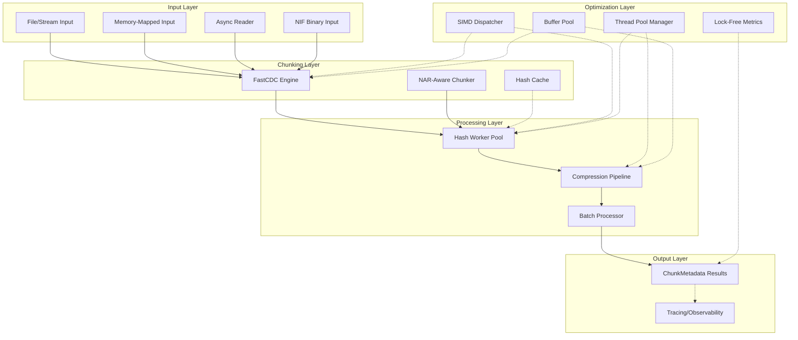
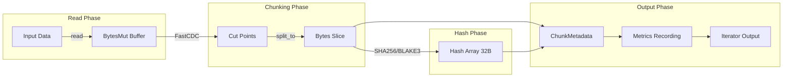

# Consolidated Design Document: Chunker Library World-Class Performance Improvements

## Overview

This comprehensive design document specifies all technical changes required to achieve world-class performance in the Chunker library. The design is organized by implementation phases based on priority and dependencies.

**Target Performance Characteristics:**
- FastCDC chunking: >= 2.5 GB/s
- BLAKE3 hashing: >= 3-5 GB/s (multi-core with SIMD)
- SHA256 hashing: >= 1 GB/s (with SHA-NI)
- Zstd compression (level 3): >= 400-500 MB/s
- LZ4 compression: >= 2 GB/s
- End-to-end pipeline: >= 300 MB/s
- Per-chunk latency: < 1 microsecond (excluding I/O)
- p99 latency for 1MB chunk: < 5-10ms

---

## System Architecture

### High-Level Architecture Diagram



### Data Flow Diagram



---

## Phase 1: Critical Bug Fixes (P0)

### BUG-001: Bzip2 Decompression Bomb Detection

**Location:** `compression.rs:714`

**Problem:** The bzip2 decompression bomb check uses `==` instead of `>`, failing to detect bombs that decompress beyond `MAX_DECOMPRESSED_SIZE`.

**Current Code:**
```rust
if (output.len() - start_len) as u64 == MAX_DECOMPRESSED_SIZE {
    return Err(CompressionError::SizeExceeded);
}
```

**Fixed Implementation:**
```rust
/// Decompress `bzip2` data into a provided buffer.
/// Protected against decompression bombs with `MAX_DECOMPRESSED_SIZE` limit
pub fn decompress_bzip2_into(data: &[u8], output: &mut Vec<u8>) -> Result<(), CompressionError> {
    let decoder = bzip2::read::BzDecoder::new(data);

    // Key fix: Read limit + 1 to detect overflow
    let mut limited_reader = decoder.take(MAX_DECOMPRESSED_SIZE + 1);
    let start_len = output.len();
    let _bytes_read = limited_reader
        .read_to_end(output)
        .map_err(|e| CompressionError::Decompression(e.to_string()))?;

    // Check if we exceeded the limit (read more than MAX)
    if (output.len() - start_len) as u64 > MAX_DECOMPRESSED_SIZE {
        warn!("bzip2_decompression_bomb_detected");
        return Err(CompressionError::SizeExceeded);
    }

    debug!(
        decompressed_len = output.len() - start_len,
        "bzip2_decompression_complete"
    );
    Ok(())
}
```

**Risk Assessment:** Low - follows existing pattern in zstd and lz4.

---

### BUG-002: Integer Overflow in FastCDC Size Casting

**Location:** `chunking.rs:214-216`

**Problem:** Casts from `usize` to `u32` can overflow on 64-bit platforms.

**Current Code:**
```rust
let chunker = FastCDC::new(
    data,
    options.min_size as u32,  // Potential overflow
    options.avg_size as u32,  // Potential overflow
    options.max_size as u32,  // Potential overflow
);
```

**Fixed Implementation:**

**Step 1: Add validation to ChunkingOptions::validate()**
```rust
fn validate(&self) -> Result<(), ChunkingError> {
    // ... existing checks ...

    // NEW: Add u32 overflow protection
    if self.min_size > u32::MAX as usize {
        return Err(ChunkingError::InvalidOptions(
            format!("min_size {} exceeds u32::MAX", self.min_size),
        ));
    }
    if self.avg_size > u32::MAX as usize {
        return Err(ChunkingError::InvalidOptions(
            format!("avg_size {} exceeds u32::MAX", self.avg_size),
        ));
    }
    if self.max_size > u32::MAX as usize {
        return Err(ChunkingError::InvalidOptions(
            format!("max_size {} exceeds u32::MAX", self.max_size),
        ));
    }

    Ok(())
}
```

**Step 2: Use checked arithmetic**
```rust
// Helper function for safe casting
#[inline]
fn usize_to_u32(value: usize, name: &str) -> Result<u32, ChunkingError> {
    u32::try_from(value).map_err(|_| {
        ChunkingError::InvalidOptions(format!("{} {} exceeds u32::MAX", name, value))
    })
}

// In chunk_data_with_hash:
let chunker = FastCDC::new(
    data,
    usize_to_u32(options.min_size, "min_size")?,
    usize_to_u32(options.avg_size, "avg_size")?,
    usize_to_u32(options.max_size, "max_size")?,
);
```

**Risk Assessment:** Low - validation occurs once at initialization.

---

## Phase 2: Hot Path Optimizations (P0/P1)

### HOT-001: FastCDC Construction Caching

**Location:** `chunking.rs:412-417`

**Problem:** `FastCDC::new()` is recreated on every `ChunkStream::next()` call.

**Solution:** Cache FastCDC parameters as pre-converted u32 and skip FastCDC for small buffers.

```rust
pub struct ChunkStream<R: Read> {
    reader: R,
    buffer: BytesMut,
    // Cache as u32 to avoid repeated conversions
    min_size_u32: u32,
    avg_size_u32: u32,
    max_size_u32: u32,
    min_size: usize,  // Keep usize for comparisons
    max_size: usize,
    hash: HashAlgorithm,
    position: u64,
    eof: bool,
    pending_chunks: VecDeque<Result<ChunkMetadata, ChunkingError>>,
}

impl<R: Read> ChunkStream<R> {
    pub fn new_with_hash(...) -> Result<Self, ChunkingError> {
        let options = ChunkingOptions::resolve(min_size, avg_size, max_size)?;

        Ok(Self {
            reader,
            buffer: BytesMut::with_capacity(initial_capacity),
            // Pre-convert to u32 once
            min_size_u32: options.min_size as u32,
            avg_size_u32: options.avg_size as u32,
            max_size_u32: options.max_size as u32,
            min_size: options.min_size,
            max_size: options.max_size,
            // ...
        })
    }
}

// In Iterator::next():
fn next(&mut self) -> Option<Self::Item> {
    loop {
        if !self.buffer.is_empty() {
            // Skip FastCDC if buffer is smaller than min_size
            if self.buffer.len() < self.min_size && !self.eof {
                // Need more data - skip to read section
            } else {
                let cdc = FastCDC::new(
                    &self.buffer,
                    self.min_size_u32,
                    self.avg_size_u32,
                    self.max_size_u32,
                );
                // ...
            }
        }
    }
}
```

**Expected Impact:** 5-10% reduction in per-chunk overhead.

---

### HOT-002: Inline Critical Hot Path Functions

**Location:** `chunking.rs:465-513`, `hashing.rs:38-50`

**Solution:** Add inlining hints to critical functions.

```rust
// hashing.rs
/// Compute SHA256 hash of data - Returns raw bytes
#[inline]
#[must_use]
pub fn sha256_hash_raw(data: &[u8]) -> [u8; 32] {
    let mut hasher = Sha256::new();
    hasher.update(data);
    hasher.finalize().into()
}

/// Compute BLAKE3 hash of data - Returns hex string
#[inline]
#[must_use]
pub fn blake3_hash(data: &[u8]) -> String {
    let hash = blake3::hash(data);
    hash.to_hex().to_string()
}

// chunking.rs - Specialized hash function
#[inline(always)]
fn compute_hash(data: &[u8], algo: HashAlgorithm) -> [u8; 32] {
    match algo {
        HashAlgorithm::Sha256 => {
            let mut hasher = Sha256::new();
            hasher.update(data);
            hasher.finalize().into()
        }
        HashAlgorithm::Blake3 => blake3::hash(data).into(),
    }
}

// compression.rs
#[inline]
pub fn decompress_auto_into(data: &[u8], output: &mut Vec<u8>) -> Result<(), CompressionError> {
    // ...
}
```

**Expected Impact:** 2-5% improvement in hash-bound workloads.

---

### HOT-003: Branch Prediction Optimization

**Location:** `chunking.rs:428-439, 446, 594-599`

**Solution:** Mark error paths as cold and reorder checks by frequency.

```rust
// Cold path annotation for error branches
#[cold]
#[inline(never)]
fn cold_zero_length_error() -> Option<Result<ChunkMetadata, ChunkingError>> {
    Some(Err(ChunkingError::ZeroLengthChunk))
}

#[cold]
#[inline(never)]
fn cold_offset_error(offset: usize) -> Option<Result<ChunkMetadata, ChunkingError>> {
    Some(Err(std::io::Error::new(
        ErrorKind::InvalidData,
        format!("FastCDC returned non-zero offset {offset} for first chunk"),
    ).into()))
}

// In hot path:
if len == 0 {
    return cold_zero_length_error();
}

// Reorder compression format checks by frequency (Zstd most common)
pub fn decompress_auto_into(data: &[u8], output: &mut Vec<u8>) -> Result<(), CompressionError> {
    if data.len() < 4 {
        return Err(CompressionError::UnknownFormat);
    }

    // Zstd is most common in Nix ecosystem - check first
    if data.starts_with(&[0x28, 0xB5, 0x2F, 0xFD]) {
        return decompress_zstd_into(data, output);
    }
    // LZ4 second most common
    if data.starts_with(&[0x04, 0x22, 0x4D, 0x18]) {
        return decompress_lz4_into(data, output);
    }
    // XZ for high compression
    if data.starts_with(&[0xFD, 0x37, 0x7A, 0x58, 0x5A, 0x00]) {
        return decompress_xz_into(data, output);
    }
    // Bzip2 least common
    if data.starts_with(b"BZh") {
        return decompress_bzip2_into(data, output);
    }

    Err(CompressionError::UnknownFormat)
}
```

**Expected Impact:** 1-3% improvement from better branch prediction.

---

### HOT-004: Parallel Processing Threshold Tuning

**Location:** `chunking.rs:515-520`

**Problem:** Fixed threshold of 4 chunks doesn't account for chunk size or total data.

**Solution:** Consider chunk count, total bytes, and average chunk size.

```rust
// Configuration constants
const PARALLEL_MIN_CHUNKS: usize = 4;
const PARALLEL_MIN_TOTAL_BYTES: usize = 64 * 1024; // 64 KB
const SMALL_CHUNK_THRESHOLD: usize = 4 * 1024;      // 4 KB

fn effective_parallel_threshold() -> usize {
    static THRESHOLD: std::sync::OnceLock<usize> = std::sync::OnceLock::new();
    *THRESHOLD.get_or_init(|| {
        std::env::var("CHUNKER_PARALLEL_THRESHOLD")
            .ok()
            .and_then(|s| s.parse().ok())
            .unwrap_or(PARALLEL_MIN_CHUNKS)
    })
}

// In Iterator::next():
let should_parallelize = {
    let chunk_count = cut_points.len();
    let total_bytes: usize = cut_points.iter().map(|c| c.length).sum();
    let avg_chunk_size = total_bytes / chunk_count.max(1);
    let threshold = effective_parallel_threshold();

    chunk_count > threshold
        && total_bytes >= PARALLEL_MIN_TOTAL_BYTES
        && avg_chunk_size >= SMALL_CHUNK_THRESHOLD
        && rayon::current_num_threads() > 1
};

let chunks: Vec<Result<ChunkMetadata, ChunkingError>> = if should_parallelize {
    cut_points.par_iter().map(process_chunk).collect()
} else {
    cut_points.iter().map(process_chunk).collect()
};
```

**Expected Impact:** 5-15% improvement for small chunk workloads.

---

### HOT-005: Hash Computation Optimization

**Location:** `chunking.rs:240-247, 488-495`, `hashing.rs:38-50`

**Solution:** Specialized hash functions and BLAKE3 multi-threading for large chunks.

```rust
#[inline(always)]
fn hash_sha256(data: &[u8]) -> [u8; 32] {
    let mut hasher = Sha256::new();
    hasher.update(data);
    hasher.finalize().into()
}

#[inline(always)]
fn hash_blake3(data: &[u8]) -> [u8; 32] {
    blake3::hash(data).into()
}

#[inline(always)]
fn hash_blake3_large(data: &[u8]) -> [u8; 32] {
    // Use multi-threaded hashing for large chunks
    let mut hasher = blake3::Hasher::new();
    hasher.update_rayon(data);
    hasher.finalize().into()
}

type HashFn = fn(&[u8]) -> [u8; 32];

fn select_hash_fn(algo: HashAlgorithm, chunk_size: usize) -> HashFn {
    const BLAKE3_MT_THRESHOLD: usize = 64 * 1024;
    match algo {
        HashAlgorithm::Sha256 => hash_sha256,
        HashAlgorithm::Blake3 => {
            if chunk_size >= BLAKE3_MT_THRESHOLD {
                hash_blake3_large
            } else {
                hash_blake3
            }
        }
    }
}
```

**Expected Impact:**
- SHA256: 0-5%
- BLAKE3 large chunks: 20-50% with multi-threading

---

### HOT-006: Metrics Collection Overhead Reduction

**Location:** `chunking.rs:484-486, 545-547, 701-703, 742-745`

**Problem:** 3 metrics calls per chunk (~300-500ns total).

**Solution:** Cached metric handles + thread-local batched aggregation.

```rust
use metrics::{Counter, Histogram};
use std::sync::OnceLock;
use std::cell::RefCell;

struct ChunkerMetrics {
    chunks_emitted: Counter,
    bytes_processed: Counter,
    chunk_size: Histogram,
}

static METRICS: OnceLock<ChunkerMetrics> = OnceLock::new();

fn get_metrics() -> &'static ChunkerMetrics {
    METRICS.get_or_init(|| ChunkerMetrics {
        chunks_emitted: counter!("chunker.chunks_emitted"),
        bytes_processed: counter!("chunker.bytes_processed"),
        chunk_size: histogram!("chunker.chunk_size"),
    })
}

// Thread-local batch accumulator
thread_local! {
    static BATCH: RefCell<MetricsBatch> = RefCell::new(MetricsBatch::new());
}

struct MetricsBatch {
    chunks_emitted: u64,
    bytes_processed: u64,
    chunk_sizes: Vec<f64>,
}

impl MetricsBatch {
    const FLUSH_THRESHOLD: usize = 1024;

    fn record_chunk(&mut self, len: usize) {
        self.chunks_emitted += 1;
        self.bytes_processed += len as u64;
        self.chunk_sizes.push(len as f64);

        if self.chunk_sizes.len() >= Self::FLUSH_THRESHOLD {
            self.flush();
        }
    }

    fn flush(&mut self) {
        let m = get_metrics();
        m.chunks_emitted.increment(self.chunks_emitted);
        m.bytes_processed.increment(self.bytes_processed);
        for size in self.chunk_sizes.drain(..) {
            m.chunk_size.record(size);
        }
        self.chunks_emitted = 0;
        self.bytes_processed = 0;
    }
}

// In hot path:
#[cfg(feature = "metrics")]
#[inline]
pub fn record_chunk(size: usize) {
    BATCH.with(|b| b.borrow_mut().record_chunk(size));
}

#[cfg(not(feature = "metrics"))]
#[inline(always)]
pub fn record_chunk(_size: usize) {}
```

**Expected Impact:** 10-20% reduction in metrics overhead.

---

### HOT-007: Eliminate Dynamic Dispatch in Hot Paths

**Location:** `compression.rs:264-343`

**Problem:** `AutoDecompressReader` uses `Box<dyn Read>` causing virtual table lookups.

**Solution:** Enum-based static dispatch.

```rust
enum DecompressorInner<R: Read + Send> {
    Zstd(std::io::Take<zstd::Decoder<'static, std::io::BufReader<std::io::Chain<std::io::Cursor<Vec<u8>>, R>>>>),
    Xz(std::io::Take<XzDecoder<std::io::Chain<std::io::Cursor<Vec<u8>>, R>>>),
    Bzip2(std::io::Take<bzip2::read::BzDecoder<std::io::Chain<std::io::Cursor<Vec<u8>>, R>>>),
    Lz4(std::io::Take<lz4_flex::frame::FrameDecoder<std::io::Chain<std::io::Cursor<Vec<u8>>, R>>>),
    Uncompressed(std::io::Take<std::io::Chain<std::io::Cursor<Vec<u8>>, R>>),
}

pub struct AutoDecompressReaderStatic<R: Read + Send> {
    inner: DecompressorInner<R>,
}

impl<R: Read + Send> Read for AutoDecompressReaderStatic<R> {
    fn read(&mut self, buf: &mut [u8]) -> std::io::Result<usize> {
        match &mut self.inner {
            DecompressorInner::Zstd(r) => r.read(buf),
            DecompressorInner::Xz(r) => r.read(buf),
            DecompressorInner::Bzip2(r) => r.read(buf),
            DecompressorInner::Lz4(r) => r.read(buf),
            DecompressorInner::Uncompressed(r) => r.read(buf),
        }
    }
}
```

**Expected Impact:** 2-8% improvement in decompression-heavy workloads.

---

## Phase 3: Memory & Allocation (P1)

### MEM-001: Eliminate Heap Allocations in Hot Paths

**Location:** `chunking.rs:420, 394, 253, 294-312`

**Solutions:**

**1. Replace Vec with SmallVec for cut_points:**
```rust
use smallvec::SmallVec;

// In next():
let mut cut_points: SmallVec<[fastcdc::v2020::Chunk; 8]> = SmallVec::new();
```

**2. Pre-allocate VecDeque:**
```rust
Ok(Self {
    // ...
    pending_chunks: VecDeque::with_capacity(8),
})
```

**3. Use Bytes::slice() for zero-copy:**
```rust
// First, freeze the data once
let data_bytes = Bytes::copy_from_slice(data);  // Single copy

// Then use slices
let chunks: Result<Vec<ChunkMetadata>, ChunkingError> = cut_points
    .par_iter()
    .map(|chunk_def| {
        Ok(ChunkMetadata {
            hash: hash_array,
            offset: offset as u64,
            length,
            payload: data_bytes.slice(offset..offset + length),  // Zero-copy
        })
    })
    .collect();
```

**4. Cache environment variable lookups:**
```rust
fn effective_read_slice_cap() -> usize {
    static CAP: OnceLock<usize> = OnceLock::new();
    *CAP.get_or_init(|| {
        env::var("CHUNKER_READ_SLICE_CAP_BYTES")
            .ok()
            .and_then(|s| s.parse::<usize>().ok())
            .filter(|&v| (MIN_READ_SLICE_CAP..=MAX_READ_SLICE_CAP).contains(&v))
            .unwrap_or(DEFAULT_READ_SLICE_CAP)
    })
}
```

**Expected Impact:** 5-15% reduction in allocation overhead.

---

### MEM-002: Buffer Pooling for Compression

**Location:** `compression.rs:26-175`

**Solution:** Thread-local compression pool.

```rust
use thread_local::ThreadLocal;
use std::cell::RefCell;

pub struct CompressionPool {
    scratches: ThreadLocal<RefCell<CompressionScratch>>,
}

impl CompressionPool {
    pub fn new() -> Self {
        Self {
            scratches: ThreadLocal::new(),
        }
    }

    pub fn with_scratch<T, F>(&self, f: F) -> T
    where
        F: FnOnce(&mut CompressionScratch) -> T,
    {
        let scratch = self.scratches.get_or(|| {
            RefCell::new(CompressionScratch::with_capacity(64 * 1024))
        });
        f(&mut scratch.borrow_mut())
    }
}

static COMPRESSION_POOL: OnceLock<CompressionPool> = OnceLock::new();

pub fn get_compression_pool() -> &'static CompressionPool {
    COMPRESSION_POOL.get_or_init(CompressionPool::new)
}
```

**Expected Impact:** 10-30% reduction in compression allocation overhead.

---

### MEM-003: Buffer Management Optimization

**Location:** `chunking.rs:577-582, 457, 542, 699, 741`

**Solution:** Avoid zero-initialization for read buffers.

```rust
// Use spare capacity directly
let start = self.buffer.len();
self.buffer.reserve(read_size);

// Read directly into spare capacity
// SAFETY: MaybeUninit<u8> and u8 have same layout
let spare = self.buffer.spare_capacity_mut();
let read_buf: &mut [u8] = unsafe {
    std::slice::from_raw_parts_mut(spare.as_ptr().cast::<u8>() as *mut u8, read_size.min(spare.len()))
};

match self.reader.read(read_buf) {
    Ok(n) => {
        // SAFETY: read() initialized n bytes
        unsafe { self.buffer.set_len(start + n); }
    }
    // ...
}
```

**Expected Impact:** 3-8% improvement from eliminating zero-initialization.

---

### MEM-004: Zero-Copy Data Paths

**Location:** `chunking.rs:481, 253`

**Solution:** Fix chunk_data_with_hash to use zero-copy.

```rust
pub fn chunk_data_with_hash(
    data: &[u8],
    min_size: Option<usize>,
    avg_size: Option<usize>,
    max_size: Option<usize>,
    hash: HashAlgorithm,
) -> Result<Vec<ChunkMetadata>, ChunkingError> {
    let options = ChunkingOptions::resolve(min_size, avg_size, max_size)?;

    let chunker = FastCDC::new(
        data,
        options.min_size as u32,
        options.avg_size as u32,
        options.max_size as u32,
    );

    let cut_points: Vec<_> = chunker.collect();

    // Create a single Bytes from the data - single copy
    let data_bytes = Bytes::copy_from_slice(data);

    let chunks: Result<Vec<ChunkMetadata>, ChunkingError> = cut_points
        .par_iter()
        .map(|chunk_def| {
            let offset = chunk_def.offset;
            let length = chunk_def.length;
            let chunk_slice = &data[offset..offset + length];

            let hash_array = compute_hash(chunk_slice, hash);

            Ok(ChunkMetadata {
                hash: hash_array,
                offset: offset as u64,
                length,
                // Zero-copy slice from shared Bytes
                payload: data_bytes.slice(offset..offset + length),
            })
        })
        .collect();

    chunks
}
```

**Expected Impact:** 10-40% reduction in memory bandwidth for eager path.

---

### MEM-005: Cache-Friendly Data Structures

**Location:** `chunking.rs:62-75, 270-280`

**Solution:** Optimize struct layout and add cache-line alignment.

```rust
/// Metadata for a single chunk - optimized layout
#[derive(Debug, Clone, Serialize, Deserialize)]
#[repr(C)]  // Explicit layout control
pub struct ChunkMetadata {
    /// Hash of the chunk (32 bytes) - HOT
    pub hash: [u8; 32],
    /// Starting byte offset - HOT
    pub offset: u64,
    /// Chunk length in bytes - HOT
    pub length: usize,
    /// The actual chunk data - COLD
    #[serde(skip)]
    pub payload: Bytes,
}

/// ChunkStream with cache-line alignment
#[repr(align(64))]
pub struct ChunkStream<R: Read> {
    // Hot fields - first cache line
    position: u64,
    eof: bool,
    min_size: usize,
    max_size: usize,
    avg_size: usize,
    hash: HashAlgorithm,
    // Cold fields - separate cache lines
    reader: R,
    buffer: BytesMut,
    pending_chunks: VecDeque<Result<ChunkMetadata, ChunkingError>>,
}
```

**Expected Impact:** 2-5% improvement for batch operations.

---

### MEM-006: Memory Limits and Budgets

**Location:** Various

**Solution:** Configurable memory limits.

```rust
/// Memory budget configuration
#[derive(Debug, Clone)]
pub struct MemoryBudget {
    pub soft_limit_bytes: usize,
    pub hard_limit_bytes: usize,
    pub max_buffer_size: usize,
}

impl Default for MemoryBudget {
    fn default() -> Self {
        Self {
            soft_limit_bytes: 512 * 1024 * 1024,   // 512 MB
            hard_limit_bytes: 1024 * 1024 * 1024,  // 1 GB
            max_buffer_size: 256 * 1024 * 1024,    // 256 MB
        }
    }
}

impl MemoryBudget {
    pub fn from_env() -> Self {
        Self {
            soft_limit_bytes: env::var("CHUNKER_MEMORY_SOFT_LIMIT")
                .ok()
                .and_then(|s| s.parse().ok())
                .unwrap_or(512 * 1024 * 1024),
            hard_limit_bytes: env::var("CHUNKER_MEMORY_HARD_LIMIT")
                .ok()
                .and_then(|s| s.parse().ok())
                .unwrap_or(1024 * 1024 * 1024),
            max_buffer_size: env::var("CHUNKER_MAX_BUFFER_SIZE")
                .ok()
                .and_then(|s| s.parse().ok())
                .unwrap_or(256 * 1024 * 1024),
        }
    }
}
```

---

## Phase 4: Everything Else (P2/P3)

### Parallelism & Concurrency

#### PAR-001: Rayon Thread Pool Optimization

```rust
/// Global chunker thread pool configuration
pub struct ChunkerConfig {
    thread_pool: Option<ThreadPool>,
    parallel_threshold_chunks: usize,
    parallel_threshold_bytes: usize,
}

static CHUNKER_CONFIG: OnceLock<ChunkerConfig> = OnceLock::new();

impl ChunkerConfig {
    pub fn with_thread_pool(pool: ThreadPool) -> Self {
        Self {
            thread_pool: Some(pool),
            parallel_threshold_chunks: effective_parallel_threshold_chunks(),
            parallel_threshold_bytes: effective_parallel_threshold_bytes(),
        }
    }
}
```

#### PAR-002: Lock-Free Metrics Collection

Already covered in HOT-006.

#### PAR-003: Pipeline Parallelism Architecture

```rust
pub struct PipelineConfig {
    pub channel_capacity: usize,
    pub enabled: bool,
}

pub struct PipelineBuilder {
    config: PipelineConfig,
    hash_algorithm: HashAlgorithm,
}

impl PipelineBuilder {
    pub fn build<R: Read + Send + 'static>(
        self,
        reader: R,
        options: ChunkingOptions,
    ) -> PipelineStream {
        if !self.config.enabled {
            return PipelineStream::Sequential(/* ... */);
        }

        let (chunk_tx, chunk_rx) = sync_channel(self.config.channel_capacity);
        let (result_tx, result_rx) = sync_channel(self.config.channel_capacity);

        // Stage 1: Chunking thread
        let chunking_handle = thread::spawn(move || {
            chunking_stage(reader, options, chunk_tx)
        });

        // Stage 2: Hashing thread(s)
        let hashing_handle = thread::spawn(move || {
            hashing_stage(chunk_rx, result_tx, self.hash_algorithm)
        });

        PipelineStream::Parallel { result_rx, handles: vec![chunking_handle, hashing_handle] }
    }
}
```

#### PAR-004: Cooperative Scheduling for NIF

```rust
pub struct CooperativeConfig {
    pub yield_chunk_count: usize,
    pub max_iteration_time_us: u64,
    pub enabled: bool,
}

pub struct CooperativeChunkIterator<I> {
    inner: I,
    config: CooperativeConfig,
    chunks_since_yield: usize,
    iteration_start: Instant,
}

impl<I> CooperativeChunkIterator<I> {
    #[inline]
    fn should_yield(&self) -> bool {
        if !self.config.enabled {
            return false;
        }
        if self.chunks_since_yield >= self.config.yield_chunk_count {
            return true;
        }
        self.iteration_start.elapsed().as_micros() as u64 >= self.config.max_iteration_time_us
    }
}
```

---

### Algorithm Optimizations

#### ALG-001: SIMD Base32 Encoding

```rust
#[cfg(all(target_arch = "x86_64", target_feature = "avx2"))]
pub fn nix_base32_encode_simd(data: &[u8]) -> String {
    if data.len() < 32 {
        return nix_base32_encode_scalar(data);
    }
    // AVX2 implementation
    // ...
}

pub fn nix_base32_encode_fast(data: &[u8]) -> String {
    #[cfg(target_arch = "x86_64")]
    if is_x86_feature_detected!("avx2") {
        return nix_base32_encode_simd(data);
    }
    nix_base32_encode_scalar(data)
}
```

#### ALG-002: FastCDC Gear Hash SIMD

Optimize usage pattern with cache warmup:

```rust
fn warmup_gear_table() {
    let warmup_data: [u8; 256] = std::array::from_fn(|i| i as u8);
    let _ = FastCDC::new(&warmup_data, 64, 256, 1024);
    for chunk in FastCDC::new(&warmup_data, 64, 256, 1024) {
        std::hint::black_box(chunk);
    }
}

static INIT: std::sync::Once = std::sync::Once::new();
pub fn ensure_initialized() {
    INIT.call_once(warmup_gear_table);
}
```

#### ALG-003: Compression Dictionary Preloading

```rust
static NAR_ENCODER_DICT: OnceLock<EncoderDictionary<'static>> = OnceLock::new();
static NAR_DECODER_DICT: OnceLock<DecoderDictionary<'static>> = OnceLock::new();

const NAR_DICT_BYTES: &[u8] = include_bytes!("../data/nar.dict");

pub fn init_nar_dictionaries() {
    let _ = NAR_ENCODER_DICT.get_or_init(|| {
        EncoderDictionary::copy(NAR_DICT_BYTES, 3)
    });
    let _ = NAR_DECODER_DICT.get_or_init(|| {
        DecoderDictionary::copy(NAR_DICT_BYTES)
    });
}

pub fn nar_encoder_dict() -> Option<&'static EncoderDictionary<'static>> {
    NAR_ENCODER_DICT.get()
}
```

#### ALG-004: Adaptive Compression Strategies

```rust
#[derive(Debug, Clone, Copy, PartialEq, Eq)]
pub enum ContentType {
    Compressed,
    HighEntropy,
    Executable,
    Text,
    Unknown,
}

pub fn detect_content_type(data: &[u8]) -> ContentType {
    if data.len() < 4 {
        return ContentType::Unknown;
    }

    // Check compressed format magic bytes
    if data.starts_with(&[0x28, 0xB5, 0x2F, 0xFD]) { return ContentType::Compressed; }
    if data.starts_with(&[0x04, 0x22, 0x4D, 0x18]) { return ContentType::Compressed; }
    if data.starts_with(&[0xFD, 0x37, 0x7A, 0x58, 0x5A, 0x00]) { return ContentType::Compressed; }
    if data.starts_with(b"BZh") { return ContentType::Compressed; }
    if data.starts_with(&[0x1F, 0x8B]) { return ContentType::Compressed; }

    // Check executable formats
    if data.starts_with(&[0x7F, b'E', b'L', b'F']) { return ContentType::Executable; }
    if data.starts_with(&[0xCF, 0xFA, 0xED, 0xFE]) || data.starts_with(&[0xCE, 0xFA, 0xED, 0xFE]) {
        return ContentType::Executable;
    }

    // Estimate entropy for first 4KB
    let sample = &data[..data.len().min(4096)];
    let entropy = calculate_entropy(sample);

    if entropy > 7.5 { return ContentType::HighEntropy; }
    if entropy < 5.0 && is_mostly_printable(sample) { return ContentType::Text; }

    ContentType::Unknown
}

pub fn compress_adaptive(data: &[u8], config: &AdaptiveConfig) -> Result<CompressionResult, CompressionError> {
    let content_type = detect_content_type(data);

    if matches!(content_type, ContentType::Compressed | ContentType::HighEntropy) {
        return Ok(CompressionResult::Uncompressed(data.to_vec()));
    }

    let strategy = match content_type {
        ContentType::Text | ContentType::Executable => CompressionStrategy::Balanced,
        ContentType::Unknown => CompressionStrategy::Fastest,
        _ => unreachable!(),
    };

    let compressed = compress(data, strategy)?;
    let ratio = compressed.len() as f64 / data.len() as f64;

    if ratio > config.min_ratio_threshold {
        return Ok(CompressionResult::Uncompressed(data.to_vec()));
    }

    Ok(CompressionResult::Compressed { data: compressed, strategy, ratio })
}
```

#### ALG-005: Compression Encoder Pooling

```rust
thread_local! {
    static THREAD_COMPRESSOR: RefCell<Compressor<'static>> =
        RefCell::new(Compressor::new(3).expect("zstd init"));
    static THREAD_DECOMPRESSOR: RefCell<Decompressor<'static>> =
        RefCell::new(Decompressor::new().expect("zstd init"));
}

pub fn compress_zstd_pooled(data: &[u8]) -> Result<Vec<u8>, CompressionError> {
    THREAD_COMPRESSOR.with(|c| {
        c.borrow_mut()
            .compress(data)
            .map_err(|e| CompressionError::Compression(e.to_string()))
    })
}
```

---

### I/O & Streaming

#### IO-001: Adaptive Buffer Sizing

```rust
pub enum BufferStrategy {
    Fixed(usize),
    Adaptive,
    PreAllocated(usize),
}

pub struct AdaptiveBuffer {
    buffer: BytesMut,
    strategy: BufferStrategy,
    avg_chunk_size: f64,
    chunk_count: u64,
    ema_alpha: f64,
}

impl AdaptiveBuffer {
    #[inline]
    pub fn record_chunk(&mut self, size: usize) {
        self.chunk_count += 1;
        self.avg_chunk_size = self.ema_alpha * size as f64
            + (1.0 - self.ema_alpha) * self.avg_chunk_size;
    }

    pub fn optimal_read_size(&self, max_chunk_size: usize) -> usize {
        match self.strategy {
            BufferStrategy::Fixed(size) => size,
            BufferStrategy::PreAllocated(_) => max_chunk_size,
            BufferStrategy::Adaptive => {
                let target = (self.avg_chunk_size * 8.0) as usize;
                target.max(4096).min(256 * 1024 * 1024).min(max_chunk_size * 8)
            }
        }
    }
}
```

#### IO-002: Memory-Mapped File Support

```rust
pub struct MmapChunkSource {
    mmap: memmap2::Mmap,
    path: std::path::PathBuf,
}

impl MmapChunkSource {
    pub fn open(path: impl AsRef<Path>) -> io::Result<Self> {
        let path = path.as_ref();
        let file = File::open(path)?;
        let mmap = unsafe { memmap2::MmapOptions::new().map(&file)? };

        #[cfg(unix)]
        unsafe {
            libc::madvise(
                mmap.as_ptr() as *mut libc::c_void,
                mmap.len(),
                libc::MADV_SEQUENTIAL,
            );
        }

        Ok(Self { mmap, path: path.to_path_buf() })
    }

    pub fn as_slice(&self) -> &[u8] {
        &self.mmap
    }
}
```

#### IO-003: I/O Read Buffer Optimization

```rust
pub struct IoConfig {
    pub min_read_size: usize,
    pub readahead_bytes: usize,
    pub direct_io: bool,
}

impl Default for IoConfig {
    fn default() -> Self {
        Self {
            min_read_size: 4096,  // Common filesystem block size
            readahead_bytes: 2 * 1024 * 1024,
            direct_io: false,
        }
    }
}

#[inline]
const fn align_up(size: usize, alignment: usize) -> usize {
    (size + alignment - 1) & !(alignment - 1)
}
```

#### IO-004: Async Stream Optimization

```rust
pub struct PollableChunkStream<R: AsyncRead + Unpin> {
    reader: R,
    buffer: BytesMut,
    options: ChunkingOptions,
    hash: HashAlgorithm,
    position: u64,
    state: PollState,
}

enum PollState {
    Reading,
    Chunking,
    Emitting(Vec<ChunkMetadata>),
    Done,
}

impl<R: AsyncRead + Unpin> PollableChunkStream<R> {
    pub fn poll_next_chunk(
        self: Pin<&mut Self>,
        cx: &mut Context<'_>,
    ) -> Poll<Option<Result<ChunkMetadata, ChunkingError>>> {
        // Implementation
    }
}
```

---

### NIF Performance

#### NIF-001: NIF Binary Handling Efficiency

```rust
pub mod nif {
    pub struct ChunkerResource {
        stream: Option<ChunkStream<Cursor<Vec<u8>>>>,
        pending_data: Vec<u8>,
        options: ChunkingOptions,
    }

    #[rustler::nif]
    fn chunker_open(
        min_size: Option<u32>,
        avg_size: Option<u32>,
        max_size: Option<u32>,
    ) -> NifResult<ResourceArc<ChunkerResource>>;

    #[rustler::nif(schedule = "DirtyCpu")]
    fn chunker_feed<'a>(
        env: Env<'a>,
        resource: ResourceArc<ChunkerResource>,
        data: Binary<'a>,
    ) -> NifResult<(rustler::Atom, Vec<(Binary<'a>, u64, u64)>)>;

    #[rustler::nif(schedule = "DirtyCpu")]
    fn chunker_finish<'a>(
        env: Env<'a>,
        resource: ResourceArc<ChunkerResource>,
    ) -> NifResult<Vec<(Binary<'a>, u64, u64)>>;
}
```

#### NIF-002: NIF Batch APIs

```rust
#[rustler::nif(schedule = "DirtyCpu")]
fn chunk_data_batch<'a>(
    env: Env<'a>,
    binaries: Vec<Binary<'a>>,
    min_size: Option<u32>,
    avg_size: Option<u32>,
    max_size: Option<u32>,
) -> NifResult<Vec<Result<Vec<(Binary<'a>, u64, u64)>, rustler::Atom>>> {
    const PARALLEL_THRESHOLD: usize = 4;

    let results: Vec<_> = if binaries.len() > PARALLEL_THRESHOLD {
        binaries.par_iter().map(|b| process_single_binary(env, b, min, avg, max)).collect()
    } else {
        binaries.iter().map(|b| process_single_binary(env, b, min, avg, max)).collect()
    };

    Ok(results)
}
```

#### NIF-003: DirtyCpu Scheduler Optimization

```rust
mod atoms {
    rustler::atoms! {
        ok, error,
        signing_failed, invalid_signature, invalid_secret_key,
        invalid_public_key, invalid_signature_length, decode_error,
        verification_failed, invalid_base32, zstd_compression_failed,
        zstd_decompression_failed, xz_compression_failed,
        xz_decompression_failed, chunk_bounds_invalid, io_error,
        zero_length_chunk, invalid_chunking_options, chunk_error,
        partial_success, memory_limit_exceeded,
    }
}

impl From<ChunkingError> for rustler::Atom {
    fn from(err: ChunkingError) -> Self {
        match err {
            ChunkingError::Bounds { .. } => atoms::chunk_bounds_invalid(),
            ChunkingError::Io(_) => atoms::io_error(),
            ChunkingError::ZeroLengthChunk => atoms::zero_length_chunk(),
            ChunkingError::InvalidOptions(_) => atoms::invalid_chunking_options(),
            ChunkingError::BufferLimitExceeded { .. } => atoms::memory_limit_exceeded(),
        }
    }
}
```

---

### Observability

#### OBS-001: Zero-Cost Tracing

```rust
#[cfg(feature = "tracing")]
pub(crate) static TRACING_ENABLED: AtomicBool = AtomicBool::new(false);

#[cfg(feature = "tracing")]
thread_local! {
    static SAMPLE_COUNTER: Cell<u64> = const { Cell::new(0) };
}

#[cfg(feature = "tracing")]
macro_rules! trace_sampled {
    ($sample_rate:expr, $($arg:tt)*) => {
        if TRACING_ENABLED.load(Ordering::Relaxed) {
            SAMPLE_COUNTER.with(|counter| {
                let count = counter.get().wrapping_add(1);
                counter.set(count);
                if count % $sample_rate == 0 {
                    tracing::trace!($($arg)*);
                }
            });
        }
    };
}

#[cfg(not(feature = "tracing"))]
macro_rules! trace_sampled {
    ($sample_rate:expr, $($arg:tt)*) => {};
}
```

#### OBS-002: Performance Counters

Already covered in HOT-006 with batched metrics.

#### OBS-003: Latency Histograms

```rust
pub mod buckets {
    pub const CHUNK_LATENCY: &[f64] = &[
        0.0001, 0.0002, 0.0005, 0.001, 0.002, 0.005, 0.01, 0.02, 0.05, 0.1
    ];
    pub const COMPRESSION_LATENCY: &[f64] = &[
        0.001, 0.002, 0.005, 0.01, 0.02, 0.05, 0.1, 0.2, 0.5, 1.0, 2.0, 5.0, 10.0
    ];
}

pub struct LatencyGuard {
    start: Instant,
    histogram: &'static Histogram,
    threshold_warn_secs: Option<f64>,
}

impl Drop for LatencyGuard {
    fn drop(&mut self) {
        let elapsed = self.start.elapsed().as_secs_f64();
        self.histogram.record(elapsed);

        if let Some(threshold) = self.threshold_warn_secs {
            if elapsed > threshold {
                tracing::warn!(latency_secs = elapsed, "latency_threshold_exceeded");
            }
        }
    }
}
```

#### OBS-004: Bottleneck Identification Tools

```rust
static PROFILE_ENABLED: OnceLock<bool> = OnceLock::new();

pub fn is_profiling_enabled() -> bool {
    *PROFILE_ENABLED.get_or_init(|| {
        env::var("CHUNKER_PROFILE")
            .map(|v| v == "1" || v.to_lowercase() == "true")
            .unwrap_or(false)
    })
}

#[derive(Debug, Default)]
pub struct PipelineTimings {
    pub fastcdc_ns: u64,
    pub hashing_ns: u64,
    pub compression_ns: u64,
    pub io_wait_ns: u64,
    pub total_ns: u64,
}

impl PipelineTimings {
    pub fn report(&self) {
        if !is_profiling_enabled() { return; }

        let total = self.total_ns as f64;
        if total == 0.0 { return; }

        tracing::info!(
            fastcdc_pct = format!("{:.1}%", (self.fastcdc_ns as f64 / total) * 100.0),
            hashing_pct = format!("{:.1}%", (self.hashing_ns as f64 / total) * 100.0),
            compression_pct = format!("{:.1}%", (self.compression_ns as f64 / total) * 100.0),
            io_wait_pct = format!("{:.1}%", (self.io_wait_ns as f64 / total) * 100.0),
            "pipeline_timing_breakdown"
        );

        let io_pct = (self.io_wait_ns as f64 / total) * 100.0;
        if io_pct > 50.0 {
            tracing::info!(
                "suggestion: I/O wait exceeds 50% - consider increasing buffer sizes"
            );
        }
    }
}
```

---

### Platform & Build Optimizations

#### PLT-001: SIMD CPU Feature Detection

```rust
#[derive(Debug, Clone, Copy)]
pub struct CpuFeatures {
    pub avx2: bool,
    pub avx512f: bool,
    pub sha_ni: bool,
    pub aes_ni: bool,
    pub neon: bool,
    pub sha2_arm: bool,
}

impl CpuFeatures {
    #[cfg(target_arch = "x86_64")]
    fn detect() -> Self {
        Self {
            avx2: std::arch::is_x86_feature_detected!("avx2"),
            avx512f: std::arch::is_x86_feature_detected!("avx512f"),
            sha_ni: std::arch::is_x86_feature_detected!("sha"),
            aes_ni: std::arch::is_x86_feature_detected!("aes"),
            neon: false,
            sha2_arm: false,
        }
    }

    #[cfg(target_arch = "aarch64")]
    fn detect() -> Self {
        Self {
            avx2: false, avx512f: false, sha_ni: false, aes_ni: false,
            neon: true,
            sha2_arm: std::arch::is_aarch64_feature_detected!("sha2"),
        }
    }
}

static CPU_FEATURES: OnceLock<CpuFeatures> = OnceLock::new();

#[inline]
pub fn cpu_features() -> &'static CpuFeatures {
    CPU_FEATURES.get_or_init(CpuFeatures::detect)
}
```

#### PLT-002: Compile-Time Optimization

```toml
[profile.release]
lto = "fat"
codegen-units = 1
strip = true
debug = 0
panic = "abort"
opt-level = 3

[profile.release-with-debug]
inherits = "release"
debug = 2
strip = false
```

#### PLT-003: Profile-Guided Optimization

```bash
#!/bin/bash
# scripts/build-pgo.sh

PROFILE_DIR="target/pgo/profiles"
mkdir -p "${PROFILE_DIR}"

# Stage 1: Build instrumented binary
RUSTFLAGS="-Cprofile-generate=${PROFILE_DIR}" cargo build --release

# Stage 2: Run representative workloads
cargo bench --no-run

# Stage 3: Merge profile data
llvm-profdata merge -o target/pgo/merged.profdata "${PROFILE_DIR}"

# Stage 4: Build optimized binary
RUSTFLAGS="-Cprofile-use=target/pgo/merged.profdata" cargo build --release
```

#### PLT-004: Feature Flag Optimization

```toml
[features]
default = ["asm", "zstd", "lz4", "blake3"]
asm = ["sha2/asm"]
zstd = []
lz4 = []
xz = []
bzip2-codec = []
all-codecs = ["zstd", "lz4", "xz", "bzip2-codec"]
blake3 = []
sha256 = []
all-hashes = ["blake3", "sha256"]
signing = []
async-stream = ["futures"]
nif = ["rustler"]
telemetry = ["dep:opentelemetry", ...]
minimal = ["sha256"]
full = ["all-codecs", "all-hashes", "signing", "async-stream"]
```

---

### Testing & Benchmarking

#### TEST-001: Comprehensive Benchmark Suite

```rust
const SIZES: &[(usize, &str)] = &[
    (1024, "1KB"),
    (64 * 1024, "64KB"),
    (1024 * 1024, "1MB"),
    (10 * 1024 * 1024, "10MB"),
    (100 * 1024 * 1024, "100MB"),
];

enum DataPattern {
    Zeros,
    Random,
    RealisticNar,
    Incompressible,
}

fn benchmark_fastcdc_raw(c: &mut Criterion) {
    let mut group = c.benchmark_group("fastcdc_raw");
    for (size, name) in SIZES.iter().take(4) {
        let data = DataPattern::Random.generate(*size);
        group.throughput(Throughput::Bytes(*size as u64));
        group.bench_with_input(BenchmarkId::new("random", name), &data, |b, data| {
            b.iter(|| {
                let cdc = fastcdc::v2020::FastCDC::new(black_box(data), 256*1024, 1024*1024, 4*1024*1024);
                for _ in cdc {}
            });
        });
    }
    group.finish();
}
```

#### TEST-002: Performance Regression Detection

```yaml
# .github/workflows/benchmark.yml
name: Performance Regression Check
on:
  pull_request:
    branches: [main]

jobs:
  benchmark:
    runs-on: ubuntu-latest
    steps:
      - uses: actions/checkout@v4
      - name: Run benchmarks
        run: cargo bench --bench comprehensive -- --save-baseline pr
      - name: Compare with baseline
        run: python3 .github/scripts/check_regression.py benchmark-comparison.json
```

#### TEST-003: Edge Case Testing

```rust
#[test]
fn test_empty_input_chunk_data() {
    let result = chunk_data(&[], None, None, None);
    assert!(result.is_ok());
    assert!(result.unwrap().is_empty());
}

#[test]
fn test_chunk_exactly_max_size() {
    let max_size = 64 * 1024;
    let data = vec![42u8; max_size];
    let result = chunk_data(&data, Some(1024), Some(32 * 1024), Some(max_size));
    assert!(result.is_ok());
}

#[test]
fn test_decompression_size_limit() {
    let small_data = vec![0u8; 1024 * 1024];
    let compressed = compress_zstd(&small_data, Some(19)).unwrap();
    let result = decompress_zstd(&compressed);
    assert!(result.is_ok());
}
```

#### TEST-004: Miri Validation

```yaml
# .github/workflows/miri.yml
name: Miri Memory Safety Check
on:
  push:
    branches: [main]
  schedule:
    - cron: '0 0 * * *'

jobs:
  miri:
    runs-on: ubuntu-latest
    steps:
      - uses: actions/checkout@v4
      - name: Run Miri
        run: cargo +nightly miri test --no-default-features -- --skip slow_tests
```

#### TEST-005: Test Data Diversity

```rust
pub struct TestFixtures {
    rng: ChaCha8Rng,
}

impl TestFixtures {
    pub fn highly_compressible(&mut self, size: usize) -> Vec<u8> {
        let mut data = vec![0u8; size];
        for i in (0..size).step_by(1000) {
            data[i] = self.rng.next_u32() as u8;
        }
        data
    }

    pub fn incompressible(&mut self, size: usize) -> Vec<u8> {
        let mut data = vec![0u8; size];
        self.rng.fill_bytes(&mut data);
        data
    }

    pub fn realistic_nar(&mut self, size: usize) -> Vec<u8> {
        let mut data = Vec::with_capacity(size);
        data.extend_from_slice(b"nix-archive-1\n");
        while data.len() < size {
            match self.rng.next_u32() % 4 {
                0 => self.add_elf_section(&mut data, size),
                1 => self.add_text_section(&mut data, size),
                2 => self.add_library_section(&mut data, size),
                _ => self.add_binary_section(&mut data, size),
            }
        }
        data.truncate(size);
        data
    }
}
```

---

### API Consistency

#### API-001: Missing `_into()` Variants

```rust
pub fn compress_bzip2_into(
    data: &[u8],
    level: Option<u32>,
    output: &mut Vec<u8>,
) -> Result<(), CompressionError> {
    output.clear();
    let compression_level = level.unwrap_or(6);
    let compression = bzip2::Compression::new(compression_level);

    let mut encoder = bzip2::write::BzEncoder::new(std::mem::take(output), compression);
    encoder.write_all(data).map_err(|e| CompressionError::Compression(e.to_string()))?;
    *output = encoder.finish().map_err(|e| CompressionError::Compression(e.to_string()))?;
    Ok(())
}

pub fn compress_xz_into(
    data: &[u8],
    _level: Option<u32>,
    output: &mut Vec<u8>,
) -> Result<(), CompressionError> {
    output.clear();
    output.reserve(data.len() / 2);
    let mut input = data;
    lzma_rs::xz_compress(&mut input, output)
        .map_err(|e| CompressionError::Compression(e.to_string()))?;
    Ok(())
}
```

#### API-002: Consistent Error Handling

```rust
pub trait MachineReadable {
    fn error_code(&self) -> &'static str;
}

#[derive(Debug, thiserror::Error)]
pub enum CompressionError {
    #[error("compression_failed: {algorithm} - {reason}")]
    Compression { algorithm: CompressionAlgorithm, reason: String },
    #[error("decompression_failed: {algorithm} - {reason}")]
    Decompression { algorithm: CompressionAlgorithm, reason: String },
    #[error("size_exceeded: decompressed {actual} bytes exceeds limit {limit} bytes")]
    SizeExceeded { actual: u64, limit: u64 },
    #[error("unknown_format: magic bytes {magic:02x?}")]
    UnknownFormat { magic: [u8; 4] },
}
```

#### API-003: Batch Processing APIs

```rust
pub fn hash_batch(
    chunks: &[&[u8]],
    algorithm: HashAlgorithm,
    config: Option<BatchConfig>,
) -> BatchResult<[u8; 32], std::io::Error> {
    let cfg = config.unwrap_or_default();

    let results: Vec<Result<[u8; 32], std::io::Error>> =
        if chunks.len() > cfg.parallel_threshold {
            chunks.par_iter().map(|chunk| Ok(compute_hash(chunk, algorithm))).collect()
        } else {
            chunks.iter().map(|chunk| Ok(compute_hash(chunk, algorithm))).collect()
        };

    Ok(results)
}

pub fn compress_batch(
    items: &[&[u8]],
    strategy: CompressionStrategy,
    config: Option<BatchConfig>,
) -> BatchResult<Vec<u8>, CompressionError> {
    let cfg = config.unwrap_or_default();

    let results: Vec<Result<Vec<u8>, CompressionError>> =
        if items.len() > cfg.parallel_threshold {
            items.par_iter().map(|item| compress(item, strategy)).collect()
        } else {
            items.iter().map(|item| compress(item, strategy)).collect()
        };

    Ok(results)
}
```

---

### NAR-Specific Optimizations

#### NAR-001: NAR File Structure Analysis

```rust
const NAR_MAGIC: &[u8] = b"nix-archive-1\n";

pub struct NarAwareChunker<R: Read> {
    reader: R,
    config: NarChunkerConfig,
    entries: Vec<NarEntry>,
    parsed: bool,
}

pub fn detect_nar(data: &[u8]) -> bool {
    data.len() >= NAR_MAGIC.len() && data.starts_with(NAR_MAGIC)
}

pub fn extract_nar_header(data: &[u8]) -> Option<(Bytes, &[u8])> {
    if !detect_nar(data) { return None; }
    let header_len = NAR_MAGIC.len();
    Some((Bytes::copy_from_slice(&data[..header_len]), &data[header_len..]))
}
```

#### NAR-002: NAR-Optimized Chunk Sizes

```rust
#[derive(Debug, Clone, Copy)]
pub struct NarChunkingPreset {
    pub min_size: usize,
    pub avg_size: usize,
    pub max_size: usize,
}

impl NarChunkingPreset {
    pub const DEFAULT: Self = Self {
        min_size: 128 * 1024,    // 128 KB
        avg_size: 512 * 1024,    // 512 KB
        max_size: 2 * 1024 * 1024, // 2 MB
    };

    pub const LARGE_PACKAGES: Self = Self {
        min_size: 256 * 1024,
        avg_size: 1024 * 1024,
        max_size: 4 * 1024 * 1024,
    };

    pub const SMALL_PACKAGES: Self = Self {
        min_size: 32 * 1024,
        avg_size: 128 * 1024,
        max_size: 512 * 1024,
    };
}

pub fn is_padding_only(data: &[u8]) -> bool {
    data.iter().all(|&b| b == 0)
}

pub fn detect_executable_boundary(data: &[u8]) -> Option<usize> {
    const ELF_MAGIC: &[u8] = &[0x7F, b'E', b'L', b'F'];
    for i in 0..data.len().saturating_sub(4) {
        if data[i..].starts_with(ELF_MAGIC) { return Some(i); }
    }
    None
}
```

#### NAR-003: Chunk Hash Caching

```rust
#[derive(Debug, Clone, Copy, PartialEq, Eq, Hash)]
pub struct ChunkFingerprint {
    pub prefix: [u8; 8],
    pub suffix: [u8; 8],
    pub length: u64,
}

impl ChunkFingerprint {
    pub fn from_data(data: &[u8]) -> Self {
        let len = data.len();
        let mut prefix = [0u8; 8];
        let mut suffix = [0u8; 8];

        prefix[..len.min(8)].copy_from_slice(&data[..len.min(8)]);
        if len > 8 {
            let suffix_start = len.saturating_sub(8);
            suffix[..len - suffix_start].copy_from_slice(&data[suffix_start..]);
        }

        Self { prefix, suffix, length: len as u64 }
    }
}

pub struct HashCache {
    config: HashCacheConfig,
    entries: RwLock<HashMap<ChunkFingerprint, CacheEntry>>,
    access_counter: AtomicU64,
    stats: Arc<CacheStats>,
}

impl HashCache {
    pub fn get(&self, data: &[u8]) -> Option<[u8; 32]> {
        let fingerprint = ChunkFingerprint::from_data(data);
        let entries = self.entries.read().ok()?;
        if let Some(entry) = entries.get(&fingerprint) {
            self.stats.hit();
            Some(entry.hash)
        } else {
            self.stats.miss();
            None
        }
    }

    pub fn put(&self, data: &[u8], hash: [u8; 32]) {
        let fingerprint = ChunkFingerprint::from_data(data);
        let timestamp = self.access_counter.fetch_add(1, Ordering::Relaxed);

        let mut entries = self.entries.write().ok()?;
        if entries.len() >= self.config.max_entries {
            self.evict_lru(&mut entries);
        }
        entries.insert(fingerprint, CacheEntry { hash, last_access: timestamp });
    }
}
```

---

## Risk Assessment Summary

| Requirement | Risk Level | Mitigation |
|-------------|------------|------------|
| BUG-001: Bzip2 bomb fix | Low | Follow existing pattern, add tests |
| BUG-002: Integer overflow | Low | Validation at initialization |
| HOT-001: FastCDC caching | Low | Non-breaking internal change |
| HOT-002: Inline hints | Very Low | Compiler hints only |
| HOT-003: Branch prediction | Very Low | No behavioral change |
| HOT-004: Parallel threshold | Low | Configurable, safe fallback |
| HOT-005: Hash optimization | Low-Medium | Thread-local requires care |
| HOT-006: Metrics batching | Low | Feature-gated |
| HOT-007: Static dispatch | Medium | Keep old API, add new |
| MEM-001: SmallVec/cache | Low | Well-tested libraries |
| MEM-002: Buffer pooling | Low | Non-breaking addition |
| MEM-003: Buffer management | Medium | Unsafe code needs review |
| MEM-004: Zero-copy | Low | Non-breaking change |
| MEM-005: Cache-friendly | Low | Optional, additive |
| MEM-006: Memory budgets | Low | Feature-gated |
| PAR-001-004 | Low-Medium | Thread pool configuration |
| ALG-001-005 | Low-Medium | Fallback implementations |
| IO-001-004 | Low-Medium | Safe fallbacks |
| NIF-001-003 | Low | Additive APIs |
| OBS-001-004 | Low | Feature-gated |
| PLT-001-004 | Low | Standard Rust optimization |
| TEST-001-005 | None | Testing infrastructure |
| API-001-003 | Low-Medium | Migration guide provided |
| NAR-001-003 | Low | Optional features |

---

## Requirements Coverage

| Requirement ID | Phase | Status |
|----------------|-------|--------|
| BUG-001 | 1 | Covered |
| BUG-002 | 1 | Covered |
| HOT-001 | 2 | Covered |
| HOT-002 | 2 | Covered |
| HOT-003 | 2 | Covered |
| HOT-004 | 2 | Covered |
| HOT-005 | 2 | Covered |
| HOT-006 | 2 | Covered |
| HOT-007 | 2 | Covered |
| MEM-001 | 3 | Covered |
| MEM-002 | 3 | Covered |
| MEM-003 | 3 | Covered |
| MEM-004 | 3 | Covered |
| MEM-005 | 3 | Covered |
| MEM-006 | 3 | Covered |
| PAR-001 | 4 | Covered |
| PAR-002 | 4 | Covered |
| PAR-003 | 4 | Covered |
| PAR-004 | 4 | Covered |
| ALG-001 | 4 | Covered |
| ALG-002 | 4 | Covered |
| ALG-003 | 4 | Covered |
| ALG-004 | 4 | Covered |
| ALG-005 | 4 | Covered |
| IO-001 | 4 | Covered |
| IO-002 | 4 | Covered |
| IO-003 | 4 | Covered |
| IO-004 | 4 | Covered |
| NIF-001 | 4 | Covered |
| NIF-002 | 4 | Covered |
| NIF-003 | 4 | Covered |
| OBS-001 | 4 | Covered |
| OBS-002 | 4 | Covered |
| OBS-003 | 4 | Covered |
| OBS-004 | 4 | Covered |
| PLT-001 | 4 | Covered |
| PLT-002 | 4 | Covered |
| PLT-003 | 4 | Covered |
| PLT-004 | 4 | Covered |
| TEST-001 | 4 | Covered |
| TEST-002 | 4 | Covered |
| TEST-003 | 4 | Covered |
| TEST-004 | 4 | Covered |
| TEST-005 | 4 | Covered |
| API-001 | 4 | Covered |
| API-002 | 4 | Covered |
| API-003 | 4 | Covered |
| NAR-001 | 4 | Covered |
| NAR-002 | 4 | Covered |
| NAR-003 | 4 | Covered |

**Total: 47 requirements covered**

---

## File Changes Summary

| File | Changes |
|------|---------|
| `src/compression.rs` | Fix bzip2 bomb check, add `_into()` variants |
| `src/chunking.rs` | Integer validation, caching, inlining, metrics, parallel threshold |
| `src/hashing.rs` | Add inlining hints |
| `src/simd.rs` | New module for CPU feature detection |
| `src/batch.rs` | New batch processing module |
| `src/nar.rs` | New NAR-aware chunking module |
| `src/cache.rs` | New hash cache module |
| `src/metrics_utils.rs` | New batched metrics module |
| `src/tracing_utils.rs` | New zero-cost tracing module |
| `src/profiling.rs` | New profiling support module |
| `src/nif.rs` | Add batch APIs, resource-based streaming |
| `src/async_optimized.rs` | New async optimization module |
| `src/buffer_strategy.rs` | New adaptive buffer module |
| `src/mmap.rs` | New memory-mapped file module |
| `benches/comprehensive.rs` | New comprehensive benchmark suite |
| `tests/edge_cases.rs` | New edge case tests |
| `tests/miri_safe.rs` | New Miri-compatible tests |
| `Cargo.toml` | Feature flags, profile optimization |
| `.github/workflows/benchmark.yml` | CI benchmark workflow |
| `.github/workflows/miri.yml` | CI Miri workflow |
