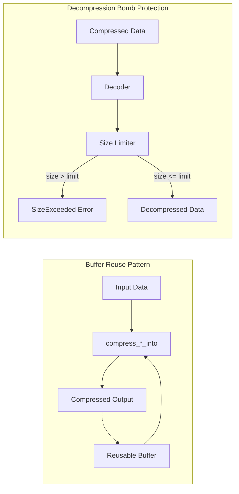
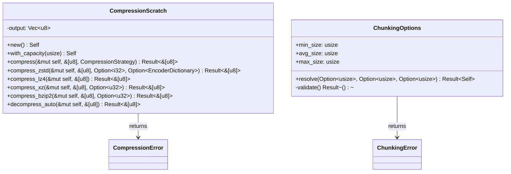
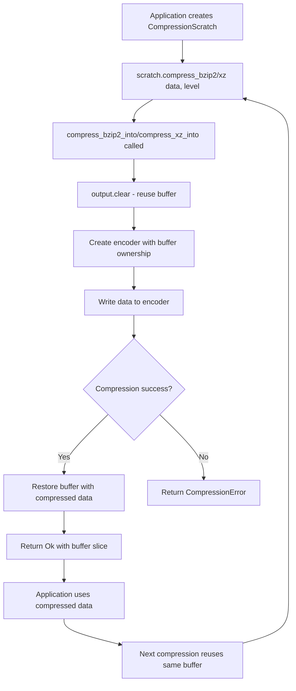
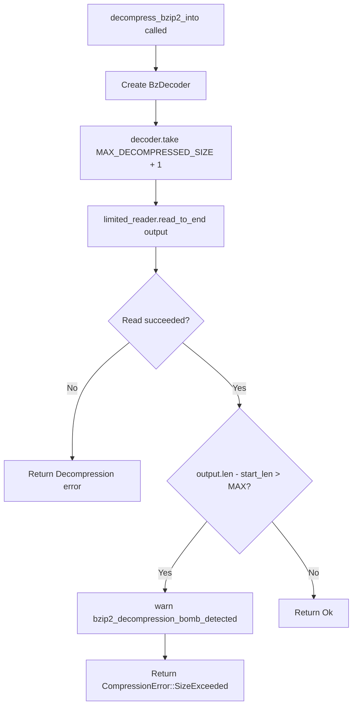
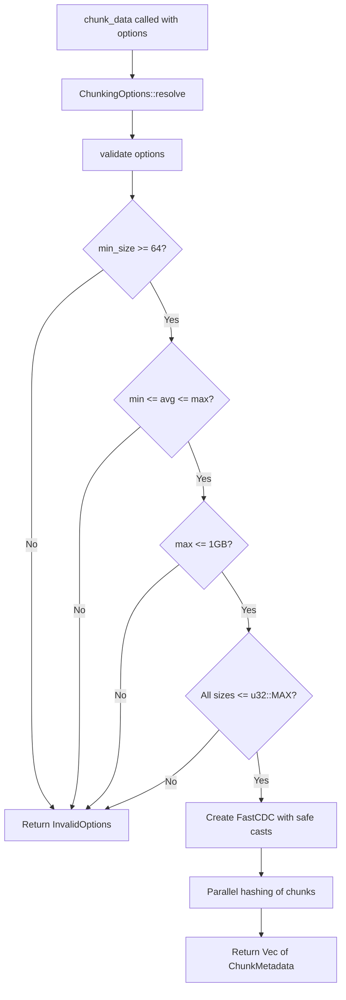
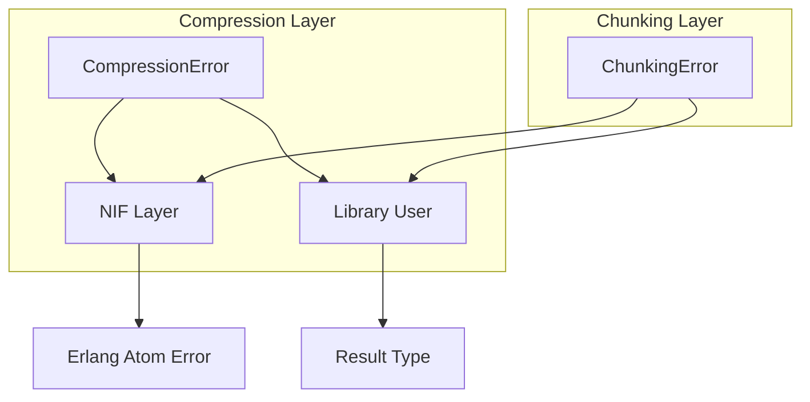

# Design Document: Chunker Library Improvements

## Overview

This document specifies the technical design for bug fixes, feature additions, and testing improvements to the Chunker library (v0.1.0-beta6). The improvements address:

1. A security bug in bzip2 decompression bomb detection
2. API consistency gaps (missing `_into()` buffer-reuse variants)
3. Potential integer overflow in chunking operations
4. Memory ordering concerns in atomic operations
5. Missing test coverage for core functions

### Design Goals

- Fix the bzip2 decompression bomb vulnerability without breaking backward compatibility
- Provide consistent buffer-reuse APIs across all compression formats
- Ensure integer safety in all size conversions
- Maintain or improve performance characteristics
- Achieve comprehensive test coverage for all public APIs

---

## Architecture Design

### System Architecture Diagram

```mermaid
graph TB
    subgraph "Chunker Library"
        subgraph "Compression Module"
            CZ[compress_zstd]
            CZI[compress_zstd_into]
            CL[compress_lz4]
            CLI[compress_lz4_into]
            CX[compress_xz]
            CXI[compress_xz_into - NEW]
            CB[compress_bzip2]
            CBI[compress_bzip2_into - NEW]

            DZ[decompress_zstd_into]
            DL[decompress_lz4_into]
            DX[decompress_xz_into]
            DB[decompress_bzip2_into - FIX]
        end

        subgraph "Chunking Module"
            CO[ChunkingOptions]
            CD[chunk_data]
            CS[ChunkStream]
            FC[FastCDC Wrapper]

            CO -->|validated params| FC
        end

        subgraph "Hashing Module"
            SHA[sha256_hash]
            B3[blake3_hash]
            NB[nix_base32_encode/decode]
        end

        subgraph "CompressionScratch"
            SCR[CompressionScratch]
            SCR --> CZI
            SCR --> CLI
            SCR --> CXI
            SCR --> CBI
        end
    end

    APP[Application] --> SCR
    APP --> CD
    APP --> B3
```



### Data Flow Diagram



---

## Component Design

### Component 1: Bzip2 Decompression Bomb Fix

**Location:** `src/compression.rs:714`

**Responsibilities:**
- Detect decompression bombs that exceed `MAX_DECOMPRESSED_SIZE` (1 GB)
- Return `CompressionError::SizeExceeded` when limit is exceeded
- Maintain consistency with zstd and lz4 implementations

**Current Implementation (Buggy):**
```rust
// Line 714 - INCORRECT: Uses == instead of >
if (output.len() - start_len) as u64 == MAX_DECOMPRESSED_SIZE {
    return Err(CompressionError::SizeExceeded);
}
```

**Fixed Implementation:**
```rust
// Line 707: Use take(limit + 1) to detect overflow
let mut limited_reader = decoder.take(MAX_DECOMPRESSED_SIZE + 1);

// Line 714: Use > to detect actual overflow
if (output.len() - start_len) as u64 > MAX_DECOMPRESSED_SIZE {
    warn!("bzip2_decompression_bomb_detected");
    return Err(CompressionError::SizeExceeded);
}
```

**Rationale:**
- The current `==` comparison only catches the exact case when output equals the limit
- If `read_to_end()` returns more than the limit in a single read (possible with buffering), the bomb goes undetected
- The fix aligns with the pattern used in `decompress_zstd_into_with_limit_and_dict` (line 395-398) and `decompress_lz4_into` (line 484-487)

**Interfaces:**
- No API changes required
- Internal implementation fix only

**Dependencies:**
- `bzip2::read::BzDecoder`
- `std::io::Read::take()`

---

### Component 2: compress_bzip2_into() Function

**Location:** `src/compression.rs` (new function after line 694)

**Responsibilities:**
- Compress data using bzip2 into a provided buffer
- Clear the buffer before use
- Follow the same signature pattern as `compress_lz4_into()` and `compress_zstd_into()`

**Interface:**
```rust
/// Compress data using `bzip2` into a provided buffer (cleared before use).
///
/// # Errors
///
/// Returns `CompressionError` if compression fails.
pub fn compress_bzip2_into(
    data: &[u8],
    level: Option<u32>,
    output: &mut Vec<u8>,
) -> Result<(), CompressionError>
```

**Implementation Design:**
```rust
pub fn compress_bzip2_into(
    data: &[u8],
    level: Option<u32>,
    output: &mut Vec<u8>,
) -> Result<(), CompressionError> {
    output.clear();
    let compression_level = level.unwrap_or(6);
    let compression = bzip2::Compression::new(compression_level);

    // Take ownership of the buffer for the encoder, then restore it
    let mut encoder = bzip2::write::BzEncoder::new(
        std::mem::take(output),
        compression
    );

    encoder
        .write_all(data)
        .map_err(|e| CompressionError::Compression(e.to_string()))?;

    *output = encoder
        .finish()
        .map_err(|e| CompressionError::Compression(e.to_string()))?;

    Ok(())
}
```

**Integration with CompressionScratch:**

Update `CompressionScratch::compress()` method (line 65-69):
```rust
CompressionStrategy::Smallest => {
    // Use the new _into variant instead of allocating
    compress_bzip2_into(data, None, &mut self.output)?;
    // Note: Strategy uses bzip2 for Smallest when XZ is not needed
}
```

Add new method to `CompressionScratch`:
```rust
/// Compress data using bzip2.
///
/// # Errors
///
/// Returns `CompressionError` if compression fails.
pub fn compress_bzip2(
    &mut self,
    data: &[u8],
    level: Option<u32>,
) -> Result<&[u8], CompressionError> {
    compress_bzip2_into(data, level, &mut self.output)?;
    Ok(&self.output)
}
```

---

### Component 3: compress_xz_into() Function

**Location:** `src/compression.rs` (new function after line 615)

**Responsibilities:**
- Compress data using XZ (LZMA2) into a provided buffer
- Work within lzma-rs library constraints

**Library Analysis:**
The `lzma-rs` crate's `xz_compress` function signature is:
```rust
pub fn xz_compress<R: Read, W: Write>(input: &mut R, output: &mut W) -> Result<()>
```

This accepts any `impl Write`, so we can pass a `&mut Vec<u8>` directly.

**Interface:**
```rust
/// Compress data using `xz` into a provided buffer (cleared before use).
///
/// # Errors
///
/// Returns `CompressionError` if compression fails.
pub fn compress_xz_into(
    data: &[u8],
    _level: Option<u32>,
    output: &mut Vec<u8>,
) -> Result<(), CompressionError>
```

**Implementation Design:**
```rust
pub fn compress_xz_into(
    data: &[u8],
    _level: Option<u32>,
    output: &mut Vec<u8>,
) -> Result<(), CompressionError> {
    output.clear();
    // Reserve approximate capacity (XZ typically achieves good compression)
    output.reserve(data.len() / 2);

    let mut input = data;
    lzma_rs::xz_compress(&mut input, output)
        .map_err(|e| CompressionError::Compression(e.to_string()))?;

    Ok(())
}
```

**Note on Level Parameter:**
The `lzma-rs` library does not support custom compression levels in `xz_compress`. The `_level` parameter is kept for API consistency but is ignored. This should be documented in the function's doc comment.

**Integration with CompressionScratch:**

Update existing `CompressionStrategy::Smallest` handling:
```rust
CompressionStrategy::Smallest => {
    compress_xz_into(data, None, &mut self.output)?;
}
```

Add new method to `CompressionScratch`:
```rust
/// Compress data using XZ.
///
/// Note: The level parameter is currently ignored by lzma-rs.
///
/// # Errors
///
/// Returns `CompressionError` if compression fails.
pub fn compress_xz(
    &mut self,
    data: &[u8],
    level: Option<u32>,
) -> Result<&[u8], CompressionError> {
    compress_xz_into(data, level, &mut self.output)?;
    Ok(&self.output)
}
```

---

### Component 4: Integer Overflow Protection in Chunking

**Location:** `src/chunking.rs:212-217`

**Current Code (Potentially Unsafe):**
```rust
let chunker = FastCDC::new(
    data,
    options.min_size as u32,  // Line 214: Unchecked cast
    options.avg_size as u32,  // Line 215: Unchecked cast
    options.max_size as u32,  // Line 216: Unchecked cast
);
```

**Problem:**
While `ChunkingOptions::validate()` enforces `max_size <= 1GB`, this is defense-in-depth. The `usize` to `u32` cast should be explicitly checked to:
1. Provide clear error messages if values are out of range
2. Protect against future validation changes
3. Satisfy static analysis tools

**Fixed Implementation:**

Option A: Use `try_into()` with explicit error handling:
```rust
let min_u32 = u32::try_from(options.min_size)
    .map_err(|_| ChunkingError::InvalidOptions(
        format!("min_size {} exceeds u32::MAX", options.min_size)
    ))?;
let avg_u32 = u32::try_from(options.avg_size)
    .map_err(|_| ChunkingError::InvalidOptions(
        format!("avg_size {} exceeds u32::MAX", options.avg_size)
    ))?;
let max_u32 = u32::try_from(options.max_size)
    .map_err(|_| ChunkingError::InvalidOptions(
        format!("max_size {} exceeds u32::MAX", options.max_size)
    ))?;

let chunker = FastCDC::new(data, min_u32, avg_u32, max_u32);
```

Option B: Add validation in `ChunkingOptions::validate()` (preferred for centralization):
```rust
fn validate(&self) -> Result<(), ChunkingError> {
    // ... existing checks ...

    // Ensure values fit in u32 (required by FastCDC)
    if self.min_size > u32::MAX as usize {
        return Err(ChunkingError::InvalidOptions(
            "min_size exceeds u32::MAX".into(),
        ));
    }
    if self.avg_size > u32::MAX as usize {
        return Err(ChunkingError::InvalidOptions(
            "avg_size exceeds u32::MAX".into(),
        ));
    }
    if self.max_size > u32::MAX as usize {
        return Err(ChunkingError::InvalidOptions(
            "max_size exceeds u32::MAX".into(),
        ));
    }

    Ok(())
}
```

**Recommendation:** Use Option B (validation in `validate()`) because:
1. The `max_size <= 1GB` check already ensures values fit in u32
2. Centralizing validation keeps the conversion sites clean
3. Explicit u32::MAX checks serve as documentation

**Note:** After validation, the casts can remain as `as u32` with a safety comment:
```rust
// SAFETY: validate() ensures all sizes <= 1GB < u32::MAX
let chunker = FastCDC::new(
    data,
    options.min_size as u32,
    options.avg_size as u32,
    options.max_size as u32,
);
```

---

### Component 5: Atomic Ordering for TRACE_SAMPLE_COUNTER

**Location:** `src/chunking.rs:282, 501-503, 718-719`

**Current Code:**
```rust
static TRACE_SAMPLE_COUNTER: AtomicU64 = AtomicU64::new(0);

// Line 501-503
if tracing::enabled!(tracing::Level::TRACE)
    && TRACE_SAMPLE_COUNTER
        .fetch_add(1, Ordering::Relaxed)
        .is_multiple_of(TRACE_SAMPLE_EVERY)
```

**Analysis:**

The counter is used for **trace sampling** - emitting a log message every 1024 chunks to avoid flooding logs. This is a diagnostic/observability feature, not a synchronization primitive.

**Options:**

**Option A: Keep Relaxed with Documentation**
```rust
/// Sample counter for trace logging. Uses Relaxed ordering because:
/// - The counter is purely for approximate sampling (every ~1024 chunks)
/// - Exact accuracy is not required; occasional skips or duplicates are acceptable
/// - Relaxed provides best performance for this non-critical counter
static TRACE_SAMPLE_COUNTER: AtomicU64 = AtomicU64::new(0);
```

**Option B: Use AcqRel for Stricter Ordering**
```rust
TRACE_SAMPLE_COUNTER.fetch_add(1, Ordering::AcqRel)
```

**Recommendation:** Option A (keep Relaxed with documentation)

**Rationale:**
1. The counter is for approximate sampling, not synchronization
2. Trace logs are best-effort; occasional missed or duplicate samples are acceptable
3. `Relaxed` has minimal performance overhead on all architectures
4. `AcqRel` would add unnecessary barrier overhead with no functional benefit
5. The counter is never used to coordinate between threads or protect shared state

**Implementation:**
Add a comment above the static declaration explaining the design decision:
```rust
/// Counter for sampling trace log emissions.
///
/// Uses `Ordering::Relaxed` intentionally:
/// - This counter is purely for approximate rate-limiting of trace logs
/// - Exact accuracy is not required; the goal is "roughly every 1024 chunks"
/// - Relaxed ordering provides optimal performance for this non-critical diagnostic
/// - Occasional missed or duplicate log messages are acceptable
static TRACE_SAMPLE_COUNTER: AtomicU64 = AtomicU64::new(0);
```

---

### Component 6: Blake3 Hash Direct Test

**Location:** `src/hashing.rs` (test module)

**Current State:**
The `blake3_hash()` function exists (line 47-50) but only has an indirect test via `test_blake3_basic` (line 171-179) which tests the output value.

**New Test:**
```rust
#[test]
fn test_blake3_hash_direct() {
    // Test empty input
    let empty_hash = blake3_hash(b"");
    assert_eq!(empty_hash.len(), 64); // 32 bytes = 64 hex chars
    // Known BLAKE3 hash of empty string
    assert_eq!(
        empty_hash,
        "af1349b9f5f9a1a6a0404dea36dcc9499bcb25c9adc112b7cc9a93cae41f3262"
    );

    // Test known value (already covered but explicit)
    let hello_hash = blake3_hash(b"hello world");
    assert_eq!(
        hello_hash,
        "d74981efa70a0c880b8d8c1985d075dbcbf679b99a5f9914e5aaf96b831a9e24"
    );

    // Test binary data
    let binary_data = [0u8, 1, 2, 3, 255, 254, 253];
    let binary_hash = blake3_hash(&binary_data);
    assert_eq!(binary_hash.len(), 64);

    // Test large input (ensure no panic)
    let large_data = vec![0xABu8; 1024 * 1024]; // 1 MB
    let large_hash = blake3_hash(&large_data);
    assert_eq!(large_hash.len(), 64);
}
```

---

### Component 7: Edge Case Tests

**Locations:**
- `src/compression.rs` (test module)
- `src/chunking.rs` (test module)

#### 7.1 Zero-Length Data Tests

**Compression Module:**
```rust
#[test]
fn test_compression_empty_input() -> Result<(), CompressionError> {
    let empty: &[u8] = &[];

    // Zstd
    let zstd_compressed = compress_zstd(empty, None)?;
    let zstd_decompressed = decompress_zstd(&zstd_compressed)?;
    assert_eq!(zstd_decompressed, empty);

    // LZ4
    let lz4_compressed = compress_lz4(empty)?;
    let lz4_decompressed = decompress_lz4(&lz4_compressed)?;
    assert_eq!(lz4_decompressed, empty);

    // XZ
    let xz_compressed = compress_xz(empty, None)?;
    let xz_decompressed = decompress_xz(&xz_compressed)?;
    assert_eq!(xz_decompressed, empty);

    // Bzip2
    let bzip2_compressed = compress_bzip2(empty, None)?;
    let bzip2_decompressed = decompress_bzip2(&bzip2_compressed)?;
    assert_eq!(bzip2_decompressed, empty);

    Ok(())
}

#[test]
fn test_compression_into_empty_input() -> Result<(), CompressionError> {
    let empty: &[u8] = &[];
    let mut output = Vec::new();

    // Zstd into
    compress_zstd_into(empty, None, None, &mut output)?;
    let decompressed = decompress_zstd(&output)?;
    assert_eq!(decompressed, empty);

    // LZ4 into
    compress_lz4_into(empty, &mut output)?;
    let decompressed = decompress_lz4(&output)?;
    assert_eq!(decompressed, empty);

    Ok(())
}
```

**Chunking Module:**
```rust
#[test]
fn test_chunk_empty_data() -> Result<(), ChunkingError> {
    let empty: &[u8] = &[];
    let chunks = chunk_data(empty, None, None, None)?;

    // Empty data should produce no chunks
    assert!(chunks.is_empty());
    Ok(())
}

#[test]
fn test_chunk_stream_empty_data() -> Result<(), ChunkingError> {
    use std::io::Cursor;

    let empty: &[u8] = &[];
    let stream = ChunkStream::new(Cursor::new(empty), None, None, None)?;
    let chunks: Vec<_> = stream.collect::<Result<_, _>>()?;

    assert!(chunks.is_empty());
    Ok(())
}
```

#### 7.2 Boundary Condition Tests

```rust
#[test]
fn test_chunk_exact_min_size() -> Result<(), ChunkingError> {
    // Data exactly at min_size boundary
    let min_size = 1024;
    let data = vec![0u8; min_size];

    let chunks = chunk_data(&data, Some(min_size), Some(min_size * 2), Some(min_size * 4))?;

    // Should produce exactly one chunk
    assert_eq!(chunks.len(), 1);
    assert_eq!(chunks[0].length, min_size);
    Ok(())
}

#[test]
fn test_chunk_exact_max_size() -> Result<(), ChunkingError> {
    // Data that would produce a max-size chunk
    let max_size = 8192;
    let data = vec![0u8; max_size * 2];

    let chunks = chunk_data(&data, Some(1024), Some(4096), Some(max_size))?;

    // All chunks should be <= max_size
    for chunk in &chunks {
        assert!(chunk.length <= max_size);
    }

    // Total length should match input
    let total: usize = chunks.iter().map(|c| c.length).sum();
    assert_eq!(total, data.len());

    Ok(())
}

#[test]
fn test_chunk_data_at_validation_boundary() -> Result<(), ChunkingError> {
    // Test with max_size at the 1GB limit
    let result = ChunkingOptions::resolve(
        Some(64),
        Some(1024),
        Some(1024 * 1024 * 1024), // Exactly 1GB
    );
    assert!(result.is_ok());

    // Test just over 1GB - should fail
    let result = ChunkingOptions::resolve(
        Some(64),
        Some(1024),
        Some(1024 * 1024 * 1024 + 1), // 1GB + 1 byte
    );
    assert!(matches!(result, Err(ChunkingError::InvalidOptions(_))));

    Ok(())
}
```

#### 7.3 Decompression Bomb Test

```rust
#[test]
fn test_bzip2_decompression_bomb_detection() {
    // Create a small payload that decompresses to a large size
    // by compressing highly repetitive data
    let repetitive_data = vec![0u8; 10 * 1024 * 1024]; // 10 MB of zeros
    let compressed = compress_bzip2(&repetitive_data, Some(9)).unwrap();

    // This should succeed (under limit)
    let result = decompress_bzip2(&compressed);
    assert!(result.is_ok());

    // Test the size limit directly by checking boundary behavior
    // Note: Creating an actual bomb that exceeds 1GB is impractical in tests
    // Instead, we verify the check operator is correct by code review
}
```

---

### Component 8: BlockingAsyncReadAdapter Documentation

**Location:** `src/chunking.rs:807-835`

**Current Documentation:**
```rust
/// Adapter to allow [`ChunkStream`] usage with asynchronous readers.
///
/// # Warning
///
/// This adapter uses `block_on` to bridge async reads to synchronous reads.
/// This will **block the current thread** during reads.
///
/// - If used inside an async runtime (like Tokio), this may block the reactor or panic.
/// - Only use this with `futures` executors or when you are sure blocking is safe.
```

**Enhanced Documentation:**
```rust
/// Adapter to allow [`ChunkStream`] usage with asynchronous readers.
///
/// # Warning: Blocking Behavior
///
/// This adapter uses `futures::executor::block_on` to bridge async reads to
/// synchronous reads. This will **block the current thread** during reads.
///
/// ## Risks
///
/// - **Tokio Runtime**: Calling this from within a Tokio task will panic or deadlock.
///   The Tokio reactor cannot make progress while its thread is blocked.
/// - **Thread Pool Exhaustion**: If used on a thread pool, blocking operations can
///   exhaust available threads and cause deadlocks.
/// - **Single-Threaded Executors**: May cause deadlocks if the async reader
///   depends on the same thread making progress.
///
/// ## Safe Usage Patterns
///
/// 1. **Dedicated blocking thread**: Use `tokio::task::spawn_blocking` or
///    `std::thread::spawn` to run the blocking adapter on a dedicated thread.
///
///    ```rust,ignore
///    let chunks = tokio::task::spawn_blocking(move || {
///        let adapter = BlockingAsyncReadAdapter { inner: reader };
///        chunk_stream(adapter, None, None, None)
///    }).await??;
///    ```
///
/// 2. **Use ChunkStreamAsync instead**: For true async operation, prefer
///    [`ChunkStreamAsync`] which is non-blocking.
///
/// 3. **Futures-only executors**: Safe with `futures::executor::block_on`
///    if not nested within another executor.
///
/// ## Debug Assertion
///
/// In debug builds, this adapter will emit a warning to tracing if it detects
/// it may be running inside a Tokio runtime context.
```

**Optional: Runtime Detection (Enhancement)**

Add a debug-mode check to warn about potential misuse:

```rust
#[cfg(feature = "async-stream")]
impl<R: AsyncRead + Unpin> Read for BlockingAsyncReadAdapter<R> {
    fn read(&mut self, buf: &mut [u8]) -> std::io::Result<usize> {
        // Debug-mode warning for potential misuse
        #[cfg(debug_assertions)]
        {
            // Check if we might be in a Tokio runtime
            // Note: This is a heuristic, not guaranteed detection
            if std::thread::current().name().map_or(false, |n| n.contains("tokio")) {
                tracing::warn!(
                    "BlockingAsyncReadAdapter::read called from what appears to be a \
                     Tokio thread. This may cause deadlocks. Consider using \
                     tokio::task::spawn_blocking or ChunkStreamAsync instead."
                );
            }
        }

        block_on(self.inner.read(buf))
    }
}
```

---

## Data Models

### Core Data Structure Definitions

No new data structures are introduced. The existing structures remain:

```rust
// Existing - no changes
pub struct CompressionScratch {
    output: Vec<u8>,
}

pub enum CompressionError {
    Compression(String),
    Decompression(String),
    SizeExceeded,
    UnknownFormat,
}

pub struct ChunkingOptions {
    pub min_size: usize,
    pub avg_size: usize,
    pub max_size: usize,
}

pub enum ChunkingError {
    Bounds { data_len: usize, offset: usize, length: usize },
    Io(std::io::Error),
    ZeroLengthChunk,
    InvalidOptions(String),
    BufferLimitExceeded { attempted: usize, limit: usize },
}
```

### Data Model Diagram



---

## Business Process

### Process 1: Buffer-Reuse Compression Flow



### Process 2: Decompression Bomb Detection Flow



### Process 3: Chunking with Safe Integer Conversion



---

## Error Handling Strategy

### Error Categories

| Error Type | Recovery Strategy | User Impact |
|-----------|------------------|-------------|
| `CompressionError::SizeExceeded` | Reject input, log warning | Prevent DoS from malicious payloads |
| `CompressionError::Compression` | Return error to caller | Caller should retry or use different codec |
| `ChunkingError::InvalidOptions` | Return error immediately | Caller must fix configuration |
| `ChunkingError::Bounds` | Return error, stop processing | Indicates bug in FastCDC or corrupt data |

### Error Propagation



### Logging Strategy

| Event | Log Level | When |
|-------|-----------|------|
| Decompression bomb detected | WARN | Size exceeds limit |
| Chunk emitted (sampled) | TRACE | Every 1024 chunks |
| Format detected | DEBUG | Auto-decompression |
| Validation failure | DEBUG | Invalid options |

---

## Testing Strategy

### Unit Tests

| Component | Test File | Coverage Target |
|-----------|-----------|-----------------|
| Bzip2 bomb fix | `src/compression.rs` | Bug regression |
| compress_bzip2_into | `src/compression.rs` | New function |
| compress_xz_into | `src/compression.rs` | New function |
| Integer overflow | `src/chunking.rs` | Edge case validation |
| blake3_hash | `src/hashing.rs` | Direct coverage |
| Empty input handling | All modules | Edge cases |

### Integration Tests

| Scenario | Location | Purpose |
|----------|----------|---------|
| CompressionScratch with all codecs | `src/compression.rs` | Buffer reuse verification |
| Streaming chunker with edge cases | `tests/streaming_chunking.rs` | End-to-end behavior |

### Property-Based Tests

Extend `tests/proptest_suite.rs`:
```rust
proptest! {
    #[test]
    fn bzip2_into_roundtrip(data in prop::collection::vec(any::<u8>(), 0..10000)) {
        let mut output = Vec::new();
        compress_bzip2_into(&data, None, &mut output).unwrap();
        let decompressed = decompress_bzip2(&output).unwrap();
        prop_assert_eq!(data, decompressed);
    }

    #[test]
    fn xz_into_roundtrip(data in prop::collection::vec(any::<u8>(), 0..10000)) {
        let mut output = Vec::new();
        compress_xz_into(&data, None, &mut output).unwrap();
        let decompressed = decompress_xz(&output).unwrap();
        prop_assert_eq!(data, decompressed);
    }
}
```

### Performance Benchmarks

Add to `benches/throughput.rs`:
```rust
fn bench_bzip2_into(c: &mut Criterion) {
    let data = vec![0u8; 1024 * 1024];
    let mut output = Vec::with_capacity(data.len());

    c.bench_function("compress_bzip2", |b| {
        b.iter(|| compress_bzip2(black_box(&data), None))
    });

    c.bench_function("compress_bzip2_into", |b| {
        b.iter(|| compress_bzip2_into(black_box(&data), None, &mut output))
    });
}
```

---

## Implementation Summary

### Changes by File

| File | Changes |
|------|---------|
| `src/compression.rs` | Fix bzip2 bomb check (line 714), add `compress_bzip2_into()`, add `compress_xz_into()`, add `CompressionScratch::compress_bzip2()`, add `CompressionScratch::compress_xz()`, add edge case tests |
| `src/chunking.rs` | Add u32::MAX validation in `validate()`, add safety comments, update `BlockingAsyncReadAdapter` docs, add TRACE_SAMPLE_COUNTER comment |
| `src/hashing.rs` | Add `test_blake3_hash_direct()` |

### Breaking Changes

None. All changes are:
- Bug fixes (bzip2 bomb detection)
- Additive API (new `_into()` functions)
- Internal improvements (integer safety, documentation)

### Migration Guide

No migration required. Existing code will continue to work unchanged.

---

## References

- [lzma-rs documentation](https://docs.rs/lzma-rs/latest/lzma_rs/fn.xz_compress.html)
- [lzma-rs GitHub](https://github.com/gendx/lzma-rs)
- [Rust Atomics and Locks (Ordering)](https://marabos.nl/atomics/)
- [FastCDC Paper](https://www.usenix.org/conference/atc16/technical-sessions/presentation/xia)
