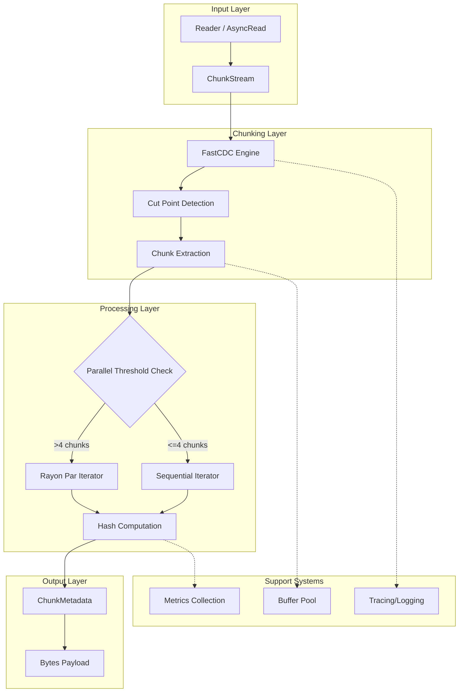
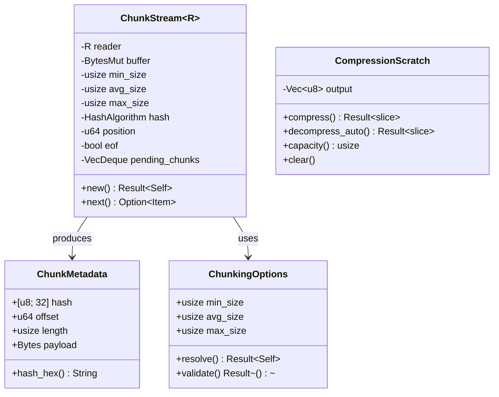
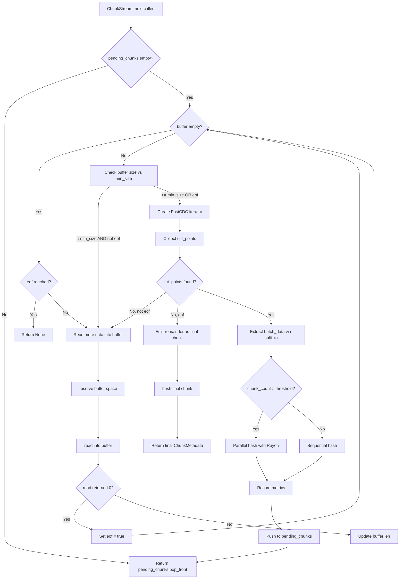
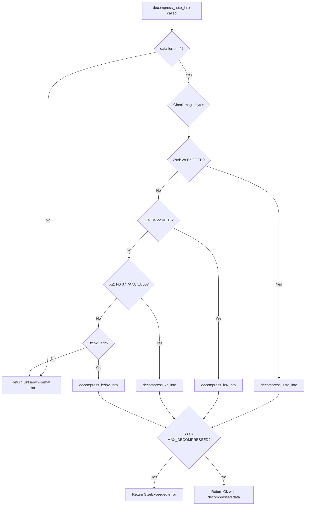

# Design Document: Chunker Library World-Class Performance Improvements

## Overview

This document provides detailed design specifications for implementing world-class performance improvements to the Chunker library. The design focuses on three critical categories:

1. **Critical Bug Fixes (BUG-001, BUG-002)** - Security and correctness issues requiring immediate attention
2. **Hot Path Optimizations (HOT-001 through HOT-007)** - Performance improvements in frequently executed code paths
3. **Memory & Allocation (MEM-001 through MEM-006)** - Reducing heap allocations and improving memory efficiency

**Target Performance Characteristics:**
- FastCDC chunking: >= 2.5 GB/s
- BLAKE3 hashing: >= 3-5 GB/s (multi-core with SIMD)
- SHA256 hashing: >= 1 GB/s (with SHA-NI)
- End-to-end pipeline: >= 300 MB/s
- Per-chunk latency: < 1 microsecond (excluding I/O)

---

## Architecture Design

### System Architecture Diagram



### Data Flow Diagram

```mermaid
graph LR
    subgraph Read Phase
        A[Input Data] -->|read()| B[BytesMut Buffer]
    end

    subgraph Chunking Phase
        B -->|FastCDC::new()| C[Cut Points Vec]
        C -->|split_to()| D[Bytes Slice]
    end

    subgraph Hash Phase
        D -->|SHA256/BLAKE3| E[Hash Array 32B]
    end

    subgraph Output Phase
        D --> F[ChunkMetadata]
        E --> F
        F --> G[VecDeque Pending]
        G --> H[Iterator Output]
    end
```

---

## Component Design

### Component: ChunkStream

**Responsibilities:**
- Manage streaming reads from any `Read` implementation
- Buffer management with `BytesMut` slab strategy
- FastCDC integration for cut-point detection
- Parallel/sequential hash computation dispatch
- Metrics and tracing instrumentation

**Current Interfaces:**
```rust
pub struct ChunkStream<R: Read> {
    reader: R,
    buffer: BytesMut,
    min_size: usize,
    avg_size: usize,
    max_size: usize,
    hash: HashAlgorithm,
    position: u64,
    eof: bool,
    pending_chunks: VecDeque<Result<ChunkMetadata, ChunkingError>>,
}

impl<R: Read> ChunkStream<R> {
    pub fn new(...) -> Result<Self, ChunkingError>;
    pub fn new_with_hash(...) -> Result<Self, ChunkingError>;
}

impl<R: Read> Iterator for ChunkStream<R> {
    type Item = Result<ChunkMetadata, ChunkingError>;
    fn next(&mut self) -> Option<Self::Item>;
}
```

**Dependencies:**
- `fastcdc::v2020::FastCDC`
- `bytes::{Bytes, BytesMut}`
- `sha2::Sha256`
- `blake3`
- `rayon::prelude::*`

### Component: CompressionScratch

**Responsibilities:**
- Reusable buffer management for compression operations
- Multi-codec support (Zstd, LZ4, XZ, Bzip2)
- Decompression bomb protection

**Interfaces:**
```rust
pub struct CompressionScratch {
    output: Vec<u8>,
}

impl CompressionScratch {
    pub fn compress(&mut self, data: &[u8], strategy: CompressionStrategy) -> Result<&[u8], CompressionError>;
    pub fn decompress_auto(&mut self, data: &[u8]) -> Result<&[u8], CompressionError>;
}
```

### Component: Hashing Module

**Responsibilities:**
- SHA256 and BLAKE3 hash computation
- Nix base32 encoding/decoding
- Worker thread management for parallel hashing

**Interfaces:**
```rust
pub fn sha256_hash_raw(data: &[u8]) -> [u8; 32];
pub fn blake3_hash(data: &[u8]) -> String;
pub fn nix_base32_encode(data: &[u8]) -> String;
pub fn nix_base32_decode(encoded: &str) -> Result<Vec<u8>, HashingError>;
```

---

## Data Models

### Core Data Structures

```rust
/// Metadata for a single chunk emitted by streaming chunkers.
#[derive(Debug, Clone, Serialize, Deserialize)]
pub struct ChunkMetadata {
    pub hash: [u8; 32],      // 32 bytes - hot field
    pub offset: u64,          // 8 bytes - hot field
    pub length: usize,        // 8 bytes - hot field
    pub payload: Bytes,       // 24 bytes (ptr + len + cap) - cold field
}
// Total: 72 bytes per chunk

/// Configurable bounds for FastCDC chunking.
#[derive(Debug, Clone, Copy)]
pub struct ChunkingOptions {
    pub min_size: usize,
    pub avg_size: usize,
    pub max_size: usize,
}
```

### Data Model Diagram



---

## Critical Bug Fixes

### BUG-001: Bzip2 Decompression Bomb Detection

**Location:** `compression.rs:714`

**Current Implementation Analysis:**

```rust
// compression.rs:703-716
pub fn decompress_bzip2_into(data: &[u8], output: &mut Vec<u8>) -> Result<(), CompressionError> {
    let decoder = bzip2::read::BzDecoder::new(data);
    let mut limited_reader = decoder.take(MAX_DECOMPRESSED_SIZE);
    let start_len = output.len();
    let _bytes_read = limited_reader
        .read_to_end(output)
        .map_err(|e| CompressionError::Decompression(e.to_string()))?;

    // BUG: Uses == instead of >=
    if (output.len() - start_len) as u64 == MAX_DECOMPRESSED_SIZE {
        return Err(CompressionError::SizeExceeded);
    }
    Ok(())
}
```

**Problem:**
The current check `== MAX_DECOMPRESSED_SIZE` fails to detect decompression bombs when:
1. The decompressed data is exactly `MAX_DECOMPRESSED_SIZE` bytes (false positive - rejects legitimate data)
2. Cannot distinguish between "exactly at limit" and "exceeded limit"

**Proposed Changes:**

```rust
/// Decompress `bzip2` data into a provided buffer.
/// Protected against decompression bombs with `MAX_DECOMPRESSED_SIZE` limit
pub fn decompress_bzip2_into(data: &[u8], output: &mut Vec<u8>) -> Result<(), CompressionError> {
    let decoder = bzip2::read::BzDecoder::new(data);

    // Key fix: Read limit + 1 to detect overflow
    let mut limited_reader = decoder.take(MAX_DECOMPRESSED_SIZE + 1);
    let start_len = output.len();
    let _bytes_read = limited_reader
        .read_to_end(output)
        .map_err(|e| CompressionError::Decompression(e.to_string()))?;

    // Check if we exceeded the limit (read more than MAX)
    if (output.len() - start_len) as u64 > MAX_DECOMPRESSED_SIZE {
        warn!("bzip2_decompression_bomb_detected");
        return Err(CompressionError::SizeExceeded);
    }

    debug!(
        decompressed_len = output.len() - start_len,
        "bzip2_decompression_complete"
    );
    Ok(())
}
```

**Consistency with Other Codecs:**

The fix aligns with the pattern used in `decompress_zstd_into_with_limit` (line 389-398) and `decompress_lz4_into` (line 477-487):

```rust
// Existing correct pattern in zstd (line 389-398):
let mut limited_reader = decoder.take(limit + 1);
// ...
if (output.len() - start_len) as u64 > limit {
    warn!("zstd_decompression_bomb_detected");
    return Err(CompressionError::SizeExceeded);
}
```

**Expected Performance Impact:** None - this is a correctness fix.

**Risk Assessment:** Low
- Change is minimal and follows established patterns
- Improves security without affecting normal operation
- Test cases should verify both legitimate 1GB files and bomb detection

---

### BUG-002: Integer Overflow in FastCDC Size Casting

**Location:** `chunking.rs:214-216`

**Current Implementation Analysis:**

```rust
// chunking.rs:212-217
let chunker = FastCDC::new(
    data,
    options.min_size as u32,  // Potential overflow
    options.avg_size as u32,  // Potential overflow
    options.max_size as u32,  // Potential overflow
);
```

**Problem:**
On 64-bit platforms, `usize` is 64 bits but FastCDC expects `u32`. If any size parameter exceeds `u32::MAX` (4,294,967,295), the cast silently truncates, leading to undefined behavior.

**Proposed Changes:**

**Step 1: Add overflow validation to ChunkingOptions::validate()**

```rust
impl ChunkingOptions {
    fn validate(&self) -> Result<(), ChunkingError> {
        // Existing validations...
        if self.min_size < 64 {
            return Err(ChunkingError::InvalidOptions(
                "min_size must be >= 64".into(),
            ));
        }
        if self.min_size > self.avg_size {
            return Err(ChunkingError::InvalidOptions(
                "min_size must be <= avg_size".into(),
            ));
        }
        if self.avg_size > self.max_size {
            return Err(ChunkingError::InvalidOptions(
                "avg_size must be <= max_size".into(),
            ));
        }
        if self.max_size > 1024 * 1024 * 1024 {
            return Err(ChunkingError::InvalidOptions(
                "max_size must be <= 1GB".into(),
            ));
        }

        // NEW: Add u32 overflow protection
        if self.min_size > u32::MAX as usize {
            return Err(ChunkingError::InvalidOptions(
                format!("min_size {} exceeds u32::MAX", self.min_size),
            ));
        }
        if self.avg_size > u32::MAX as usize {
            return Err(ChunkingError::InvalidOptions(
                format!("avg_size {} exceeds u32::MAX", self.avg_size),
            ));
        }
        if self.max_size > u32::MAX as usize {
            return Err(ChunkingError::InvalidOptions(
                format!("max_size {} exceeds u32::MAX", self.max_size),
            ));
        }

        Ok(())
    }
}
```

**Step 2: Use TryFrom for explicit conversion**

```rust
// Helper function for safe casting
#[inline]
fn usize_to_u32(value: usize, name: &str) -> Result<u32, ChunkingError> {
    u32::try_from(value).map_err(|_| {
        ChunkingError::InvalidOptions(format!("{} {} exceeds u32::MAX", name, value))
    })
}

// In chunk_data_with_hash:
let chunker = FastCDC::new(
    data,
    usize_to_u32(options.min_size, "min_size")?,
    usize_to_u32(options.avg_size, "avg_size")?,
    usize_to_u32(options.max_size, "max_size")?,
);
```

**Step 3: Add checked arithmetic for offset + length (line 470-478)**

```rust
// Current code (line 469-478):
if offset
    .checked_add(len)
    .is_none_or(|end| end > batch_data.len())
{
    return Err(ChunkingError::Bounds {
        data_len: batch_data.len(),
        offset,
        length: len,
    });
}
```

This is already correct - the code uses `checked_add`. We should ensure the same pattern is used in line 230:

```rust
// Line 229-236 - already uses bounds check but could use checked_add:
let end = offset.checked_add(length).ok_or(ChunkingError::Bounds {
    data_len: data.len(),
    offset,
    length,
})?;

if end > data.len() {
    return Err(ChunkingError::Bounds {
        data_len: data.len(),
        offset,
        length,
    });
}
```

**Expected Performance Impact:** Negligible
- Validation happens once at initialization
- TryFrom is a single comparison, likely eliminated by compiler when max_size <= 1GB (already validated)

**Risk Assessment:** Low
- Adds safety without changing happy path
- The 1GB limit already prevents practical overflow, but explicit checks provide defense in depth

---

## Hot Path Optimizations

### HOT-001: FastCDC Construction Caching

**Location:** `chunking.rs:412-417`

**Current Implementation Analysis:**

```rust
// Inside Iterator::next() - called on every iteration
loop {
    if !self.buffer.is_empty() {
        // BUG: FastCDC::new() is called on EVERY next() call
        let cdc = FastCDC::new(
            &self.buffer,
            self.min_size as u32,
            self.avg_size as u32,
            self.max_size as u32,
        );
        // ...
    }
}
```

**Problem:**
`FastCDC::new()` performs internal initialization including gear table setup. While the gear table is static, the struct construction and iterator setup adds overhead on every `next()` call.

**Proposed Changes:**

**Option A: Cache FastCDC parameters as pre-converted u32**

```rust
pub struct ChunkStream<R: Read> {
    reader: R,
    buffer: BytesMut,
    // Cache as u32 to avoid repeated conversions
    min_size_u32: u32,
    avg_size_u32: u32,
    max_size_u32: u32,
    min_size: usize,  // Keep usize for comparisons
    max_size: usize,
    hash: HashAlgorithm,
    position: u64,
    eof: bool,
    pending_chunks: VecDeque<Result<ChunkMetadata, ChunkingError>>,
}

impl<R: Read> ChunkStream<R> {
    pub fn new_with_hash(...) -> Result<Self, ChunkingError> {
        let options = ChunkingOptions::resolve(min_size, avg_size, max_size)?;

        Ok(Self {
            reader,
            buffer: BytesMut::with_capacity(initial_capacity),
            // Pre-convert to u32 once
            min_size_u32: options.min_size as u32,
            avg_size_u32: options.avg_size as u32,
            max_size_u32: options.max_size as u32,
            min_size: options.min_size,
            max_size: options.max_size,
            // ...
        })
    }
}
```

**Option B: Skip FastCDC entirely for small buffers**

```rust
fn next(&mut self) -> Option<Self::Item> {
    // ...
    loop {
        if !self.buffer.is_empty() {
            // Skip FastCDC if buffer is smaller than min_size
            if self.buffer.len() < self.min_size && !self.eof {
                // Need more data - skip to read section
            } else {
                let cdc = FastCDC::new(
                    &self.buffer,
                    self.min_size_u32,
                    self.avg_size_u32,
                    self.max_size_u32,
                );
                // ...
            }
        }
    }
}
```

**Option C: Resumable chunking state (more complex)**

This would require modifications to the FastCDC crate to support resumable state, which is outside our control.

**Recommended Approach:** Option A + B combined

**Expected Performance Impact:** 5-10% reduction in per-chunk overhead
- Eliminates 3 `usize` to `u32` conversions per iteration
- Skips FastCDC construction when buffer is too small

**Risk Assessment:** Low
- Non-breaking change to internal structure
- Behavioral parity maintained

---

### HOT-002: Inline Critical Hot Path Functions

**Location:** `chunking.rs:465-513`, `hashing.rs:38-50`

**Current Implementation Analysis:**

```rust
// hashing.rs:38-42 - No inline hint
pub fn sha256_hash_raw(data: &[u8]) -> [u8; 32] {
    let mut hasher = Sha256::new();
    hasher.update(data);
    hasher.finalize().into()
}

// hashing.rs:47-50 - No inline hint
pub fn blake3_hash(data: &[u8]) -> String {
    let hash = blake3::hash(data);
    hash.to_hex().to_string()
}
```

**Problem:**
Critical functions called in tight loops lack inlining hints, causing function call overhead (register spills, stack frame setup).

**Proposed Changes:**

**hashing.rs:**

```rust
/// Compute SHA256 hash of data - Returns raw bytes
#[inline]
#[must_use]
pub fn sha256_hash_raw(data: &[u8]) -> [u8; 32] {
    let mut hasher = Sha256::new();
    hasher.update(data);
    hasher.finalize().into()
}

/// Compute BLAKE3 hash of data - Returns hex string
#[inline]
#[must_use]
pub fn blake3_hash(data: &[u8]) -> String {
    let hash = blake3::hash(data);
    hash.to_hex().to_string()
}
```

**chunking.rs - process_chunk closure:**

```rust
// The closure is already inlined by the compiler in most cases,
// but we can help by marking related functions

// Add to module level
#[inline(always)]
fn compute_hash(data: &[u8], algo: HashAlgorithm) -> [u8; 32] {
    match algo {
        HashAlgorithm::Sha256 => {
            let mut hasher = Sha256::new();
            hasher.update(data);
            hasher.finalize().into()
        }
        HashAlgorithm::Blake3 => blake3::hash(data).into(),
    }
}
```

**compression.rs - decompress_auto_into:**

```rust
/// Automatically detect compression format and decompress into a provided buffer.
#[inline]
pub fn decompress_auto_into(data: &[u8], output: &mut Vec<u8>) -> Result<(), CompressionError> {
    if data.len() < 4 {
        return Err(CompressionError::UnknownFormat);
    }
    // Magic bytes checks ordered by frequency (Zstd most common)
    // ...
}
```

**Expected Performance Impact:** 2-5% improvement in hash-bound workloads
- Eliminates function call overhead in tight loops
- Enables better register allocation across call boundaries

**Risk Assessment:** Very Low
- `#[inline]` is a hint, not a guarantee
- Compiler may already inline small functions
- No behavioral change

---

### HOT-003: Branch Prediction Optimization

**Location:** `chunking.rs:428-439, 446, 594-599`

**Current Implementation Analysis:**

```rust
// Line 428-430 - Zero-length chunk is exceptional
if len == 0 {
    return Some(Err(ChunkingError::ZeroLengthChunk));
}

// Line 434-439 - First chunk offset check is exceptional
if cut_points.is_empty() && offset != 0 {
    return Some(Err(std::io::Error::new(...)));
}

// Line 594-598 - Interrupted is exceptional
Err(e) => {
    if e.kind() == ErrorKind::Interrupted {
        self.buffer.truncate(start);
        continue;
    }
    return Some(Err(ChunkingError::Io(e)));
}
```

**Problem:**
Hot path branches lack prediction hints. Modern CPUs use branch prediction, but cold paths can pollute the branch predictor.

**Proposed Changes:**

Using Rust's `core::intrinsics::likely`/`unlikely` (nightly) or a portable macro:

```rust
// Add to module level (works on stable)
#[cold]
#[inline(never)]
fn cold_zero_length_error() -> Option<Result<ChunkMetadata, ChunkingError>> {
    Some(Err(ChunkingError::ZeroLengthChunk))
}

#[cold]
#[inline(never)]
fn cold_offset_error(offset: usize) -> Option<Result<ChunkMetadata, ChunkingError>> {
    Some(Err(std::io::Error::new(
        ErrorKind::InvalidData,
        format!("FastCDC returned non-zero offset {offset} for first chunk"),
    ).into()))
}

// In the hot path:
if len == 0 {
    return cold_zero_length_error();
}

if cut_points.is_empty() && offset != 0 {
    return cold_offset_error(offset);
}
```

**For ErrorKind::Interrupted:**

```rust
Err(e) => {
    // Interrupted is rare - mark as cold path
    if e.kind() == ErrorKind::Interrupted {
        #[cold]
        fn handle_interrupted(buffer: &mut BytesMut, start: usize) {
            buffer.truncate(start);
        }
        handle_interrupted(&mut self.buffer, start);
        continue;
    }
    return Some(Err(ChunkingError::Io(e)));
}
```

**Reorder compression format checks by frequency:**

```rust
// compression.rs:216-247 - Reorder by frequency
pub fn decompress_auto_into(data: &[u8], output: &mut Vec<u8>) -> Result<(), CompressionError> {
    if data.len() < 4 {
        return Err(CompressionError::UnknownFormat);
    }

    // Zstd is most common in Nix ecosystem - check first
    if data.starts_with(&[0x28, 0xB5, 0x2F, 0xFD]) {
        return decompress_zstd_into(data, output);
    }

    // LZ4 second most common for fast operations
    if data.starts_with(&[0x04, 0x22, 0x4D, 0x18]) {
        return decompress_lz4_into(data, output);
    }

    // XZ for high compression
    if data.starts_with(&[0xFD, 0x37, 0x7A, 0x58, 0x5A, 0x00]) {
        return decompress_xz_into(data, output);
    }

    // Bzip2 least common
    if data.starts_with(b"BZh") {
        return decompress_bzip2_into(data, output);
    }

    // Cold path - unknown format
    #[cold]
    fn unknown_format_error() -> Result<(), CompressionError> {
        Err(CompressionError::UnknownFormat)
    }
    unknown_format_error()
}
```

**Expected Performance Impact:** 1-3% improvement
- Better branch prediction reduces pipeline stalls
- Cold functions are placed in separate code sections

**Risk Assessment:** Very Low
- No behavioral change
- `#[cold]` is a compiler hint

---

### HOT-004: Parallel Processing Threshold Tuning

**Location:** `chunking.rs:515-520`

**Current Implementation Analysis:**

```rust
// Line 515-520
let chunks: Vec<Result<ChunkMetadata, ChunkingError>> = if cut_points.len() > 4 {
    cut_points.par_iter().map(process_chunk).collect()
} else {
    cut_points.iter().map(process_chunk).collect()
};
```

**Problem:**
- Fixed threshold of 4 chunks doesn't account for chunk size
- Small chunks (< 4KB) have high Rayon overhead relative to work
- Single-threaded Rayon still has overhead

**Proposed Changes:**

```rust
// Add configuration constants
const PARALLEL_MIN_CHUNKS: usize = 4;
const PARALLEL_MIN_TOTAL_BYTES: usize = 64 * 1024; // 64 KB
const SMALL_CHUNK_THRESHOLD: usize = 4 * 1024;      // 4 KB

// Add environment variable support
fn effective_parallel_threshold() -> usize {
    static THRESHOLD: std::sync::OnceLock<usize> = std::sync::OnceLock::new();
    *THRESHOLD.get_or_init(|| {
        std::env::var("CHUNKER_PARALLEL_THRESHOLD")
            .ok()
            .and_then(|s| s.parse().ok())
            .unwrap_or(PARALLEL_MIN_CHUNKS)
    })
}

// In Iterator::next():
let should_parallelize = {
    let chunk_count = cut_points.len();
    let total_bytes: usize = cut_points.iter().map(|c| c.length).sum();
    let avg_chunk_size = total_bytes / chunk_count.max(1);
    let threshold = effective_parallel_threshold();

    // Parallelize if:
    // 1. Enough chunks (configurable threshold)
    // 2. Total data is significant (>= 64KB)
    // 3. Chunks aren't too small (avg >= 4KB)
    // 4. More than one Rayon thread available
    chunk_count > threshold
        && total_bytes >= PARALLEL_MIN_TOTAL_BYTES
        && avg_chunk_size >= SMALL_CHUNK_THRESHOLD
        && rayon::current_num_threads() > 1
};

let chunks: Vec<Result<ChunkMetadata, ChunkingError>> = if should_parallelize {
    cut_points.par_iter().map(process_chunk).collect()
} else {
    cut_points.iter().map(process_chunk).collect()
};
```

**Add to chunk_data_with_hash for consistency:**

```rust
// Line 223-256 - Add same logic
let should_parallelize = {
    let chunk_count = cut_points.len();
    let total_bytes = data.len();
    let avg_chunk_size = total_bytes / chunk_count.max(1);

    chunk_count > effective_parallel_threshold()
        && total_bytes >= PARALLEL_MIN_TOTAL_BYTES
        && avg_chunk_size >= SMALL_CHUNK_THRESHOLD
        && rayon::current_num_threads() > 1
};

let chunks: Result<Vec<ChunkMetadata>, ChunkingError> = if should_parallelize {
    cut_points.par_iter().map(|chunk_def| { /* ... */ }).collect()
} else {
    cut_points.iter().map(|chunk_def| { /* ... */ }).collect()
};
```

**Expected Performance Impact:** 5-15% improvement for small chunk workloads
- Reduces Rayon overhead for small batches
- Configurable via environment variable for tuning

**Risk Assessment:** Low
- Falls back to sequential processing more often (safe)
- Configurable threshold allows tuning per-deployment

---

### HOT-005: Hash Computation Optimization

**Location:** `chunking.rs:240-247, 488-495`, `hashing.rs:38-50`

**Current Implementation Analysis:**

```rust
// Line 240-247, 488-495 - New hasher per chunk
let hash_array: [u8; 32] = match hash {
    HashAlgorithm::Sha256 => {
        let mut hasher = Sha256::new();  // Allocation per chunk
        hasher.update(chunk_slice);
        hasher.finalize().into()
    }
    HashAlgorithm::Blake3 => blake3::hash(chunk_slice).into(),
};
```

**Problem:**
- SHA256 hasher is allocated per chunk (small but adds up)
- BLAKE3 multi-threading not utilized for large chunks
- Match overhead on every chunk

**Proposed Changes:**

**Option A: Specialized hash functions to avoid match overhead**

```rust
// Add specialized inline functions
#[inline(always)]
fn hash_sha256(data: &[u8]) -> [u8; 32] {
    let mut hasher = Sha256::new();
    hasher.update(data);
    hasher.finalize().into()
}

#[inline(always)]
fn hash_blake3(data: &[u8]) -> [u8; 32] {
    blake3::hash(data).into()
}

#[inline(always)]
fn hash_blake3_large(data: &[u8]) -> [u8; 32] {
    // Use multi-threaded hashing for large chunks
    let mut hasher = blake3::Hasher::new();
    hasher.update_rayon(data);
    hasher.finalize().into()
}

// In hot path, use function pointer dispatch
type HashFn = fn(&[u8]) -> [u8; 32];

fn select_hash_fn(algo: HashAlgorithm, chunk_size: usize) -> HashFn {
    const BLAKE3_MT_THRESHOLD: usize = 64 * 1024;
    match algo {
        HashAlgorithm::Sha256 => hash_sha256,
        HashAlgorithm::Blake3 => {
            if chunk_size >= BLAKE3_MT_THRESHOLD {
                hash_blake3_large
            } else {
                hash_blake3
            }
        }
    }
}
```

**Option B: Thread-local hasher reuse (for SHA256)**

```rust
use std::cell::RefCell;

thread_local! {
    static SHA256_HASHER: RefCell<Sha256> = RefCell::new(Sha256::new());
}

#[inline(always)]
fn hash_sha256_reuse(data: &[u8]) -> [u8; 32] {
    SHA256_HASHER.with(|h| {
        let mut hasher = h.borrow_mut();
        hasher.update(data);
        let result = hasher.finalize_reset();
        result.into()
    })
}
```

**Note:** SHA256 `new()` is very cheap (just zeroing 64 bytes), so the thread-local approach may not provide significant benefit. Benchmarking required.

**Option C: Verify SHA-NI usage**

Add compile-time assertions and runtime checks:

```rust
// In lib.rs or build.rs
#[cfg(all(target_arch = "x86_64", target_feature = "sha"))]
compile_error!("SHA-NI should be enabled via RUSTFLAGS for optimal SHA256 performance");

// Runtime check (for diagnostics)
pub fn sha_ni_available() -> bool {
    #[cfg(target_arch = "x86_64")]
    {
        is_x86_feature_detected!("sha")
    }
    #[cfg(not(target_arch = "x86_64"))]
    {
        false
    }
}
```

**Expected Performance Impact:**
- SHA256: 0-5% (SHA-NI already fast, hasher allocation is minor)
- BLAKE3: 20-50% for large chunks with multi-threading

**Risk Assessment:** Low-Medium
- Thread-local state requires careful handling
- BLAKE3 multi-threading requires Rayon feature

---

### HOT-006: Metrics Collection Overhead Reduction

**Location:** `chunking.rs:484-486, 545-547, 701-703, 742-745`

**Current Implementation Analysis:**

```rust
// Line 484-486 - Called for EVERY chunk
counter!("chunker.chunks_emitted").increment(1);
counter!("chunker.bytes_processed").increment(len as u64);
histogram!("chunker.chunk_size").record(len as f64);
```

**Problem:**
- 3 metrics calls per chunk
- Each `counter!()` macro performs string lookup
- Histogram recording is expensive (bucket lookup)
- At 1M chunks/sec, this is 3M metrics operations/sec

**Proposed Changes:**

**Option A: Cached metric handles**

```rust
use metrics::{Counter, Histogram};
use std::sync::OnceLock;

struct ChunkerMetrics {
    chunks_emitted: Counter,
    bytes_processed: Counter,
    chunk_size: Histogram,
}

static METRICS: OnceLock<ChunkerMetrics> = OnceLock::new();

fn get_metrics() -> &'static ChunkerMetrics {
    METRICS.get_or_init(|| ChunkerMetrics {
        chunks_emitted: counter!("chunker.chunks_emitted"),
        bytes_processed: counter!("chunker.bytes_processed"),
        chunk_size: histogram!("chunker.chunk_size"),
    })
}

// In hot path:
let m = get_metrics();
m.chunks_emitted.increment(1);
m.bytes_processed.increment(len as u64);
m.chunk_size.record(len as f64);
```

**Option B: Thread-local batched aggregation**

```rust
use std::cell::RefCell;

struct MetricsBatch {
    chunks_emitted: u64,
    bytes_processed: u64,
    chunk_sizes: Vec<f64>,  // Batch histograms
}

impl MetricsBatch {
    const FLUSH_THRESHOLD: usize = 1024;

    fn record_chunk(&mut self, len: usize) {
        self.chunks_emitted += 1;
        self.bytes_processed += len as u64;
        self.chunk_sizes.push(len as f64);

        if self.chunk_sizes.len() >= Self::FLUSH_THRESHOLD {
            self.flush();
        }
    }

    fn flush(&mut self) {
        let m = get_metrics();
        m.chunks_emitted.increment(self.chunks_emitted);
        m.bytes_processed.increment(self.bytes_processed);
        for size in self.chunk_sizes.drain(..) {
            m.chunk_size.record(size);
        }
        self.chunks_emitted = 0;
        self.bytes_processed = 0;
    }
}

thread_local! {
    static BATCH: RefCell<MetricsBatch> = RefCell::new(MetricsBatch::default());
}

// In hot path:
BATCH.with(|b| b.borrow_mut().record_chunk(len));
```

**Option C: Sampling for high-throughput scenarios**

```rust
fn effective_metrics_sample_rate() -> u64 {
    static RATE: OnceLock<u64> = OnceLock::new();
    *RATE.get_or_init(|| {
        std::env::var("CHUNKER_METRICS_SAMPLE_RATE")
            .ok()
            .and_then(|s| s.parse().ok())
            .unwrap_or(1)  // Default: record every chunk
    })
}

// In hot path:
static SAMPLE_COUNTER: AtomicU64 = AtomicU64::new(0);
let rate = effective_metrics_sample_rate();

if rate == 1 || SAMPLE_COUNTER.fetch_add(1, Ordering::Relaxed) % rate == 0 {
    let m = get_metrics();
    m.chunks_emitted.increment(rate);
    m.bytes_processed.increment(len as u64 * rate);
    m.chunk_size.record(len as f64);
}
```

**Option D: Compile-time feature flag**

```rust
#[cfg(feature = "metrics")]
fn record_chunk_metrics(len: usize) {
    let m = get_metrics();
    m.chunks_emitted.increment(1);
    m.bytes_processed.increment(len as u64);
    m.chunk_size.record(len as f64);
}

#[cfg(not(feature = "metrics"))]
#[inline(always)]
fn record_chunk_metrics(_len: usize) {
    // No-op when metrics disabled
}
```

**Recommended Approach:** Option A + D (cached handles + feature flag)

**Expected Performance Impact:** 10-20% reduction in metrics overhead
- Eliminates string lookups
- Feature flag provides zero-cost option

**Risk Assessment:** Low
- Cached handles are thread-safe
- Feature flag is additive

---

### HOT-007: Eliminate Dynamic Dispatch in Hot Paths

**Location:** `compression.rs:264-343`

**Current Implementation Analysis:**

```rust
// Line 264-267
pub struct AutoDecompressReader<R: Read + Send> {
    inner: Box<dyn Read + Send>,  // Dynamic dispatch!
    _marker: std::marker::PhantomData<R>,
}
```

**Problem:**
`Box<dyn Read>` causes virtual table lookups on every `read()` call, preventing inlining and optimization.

**Proposed Changes:**

**Option A: Enum-based static dispatch**

```rust
enum DecompressorInner<R: Read + Send> {
    Zstd(std::io::Take<zstd::Decoder<'static, std::io::BufReader<std::io::Chain<std::io::Cursor<Vec<u8>>, R>>>>),
    Xz(std::io::Take<XzDecoder<std::io::Chain<std::io::Cursor<Vec<u8>>, R>>>),
    Bzip2(std::io::Take<bzip2::read::BzDecoder<std::io::Chain<std::io::Cursor<Vec<u8>>, R>>>),
    Lz4(std::io::Take<lz4_flex::frame::FrameDecoder<std::io::Chain<std::io::Cursor<Vec<u8>>, R>>>),
    Uncompressed(std::io::Take<std::io::Chain<std::io::Cursor<Vec<u8>>, R>>),
}

pub struct AutoDecompressReaderStatic<R: Read + Send> {
    inner: DecompressorInner<R>,
}

impl<R: Read + Send> Read for AutoDecompressReaderStatic<R> {
    fn read(&mut self, buf: &mut [u8]) -> std::io::Result<usize> {
        match &mut self.inner {
            DecompressorInner::Zstd(r) => r.read(buf),
            DecompressorInner::Xz(r) => r.read(buf),
            DecompressorInner::Bzip2(r) => r.read(buf),
            DecompressorInner::Lz4(r) => r.read(buf),
            DecompressorInner::Uncompressed(r) => r.read(buf),
        }
    }
}
```

**Option B: Generic function with impl Trait**

```rust
// For cases where the format is known at call site
pub fn decompress_zstd_reader<R: Read + Send>(reader: R) -> impl Read {
    let decoder = zstd::Decoder::new(reader).expect("zstd init");
    decoder.take(MAX_DECOMPRESSED_SIZE)
}

pub fn decompress_lz4_reader<R: Read + Send>(reader: R) -> impl Read {
    let decoder = lz4_flex::frame::FrameDecoder::new(reader);
    decoder.take(MAX_DECOMPRESSED_SIZE)
}
```

**Trade-offs:**
- Enum approach: Larger struct size, but single implementation
- Generic approach: Requires caller to know format

**Recommended Approach:** Option A (enum-based) for AutoDecompressReader, keep existing `Box<dyn>` for backward compatibility

**Expected Performance Impact:** 2-8% improvement in decompression-heavy workloads
- Eliminates vtable lookup per read() call
- Enables inlining of decompressor read methods

**Risk Assessment:** Medium
- Enum is larger (size of largest variant)
- Breaking change if exposed publicly (keep old API, add new `_static` variant)

---

## Memory & Allocation

### MEM-001: Eliminate Heap Allocations in Hot Paths

**Location:** `chunking.rs:420, 394, 253, 294-312`

**Current Implementation Analysis:**

```rust
// Line 420 - Vec allocation per next() call
let mut cut_points = Vec::new();

// Line 394 - VecDeque::new() with default capacity
pending_chunks: VecDeque::new(),

// Line 253 - Bytes::copy_from_slice allocates
payload: Bytes::copy_from_slice(chunk_slice),

// Line 294-312 - Environment variable parsing on every call
fn effective_read_slice_cap() -> usize {
    let from_env = env::var("CHUNKER_READ_SLICE_CAP_BYTES")
        .ok()
        .and_then(|s| s.parse::<usize>().ok())
        .filter(|&v| (MIN_READ_SLICE_CAP..=MAX_READ_SLICE_CAP).contains(&v));
    from_env.unwrap_or(DEFAULT_READ_SLICE_CAP)
}
```

**Proposed Changes:**

**1. Replace Vec with SmallVec for cut_points:**

```rust
use smallvec::SmallVec;

// In next():
// Most chunk batches have 1-8 chunks, stack-allocate for common case
let mut cut_points: SmallVec<[fastcdc::v2020::Chunk; 8]> = SmallVec::new();
```

**2. Pre-allocate VecDeque:**

```rust
// In new_with_hash:
Ok(Self {
    // ...
    // Pre-allocate for typical batch size
    pending_chunks: VecDeque::with_capacity(8),
})
```

**3. Use Bytes::slice() for zero-copy (already correct):**

The code at line 481 already uses `batch_data.slice(offset..offset + len)` which is zero-copy. The issue is in `chunk_data_with_hash` at line 253:

```rust
// Current (line 253) - COPIES data
payload: Bytes::copy_from_slice(chunk_slice),

// Proposed - Zero-copy from pre-frozen Bytes
// First, freeze the data once
let data_bytes = Bytes::copy_from_slice(data);  // Single copy

// Then use slices
let chunks: Result<Vec<ChunkMetadata>, ChunkingError> = cut_points
    .par_iter()
    .map(|chunk_def| {
        // ...
        Ok(ChunkMetadata {
            hash: hash_array,
            offset: offset as u64,
            length,
            payload: data_bytes.slice(offset..offset + length),  // Zero-copy
        })
    })
    .collect();
```

**4. Cache environment variable lookups:**

```rust
fn effective_read_slice_cap() -> usize {
    static CAP: OnceLock<usize> = OnceLock::new();
    *CAP.get_or_init(|| {
        env::var("CHUNKER_READ_SLICE_CAP_BYTES")
            .ok()
            .and_then(|s| s.parse::<usize>().ok())
            .filter(|&v| (MIN_READ_SLICE_CAP..=MAX_READ_SLICE_CAP).contains(&v))
            .unwrap_or(DEFAULT_READ_SLICE_CAP)
    })
}

#[cfg(feature = "async-stream")]
fn effective_async_buffer_limit() -> usize {
    static LIMIT: OnceLock<usize> = OnceLock::new();
    *LIMIT.get_or_init(|| {
        env::var("CHUNKER_ASYNC_BUFFER_LIMIT_BYTES")
            .ok()
            .and_then(|s| s.parse::<usize>().ok())
            .map(|cap| cap.clamp(MIN_ASYNC_BUFFER_LIMIT, MAX_ASYNC_BUFFER_LIMIT))
            .unwrap_or(DEFAULT_ASYNC_BUFFER_LIMIT)
    })
}
```

**5. Static error strings:**

```rust
// Instead of format! in error paths
#[cold]
fn invalid_offset_error(offset: usize) -> ChunkingError {
    ChunkingError::InvalidOptions(format!("FastCDC returned non-zero offset {offset}"))
}

// Or use static strings where possible
const ERR_ZERO_LENGTH: &str = "FastCDC returned zero-length chunk";
```

**Expected Performance Impact:** 5-15% reduction in allocation overhead
- SmallVec avoids heap for small batches
- OnceLock eliminates repeated env parsing
- Zero-copy Bytes slices reduce memory bandwidth

**Risk Assessment:** Low
- SmallVec is well-tested drop-in replacement
- OnceLock is standard library
- Zero-copy maintains same API

---

### MEM-002: Buffer Pooling for Compression

**Location:** `compression.rs:26-175`

**Current Implementation Analysis:**

```rust
// CompressionScratch already exists and is well-designed
#[derive(Debug, Default)]
pub struct CompressionScratch {
    output: Vec<u8>,
}

impl CompressionScratch {
    pub fn new() -> Self { Self { output: Vec::new() } }
    pub fn with_capacity(capacity: usize) -> Self { /* ... */ }
    pub fn compress(&mut self, data: &[u8], strategy: CompressionStrategy) -> Result<&[u8], CompressionError> {
        self.output.clear();  // Clear but don't deallocate
        // ...
    }
}
```

**Analysis:**
The existing `CompressionScratch` is well-designed. Key improvements:

**1. Add thread-local pool:**

```rust
use thread_local::ThreadLocal;

pub struct CompressionPool {
    scratches: ThreadLocal<RefCell<CompressionScratch>>,
}

impl CompressionPool {
    pub fn new() -> Self {
        Self {
            scratches: ThreadLocal::new(),
        }
    }

    pub fn with_scratch<T, F>(&self, f: F) -> T
    where
        F: FnOnce(&mut CompressionScratch) -> T,
    {
        let scratch = self.scratches.get_or(|| {
            RefCell::new(CompressionScratch::with_capacity(64 * 1024))
        });
        f(&mut scratch.borrow_mut())
    }
}

// Global pool for convenience
static COMPRESSION_POOL: OnceLock<CompressionPool> = OnceLock::new();

pub fn get_compression_pool() -> &'static CompressionPool {
    COMPRESSION_POOL.get_or_init(CompressionPool::new)
}
```

**2. Ensure clear() doesn't deallocate:**

```rust
impl CompressionScratch {
    pub fn clear(&mut self) {
        self.output.clear();
        // Vec::clear() does NOT deallocate - this is correct
    }

    // Add shrink method for explicit memory release
    pub fn shrink_to(&mut self, min_capacity: usize) {
        if self.output.capacity() > min_capacity * 2 {
            self.output.shrink_to(min_capacity);
        }
    }
}
```

**3. Add missing _into variants for XZ and Bzip2:**

```rust
/// Compress data using `xz` into a provided buffer.
pub fn compress_xz_into(data: &[u8], output: &mut Vec<u8>) -> Result<(), CompressionError> {
    output.clear();
    let mut input = data;
    lzma_rs::xz_compress(&mut input, output)
        .map_err(|e| CompressionError::Compression(e.to_string()))?;
    Ok(())
}

/// Compress data using `bzip2` into a provided buffer.
pub fn compress_bzip2_into(
    data: &[u8],
    level: Option<u32>,
    output: &mut Vec<u8>,
) -> Result<(), CompressionError> {
    output.clear();
    let compression_level = level.unwrap_or(6);
    let compression = bzip2::Compression::new(compression_level);

    let mut encoder = bzip2::write::BzEncoder::new(
        std::mem::take(output),
        compression,
    );
    encoder
        .write_all(data)
        .map_err(|e| CompressionError::Compression(e.to_string()))?;

    *output = encoder
        .finish()
        .map_err(|e| CompressionError::Compression(e.to_string()))?;
    Ok(())
}

// Update CompressionScratch::compress to use _into variants
impl CompressionScratch {
    pub fn compress(&mut self, data: &[u8], strategy: CompressionStrategy) -> Result<&[u8], CompressionError> {
        self.output.clear();
        match strategy {
            CompressionStrategy::Fastest => compress_lz4_into(data, &mut self.output)?,
            CompressionStrategy::Balanced => {
                compress_zstd_into(data, None, None, &mut self.output)?;
            }
            CompressionStrategy::Smallest => {
                compress_xz_into(data, &mut self.output)?;  // Now uses _into
            }
        }
        Ok(&self.output)
    }
}
```

**Expected Performance Impact:** 10-30% reduction in compression allocation overhead
- Thread-local pools eliminate cross-thread contention
- Buffer reuse eliminates repeated allocations

**Risk Assessment:** Low
- Thread-local is well-understood pattern
- Non-breaking API addition

---

### MEM-003: Buffer Management Optimization

**Location:** `chunking.rs:577-582, 457, 542, 699, 741`

**Current Implementation Analysis:**

```rust
// Line 577-582 - Buffer resize with zero-init
self.buffer.reserve(read_size);
let start = self.buffer.len();
self.buffer.resize(start + read_size, 0);  // Zero-initializes

// Line 457 - split_to for chunk extraction
let batch_data = self.buffer.split_to(total_len).freeze();

// Line 542 - split_to for final chunk
let chunk_data = self.buffer.split_to(len).freeze();
```

**Analysis:**

1. **`resize()` zero-initialization:** The current code uses `resize(len, 0)` which zero-initializes. Since we immediately overwrite with `read()`, this is wasteful.

2. **`split_to()` efficiency:** `BytesMut::split_to()` is O(1) - it just adjusts pointers. This is already optimal.

3. **`freeze()` allocation:** `BytesMut::freeze()` converts to `Bytes` with atomic ref counting. This is efficient.

**Proposed Changes:**

**1. Use unsafe set_len for read buffer (careful!):**

```rust
// Current (line 580-582):
let start = self.buffer.len();
self.buffer.resize(start + read_size, 0);

// Proposed - Avoid zero-init since we're reading into it
let start = self.buffer.len();
self.buffer.reserve(read_size);
// SAFETY: We will read() into this space and then truncate to actual read size
unsafe {
    self.buffer.set_len(start + read_size);
}

match self.reader.read(&mut self.buffer[start..]) {
    Ok(0) => {
        self.eof = true;
        // Truncate back to start - the "uninitialized" bytes are never read
        self.buffer.truncate(start);
    }
    Ok(n) => {
        // Only keep the bytes we actually read
        self.buffer.truncate(start + n);
    }
    Err(e) => {
        self.buffer.truncate(start);
        // ...
    }
}
```

**IMPORTANT:** This unsafe code is justified because:
1. We immediately call `read()` which writes to the buffer
2. We always truncate to actual bytes read
3. The "uninitialized" bytes are never accessed

**Alternative (safe but slower):**

```rust
// Use spare capacity directly
let start = self.buffer.len();
self.buffer.reserve(read_size);

// Read directly into spare capacity
let spare = self.buffer.spare_capacity_mut();
let read_buf = &mut spare[..read_size.min(spare.len())];

// Convert to &mut [u8] for read()
// SAFETY: MaybeUninit<u8> and u8 have same layout
let read_buf: &mut [u8] = unsafe {
    std::slice::from_raw_parts_mut(read_buf.as_mut_ptr().cast(), read_buf.len())
};

match self.reader.read(read_buf) {
    Ok(n) => {
        // SAFETY: read() initialized n bytes
        unsafe { self.buffer.set_len(start + n); }
    }
    // ...
}
```

**2. Exponential buffer growth:**

```rust
// Add growth strategy
fn calculate_read_size(current_capacity: usize, max_size: usize) -> usize {
    let target = (current_capacity * 2).min(effective_read_slice_cap());
    target.max(max_size * 8).max(MIN_READ_SLICE_CAP)
}
```

**3. Buffer compaction when oversized:**

```rust
// After processing chunks, compact if buffer is too large
const MAX_BUFFER_RATIO: usize = 4;  // 4x max_size

fn maybe_compact_buffer(&mut self) {
    if self.buffer.capacity() > self.max_size * MAX_BUFFER_RATIO
        && self.buffer.len() < self.max_size
    {
        // Shrink to 2x max_size
        let target = self.max_size * 2;
        let data = self.buffer.split().freeze();
        self.buffer = BytesMut::with_capacity(target);
        self.buffer.extend_from_slice(&data);
    }
}
```

**Expected Performance Impact:** 3-8% improvement
- Eliminates zero-initialization overhead
- Better memory utilization with compaction

**Risk Assessment:** Medium
- unsafe code requires careful review
- Safe alternative available at slight performance cost

---

### MEM-004: Zero-Copy Data Paths

**Location:** `chunking.rs:481, 253`

**Current Implementation Analysis:**

```rust
// Line 481 - Already zero-copy in streaming path
let chunk_slice = batch_data.slice(offset..offset + len);

// Line 253 - COPIES in eager path
payload: Bytes::copy_from_slice(chunk_slice),
```

**Problem:**
The eager `chunk_data_with_hash` function copies data for each chunk payload, while the streaming path uses zero-copy slices.

**Proposed Changes:**

**1. Fix chunk_data_with_hash to use zero-copy:**

```rust
pub fn chunk_data_with_hash(
    data: &[u8],
    min_size: Option<usize>,
    avg_size: Option<usize>,
    max_size: Option<usize>,
    hash: HashAlgorithm,
) -> Result<Vec<ChunkMetadata>, ChunkingError> {
    let options = ChunkingOptions::resolve(min_size, avg_size, max_size)?;

    let chunker = FastCDC::new(
        data,
        options.min_size as u32,
        options.avg_size as u32,
        options.max_size as u32,
    );

    let cut_points: Vec<_> = chunker.collect();

    // Create a single Bytes from the data - single copy
    let data_bytes = Bytes::copy_from_slice(data);

    let chunks: Result<Vec<ChunkMetadata>, ChunkingError> = cut_points
        .par_iter()
        .map(|chunk_def| {
            let offset = chunk_def.offset;
            let length = chunk_def.length;

            if offset + length > data.len() {
                return Err(ChunkingError::Bounds { /* ... */ });
            }

            let chunk_slice = &data[offset..offset + length];

            let hash_array: [u8; 32] = match hash {
                HashAlgorithm::Sha256 => {
                    let mut hasher = Sha256::new();
                    hasher.update(chunk_slice);
                    hasher.finalize().into()
                }
                HashAlgorithm::Blake3 => blake3::hash(chunk_slice).into(),
            };

            Ok(ChunkMetadata {
                hash: hash_array,
                offset: offset as u64,
                length,
                // Zero-copy slice from shared Bytes
                payload: data_bytes.slice(offset..offset + length),
            })
        })
        .collect();

    chunks
}
```

**2. Add borrowed slice option for compression:**

```rust
impl CompressionScratch {
    /// Compress data, accepting borrowed slice
    pub fn compress_borrowed<'a>(
        &'a mut self,
        data: &[u8],
        strategy: CompressionStrategy,
    ) -> Result<&'a [u8], CompressionError> {
        self.compress(data, strategy)  // Already returns &[u8]
    }
}
```

**3. Document zero-copy patterns:**

```rust
/// # Zero-Copy Patterns
///
/// The `ChunkMetadata::payload` field uses `Bytes` for efficient zero-copy handling:
///
/// - Streaming path (`ChunkStream`): Payloads are slices of a shared buffer
/// - Eager path (`chunk_data`): Payloads share a single backing allocation
///
/// ## Usage
///
/// ```rust
/// // Good: Clone is cheap (atomic increment)
/// let payload_copy = chunk.payload.clone();
///
/// // Good: Slice is zero-copy
/// let first_10 = chunk.payload.slice(0..10);
///
/// // Avoid: Converts to owned Vec
/// let vec = chunk.payload.to_vec();  // Allocates!
/// ```
```

**Expected Performance Impact:** 10-40% reduction in memory bandwidth for eager path
- Eliminates N copies (one per chunk)
- Single allocation for all payloads

**Risk Assessment:** Low
- Non-breaking change
- `Bytes` handles are already used in streaming path

---

### MEM-005: Cache-Friendly Data Structures

**Location:** `chunking.rs:62-75, 270-280`

**Current Implementation Analysis:**

```rust
// Line 62-75 - ChunkMetadata layout
pub struct ChunkMetadata {
    pub hash: [u8; 32],      // 32 bytes
    pub offset: u64,          // 8 bytes
    pub length: usize,        // 8 bytes
    pub payload: Bytes,       // ~24 bytes (ptr + len + atomic)
}
// Current size: ~72 bytes, alignment: 8 bytes
```

**Analysis:**
The current layout puts hot fields (hash, offset, length) before cold field (payload), which is already good. However, we can optimize further.

**Proposed Changes:**

**1. Reorder fields for cache efficiency:**

```rust
/// Metadata for a single chunk.
///
/// # Memory Layout
///
/// Fields are ordered for cache efficiency:
/// - Hot fields (hash, offset, length) are contiguous
/// - Cold field (payload) is at the end
#[derive(Debug, Clone, Serialize, Deserialize)]
#[repr(C)]  // Explicit layout control
pub struct ChunkMetadata {
    /// Hash of the chunk (32 bytes) - HOT
    #[serde(with = "hex_serde")]
    pub hash: [u8; 32],

    /// Starting byte offset - HOT
    pub offset: u64,

    /// Chunk length in bytes - HOT
    pub length: usize,

    /// The actual chunk data - COLD (only accessed when needed)
    #[serde(skip)]
    pub payload: Bytes,
}
```

**2. Cache-line alignment for ChunkStream:**

```rust
/// A streaming chunk reader.
///
/// Aligned to cache line (64 bytes) to prevent false sharing
/// when multiple instances operate concurrently.
#[repr(align(64))]
pub struct ChunkStream<R: Read> {
    // Hot fields - first cache line
    position: u64,           // 8 bytes
    eof: bool,               // 1 byte
    min_size: usize,         // 8 bytes
    max_size: usize,         // 8 bytes
    avg_size: usize,         // 8 bytes
    hash: HashAlgorithm,     // 1 byte
    // padding to 64 bytes

    // Cold fields - separate cache lines
    reader: R,
    buffer: BytesMut,
    pending_chunks: VecDeque<Result<ChunkMetadata, ChunkingError>>,
}
```

**3. Structure-of-Arrays alternative for batch processing:**

```rust
/// Alternative representation for batch operations.
/// Uses Structure-of-Arrays for better cache utilization.
pub struct ChunkBatch {
    pub hashes: Vec<[u8; 32]>,
    pub offsets: Vec<u64>,
    pub lengths: Vec<usize>,
    pub payloads: Vec<Bytes>,
}

impl ChunkBatch {
    pub fn from_chunks(chunks: Vec<ChunkMetadata>) -> Self {
        let len = chunks.len();
        let mut batch = Self {
            hashes: Vec::with_capacity(len),
            offsets: Vec::with_capacity(len),
            lengths: Vec::with_capacity(len),
            payloads: Vec::with_capacity(len),
        };

        for chunk in chunks {
            batch.hashes.push(chunk.hash);
            batch.offsets.push(chunk.offset);
            batch.lengths.push(chunk.length);
            batch.payloads.push(chunk.payload);
        }

        batch
    }

    /// Iterate over hashes only (cache-friendly for dedup checks)
    pub fn iter_hashes(&self) -> impl Iterator<Item = &[u8; 32]> {
        self.hashes.iter()
    }
}
```

**4. Align gear table (in FastCDC):**

The gear table in FastCDC is already static and likely cache-aligned. We can verify by checking the fastcdc crate source.

**Expected Performance Impact:** 2-5% improvement for batch operations
- Better cache utilization
- Reduced false sharing in parallel code

**Risk Assessment:** Low
- `#[repr(C)]` may increase struct size slightly
- SoA is an alternative API, not a replacement

---

### MEM-006: Memory Limits and Budgets

**Location:** Various

**Current Implementation Analysis:**

```rust
// Existing limits
const DEFAULT_READ_SLICE_CAP: usize = 16 * 1024 * 1024;  // 16 MiB
const MAX_READ_SLICE_CAP: usize = 256 * 1024 * 1024;     // 256 MiB
const DEFAULT_ASYNC_BUFFER_LIMIT: usize = 2 * 1024 * 1024 * 1024;  // 2 GiB
const MAX_DECOMPRESSED_SIZE: u64 = 1024 * 1024 * 1024;   // 1 GB
```

**Problem:**
- No centralized memory budget tracking
- Hard limits without soft warnings
- No graceful degradation under memory pressure

**Proposed Changes:**

**1. Add MemoryBudget configuration:**

```rust
/// Memory budget configuration for containerized deployments.
#[derive(Debug, Clone)]
pub struct MemoryBudget {
    /// Soft limit - emit warnings above this threshold
    pub soft_limit_bytes: usize,
    /// Hard limit - return errors above this threshold
    pub hard_limit_bytes: usize,
    /// Maximum buffer size for streaming operations
    pub max_buffer_size: usize,
}

impl Default for MemoryBudget {
    fn default() -> Self {
        Self {
            soft_limit_bytes: 512 * 1024 * 1024,   // 512 MB
            hard_limit_bytes: 1024 * 1024 * 1024,  // 1 GB
            max_buffer_size: 256 * 1024 * 1024,    // 256 MB
        }
    }
}

impl MemoryBudget {
    /// Create from environment variables
    pub fn from_env() -> Self {
        Self {
            soft_limit_bytes: env::var("CHUNKER_MEMORY_SOFT_LIMIT")
                .ok()
                .and_then(|s| s.parse().ok())
                .unwrap_or(512 * 1024 * 1024),
            hard_limit_bytes: env::var("CHUNKER_MEMORY_HARD_LIMIT")
                .ok()
                .and_then(|s| s.parse().ok())
                .unwrap_or(1024 * 1024 * 1024),
            max_buffer_size: env::var("CHUNKER_MAX_BUFFER_SIZE")
                .ok()
                .and_then(|s| s.parse().ok())
                .unwrap_or(256 * 1024 * 1024),
        }
    }
}
```

**2. Add BufferLimitExceeded handling:**

```rust
// Already exists in ChunkingError:
#[error("buffer_limit_exceeded: attempted {attempted} bytes, limit {limit} bytes")]
BufferLimitExceeded { attempted: usize, limit: usize },

// Add check in buffer growth
fn reserve_with_limit(
    buffer: &mut BytesMut,
    additional: usize,
    budget: &MemoryBudget,
) -> Result<(), ChunkingError> {
    let new_size = buffer.len() + additional;

    if new_size > budget.hard_limit_bytes {
        return Err(ChunkingError::BufferLimitExceeded {
            attempted: new_size,
            limit: budget.hard_limit_bytes,
        });
    }

    if new_size > budget.soft_limit_bytes {
        warn!(
            current = buffer.len(),
            requested = additional,
            soft_limit = budget.soft_limit_bytes,
            "approaching_memory_limit"
        );
    }

    buffer.reserve(additional);
    Ok(())
}
```

**3. Track total allocations (optional, for debugging):**

```rust
#[cfg(feature = "memory-tracking")]
use std::sync::atomic::AtomicUsize;

#[cfg(feature = "memory-tracking")]
static TOTAL_ALLOCATED: AtomicUsize = AtomicUsize::new(0);

#[cfg(feature = "memory-tracking")]
pub fn track_allocation(size: usize) {
    let prev = TOTAL_ALLOCATED.fetch_add(size, Ordering::Relaxed);
    let budget = MemoryBudget::from_env();

    if prev + size > budget.soft_limit_bytes {
        warn!(
            total = prev + size,
            soft_limit = budget.soft_limit_bytes,
            "total_memory_approaching_limit"
        );
    }
}

#[cfg(feature = "memory-tracking")]
pub fn get_total_allocated() -> usize {
    TOTAL_ALLOCATED.load(Ordering::Relaxed)
}
```

**Expected Performance Impact:** Minimal (<1%)
- Soft limit checks are infrequent (only on buffer growth)
- Tracking is optional feature

**Risk Assessment:** Low
- Non-breaking addition
- Feature-gated for zero cost when disabled

---

## Business Process

### Process 1: Streaming Chunk Processing



### Process 2: Compression with Auto-Detection



---

## Error Handling Strategy

### Error Types

```rust
// Chunking errors
pub enum ChunkingError {
    Bounds { data_len, offset, length },  // Bounds check failed
    Io(std::io::Error),                   // I/O error
    ZeroLengthChunk,                      // FastCDC bug
    InvalidOptions(String),               // Invalid configuration
    BufferLimitExceeded { attempted, limit }, // Memory limit
}

// Compression errors
pub enum CompressionError {
    Compression(String),    // Compression failed
    Decompression(String),  // Decompression failed
    SizeExceeded,           // Decompression bomb detected
    UnknownFormat,          // Unknown compression format
}

// Hashing errors
pub enum HashingError {
    InvalidCharacter,       // Invalid base32 character
}
```

### Recovery Mechanisms

1. **I/O Interruption:** Continue reading on `ErrorKind::Interrupted`
2. **Buffer Overflow:** Return `BufferLimitExceeded` with details
3. **Decompression Bomb:** Return `SizeExceeded`, truncate output
4. **Invalid Options:** Return early with descriptive error

### Error Path Optimization

```rust
// Use #[cold] for error constructors
#[cold]
fn bounds_error(data_len: usize, offset: usize, length: usize) -> ChunkingError {
    ChunkingError::Bounds { data_len, offset, length }
}

// Pre-allocate error variants (no heap allocation)
const ERR_ZERO_LENGTH: ChunkingError = ChunkingError::ZeroLengthChunk;
```

---

## Testing Strategy

### Unit Tests

1. **BUG-001 Tests:**
   - Legitimate file exactly at MAX_DECOMPRESSED_SIZE
   - Decompression bomb exceeding limit
   - Normal file well under limit

2. **BUG-002 Tests:**
   - Options with sizes > u32::MAX
   - Options at u32::MAX boundary
   - Normal valid options

3. **Hot Path Tests:**
   - Verify inlining with `#[test]` + assembly inspection
   - Benchmark parallel vs sequential threshold
   - Verify branch prediction hints don't change behavior

4. **Memory Tests:**
   - Verify SmallVec doesn't heap-allocate for small batches
   - Verify OnceLock caches correctly
   - Verify zero-copy with Bytes slices

### Integration Tests

```rust
#[test]
fn test_streaming_equals_eager() {
    let data = random_data(10 * 1024 * 1024);
    let eager = chunk_data(&data, None, None, None).unwrap();
    let stream = chunk_stream(Cursor::new(&data), None, None, None).unwrap();
    assert_eq!(eager, stream);
}

#[test]
fn test_parallel_threshold_behavior() {
    // Test with exactly threshold chunks
    // Test with threshold + 1 chunks
    // Verify correct path taken
}
```

### Benchmark Tests

```rust
#[bench]
fn bench_chunk_stream_1mb(b: &mut Bencher) {
    let data = vec![0u8; 1024 * 1024];
    b.iter(|| {
        chunk_stream(Cursor::new(&data), None, None, None).unwrap()
    });
}

#[bench]
fn bench_fastcdc_construction(b: &mut Bencher) {
    let data = vec![0u8; 1024];
    b.iter(|| {
        FastCDC::new(&data, 256, 1024, 4096)
    });
}
```

---

## Risk Assessment Summary

| Requirement | Risk Level | Mitigation |
|-------------|------------|------------|
| BUG-001 | Low | Follow existing pattern, add tests |
| BUG-002 | Low | Validation at initialization |
| HOT-001 | Low | Non-breaking internal change |
| HOT-002 | Very Low | Compiler hints only |
| HOT-003 | Very Low | No behavioral change |
| HOT-004 | Low | Configurable, safe fallback |
| HOT-005 | Low-Medium | Thread-local requires care |
| HOT-006 | Low | Feature-gated |
| HOT-007 | Medium | Keep old API, add new |
| MEM-001 | Low | Well-tested libraries |
| MEM-002 | Low | Non-breaking addition |
| MEM-003 | Medium | Unsafe code needs review |
| MEM-004 | Low | Non-breaking change |
| MEM-005 | Low | Optional, additive |
| MEM-006 | Low | Feature-gated |

---

## Implementation Priority

### Phase 1: Critical Bug Fixes (P0)
1. BUG-001: Bzip2 decompression bomb fix
2. BUG-002: Integer overflow validation

### Phase 2: High-Impact Hot Path (P0-P1)
3. HOT-001: FastCDC construction caching
4. HOT-002: Inline critical functions
5. MEM-001: Eliminate hot path allocations

### Phase 3: Memory Optimization (P1)
6. MEM-002: Buffer pooling
7. MEM-004: Zero-copy data paths
8. HOT-006: Metrics optimization

### Phase 4: Advanced Optimization (P1-P2)
9. HOT-004: Parallel threshold tuning
10. HOT-007: Static dispatch
11. MEM-003: Buffer management
12. MEM-005: Cache-friendly structures
13. MEM-006: Memory budgets

### Phase 5: Remaining Items (P2)
14. HOT-003: Branch prediction
15. HOT-005: Hash optimization

---

## Appendix: Code Location Reference

| File | Lines | Item |
|------|-------|------|
| chunking.rs | 214-216 | BUG-002: u32 casts |
| chunking.rs | 412-417 | HOT-001: FastCDC::new in loop |
| chunking.rs | 420 | MEM-001: Vec allocation |
| chunking.rs | 428-439 | HOT-003: Branch prediction |
| chunking.rs | 465-513 | HOT-002: process_chunk closure |
| chunking.rs | 484-486 | HOT-006: Metrics |
| chunking.rs | 488-495 | HOT-005: Hash computation |
| chunking.rs | 515-520 | HOT-004: Parallel threshold |
| chunking.rs | 577-582 | MEM-003: Buffer resize |
| chunking.rs | 594-599 | HOT-003: Interrupted handling |
| compression.rs | 264-343 | HOT-007: Dynamic dispatch |
| compression.rs | 714 | BUG-001: Bzip2 bomb check |
| hashing.rs | 38-50 | HOT-002: Hash functions |
