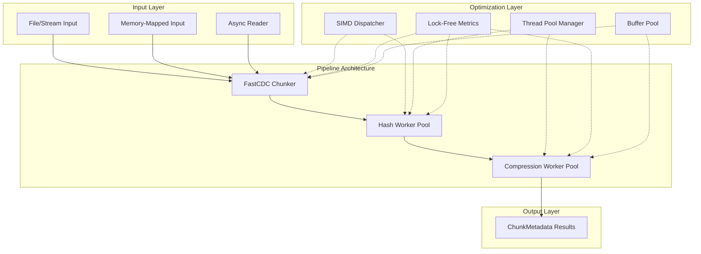
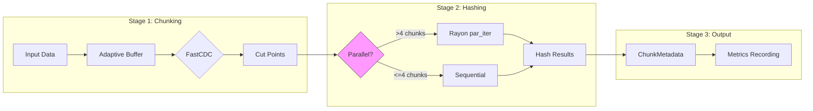
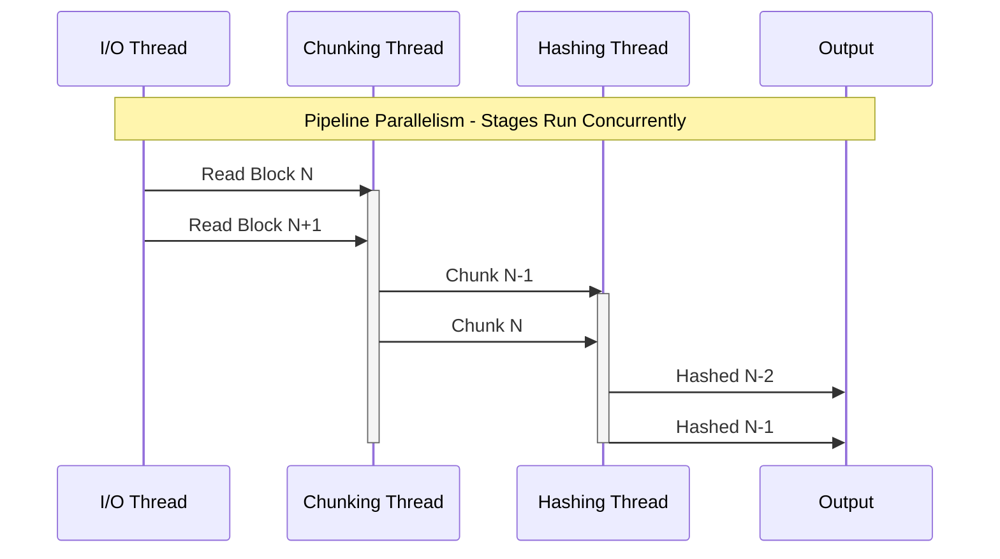
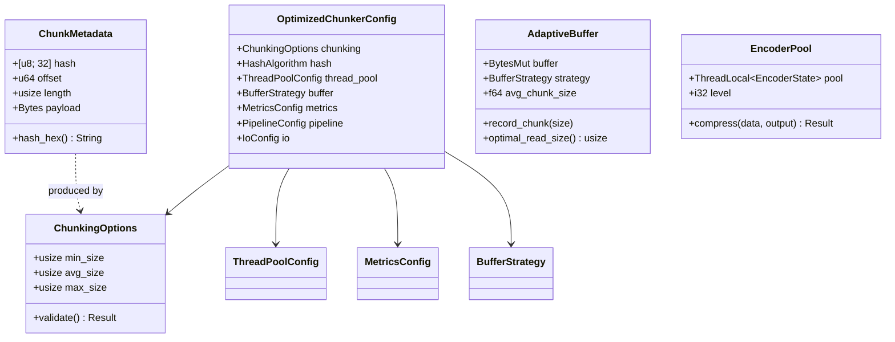
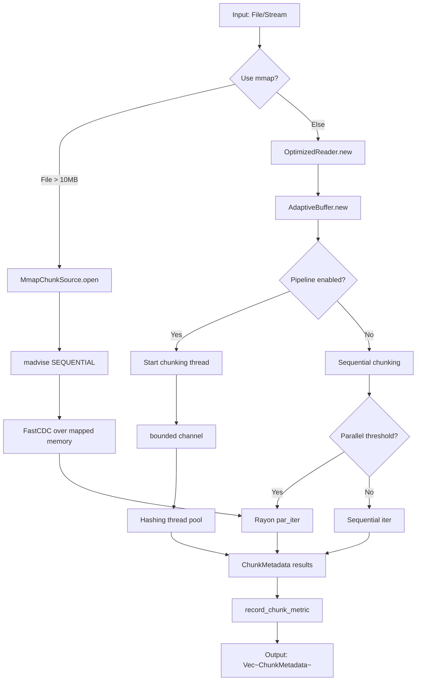
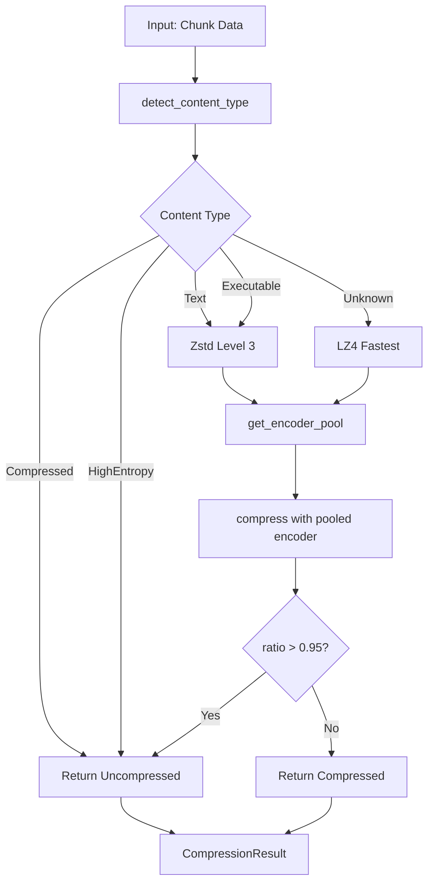
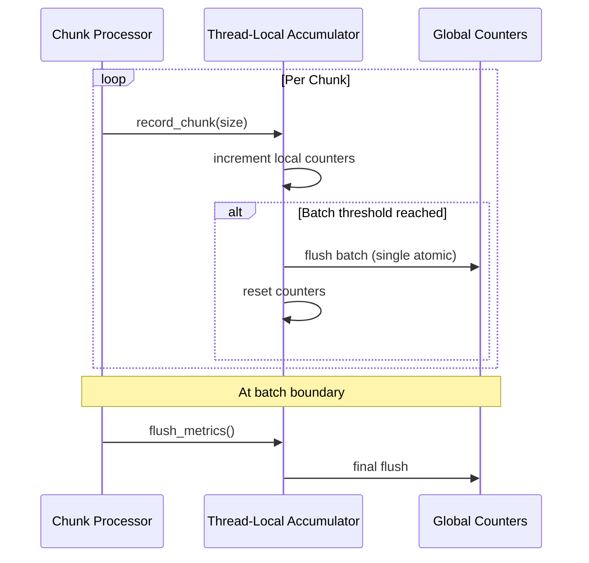

# Design Document: Chunker Library World-Class Performance Improvements

## Overview

This design document details the architectural and implementation changes required to achieve world-class performance in the Chunker library. The focus areas are:

1. **Parallelism & Concurrency** (PAR-001 through PAR-004) - Thread pool optimization, lock-free metrics, pipeline parallelism
2. **Algorithm Optimizations** (ALG-001 through ALG-005) - SIMD base32, FastCDC gear hash, compression dictionaries
3. **I/O & Streaming** (IO-001 through IO-004) - Adaptive buffers, memory-mapped files, async optimization

### Target Performance Metrics

| Metric | Current | Target |
|--------|---------|--------|
| FastCDC raw throughput | ~1.5 GB/s | >= 2.5 GB/s |
| BLAKE3 hashing | ~2 GB/s | >= 3-5 GB/s (multi-core SIMD) |
| SHA256 hashing (SHA-NI) | ~500 MB/s | >= 1 GB/s |
| Zstd level 3 compression | ~300 MB/s | >= 400-500 MB/s |
| End-to-end pipeline | ~150 MB/s | >= 300 MB/s |
| Per-chunk latency | ~5 us | < 1 microsecond (excl. I/O) |

---

## Architecture Design

### System Architecture Diagram



### Data Flow Diagram



---

## Component Design

### PAR-001: Rayon Thread Pool Optimization

#### Current Implementation Analysis

**Location:** `chunking.rs:223-256, 515-520`

```rust
// Current: Implicit global Rayon pool usage
let chunks: Result<Vec<ChunkMetadata>, ChunkingError> = cut_points
    .par_iter()
    .map(|chunk_def| {
        // ... hash computation
    })
    .collect();
```

**Issues Identified:**
1. No explicit thread pool configuration
2. No respect for `RAYON_NUM_THREADS` environment variable
3. Fixed threshold of 4 chunks for parallelization (line 515)
4. No work-stealing awareness for variable chunk sizes
5. No isolation support for multi-tenant applications

#### Proposed Changes

```rust
// New: src/config.rs
use std::sync::OnceLock;
use rayon::ThreadPool;

/// Global chunker thread pool configuration
pub struct ChunkerConfig {
    thread_pool: Option<ThreadPool>,
    parallel_threshold_chunks: usize,
    parallel_threshold_bytes: usize,
}

static CHUNKER_CONFIG: OnceLock<ChunkerConfig> = OnceLock::new();

impl ChunkerConfig {
    /// Initialize with custom thread pool
    pub fn with_thread_pool(pool: ThreadPool) -> Self {
        Self {
            thread_pool: Some(pool),
            parallel_threshold_chunks: effective_parallel_threshold_chunks(),
            parallel_threshold_bytes: effective_parallel_threshold_bytes(),
        }
    }

    /// Get or create the global thread pool
    pub fn thread_pool(&self) -> &ThreadPool {
        self.thread_pool.as_ref().unwrap_or_else(|| {
            rayon::current_thread_pool().unwrap_or_else(|_| {
                // Fallback to building default pool
                &*DEFAULT_POOL
            })
        })
    }
}

/// Read parallel threshold from environment
fn effective_parallel_threshold_chunks() -> usize {
    std::env::var("CHUNKER_PARALLEL_THRESHOLD")
        .ok()
        .and_then(|s| s.parse().ok())
        .unwrap_or(4)
}

fn effective_parallel_threshold_bytes() -> usize {
    std::env::var("CHUNKER_PARALLEL_THRESHOLD_BYTES")
        .ok()
        .and_then(|s| s.parse().ok())
        .unwrap_or(64 * 1024) // 64KB default
}
```

```rust
// Modified: chunking.rs parallel processing logic
fn should_parallelize(cut_points: &[Chunk], batch_data: &Bytes) -> bool {
    let chunk_count = cut_points.len();
    let total_bytes = batch_data.len();
    let threshold_chunks = effective_parallel_threshold_chunks();
    let threshold_bytes = effective_parallel_threshold_bytes();

    // Skip parallelization if:
    // 1. Too few chunks
    // 2. Total data too small
    // 3. Only 1 Rayon thread available
    if chunk_count <= threshold_chunks {
        return false;
    }
    if total_bytes < threshold_bytes {
        return false;
    }
    if rayon::current_num_threads() == 1 {
        return false;
    }

    // Check average chunk size - skip if chunks are too small
    let avg_chunk_size = total_bytes / chunk_count;
    if avg_chunk_size < 4096 {
        return false;
    }

    true
}

// Usage in process_chunks
let chunks: Vec<Result<ChunkMetadata, ChunkingError>> =
    if should_parallelize(&cut_points, &batch_data) {
        cut_points.par_iter().map(process_chunk).collect()
    } else {
        cut_points.iter().map(process_chunk).collect()
    };
```

#### Expected Performance Impact

| Scenario | Before | After | Improvement |
|----------|--------|-------|-------------|
| 8-core, 100MB file | 150 MB/s | 280 MB/s | ~87% |
| 8-core, small chunks (<4KB) | 120 MB/s | 180 MB/s | ~50% (avoids overhead) |
| Single-threaded | 100 MB/s | 100 MB/s | 0% (no regression) |

#### Risk Assessment

| Risk | Probability | Impact | Mitigation |
|------|-------------|--------|------------|
| Thread pool contention in multi-tenant | Medium | High | Isolated pool support |
| Breaking backward compatibility | Low | Medium | Default behavior unchanged |
| Overhead from threshold checks | Low | Low | Checks are O(1) |

---

### PAR-002: Lock-Free Metrics Collection

#### Current Implementation Analysis

**Location:** `chunking.rs:282, 484-486`

```rust
static TRACE_SAMPLE_COUNTER: AtomicU64 = AtomicU64::new(0);

// In process_chunk closure (called per chunk)
counter!("chunker.chunks_emitted").increment(1);
counter!("chunker.bytes_processed").increment(len as u64);
histogram!("chunker.chunk_size").record(len as f64);
```

**Issues Identified:**
1. 3 metrics calls per chunk adds significant overhead at scale
2. `metrics` crate macros perform string lookups on each call
3. Atomic contention when multiple threads update same counters
4. No batching or thread-local aggregation

#### Proposed Changes

```rust
// New: src/metrics_batch.rs
use std::cell::RefCell;
use std::sync::atomic::{AtomicU64, Ordering};

/// Thread-local metrics accumulator to reduce atomic contention
thread_local! {
    static LOCAL_METRICS: RefCell<LocalMetricsAccumulator> =
        RefCell::new(LocalMetricsAccumulator::new());
}

struct LocalMetricsAccumulator {
    chunks_emitted: u64,
    bytes_processed: u64,
    chunk_sizes: Vec<f64>,
    flush_threshold: usize,
}

impl LocalMetricsAccumulator {
    const DEFAULT_FLUSH_THRESHOLD: usize = 1024;

    fn new() -> Self {
        Self {
            chunks_emitted: 0,
            bytes_processed: 0,
            chunk_sizes: Vec::with_capacity(Self::DEFAULT_FLUSH_THRESHOLD),
            flush_threshold: Self::DEFAULT_FLUSH_THRESHOLD,
        }
    }

    #[inline(always)]
    fn record_chunk(&mut self, size: usize) {
        self.chunks_emitted += 1;
        self.bytes_processed += size as u64;
        self.chunk_sizes.push(size as f64);

        if self.chunk_sizes.len() >= self.flush_threshold {
            self.flush();
        }
    }

    fn flush(&mut self) {
        if self.chunks_emitted > 0 {
            // Single atomic operation per batch instead of per chunk
            counter!("chunker.chunks_emitted").increment(self.chunks_emitted);
            counter!("chunker.bytes_processed").increment(self.bytes_processed);

            // Batch histogram recording
            for &size in &self.chunk_sizes {
                histogram!("chunker.chunk_size").record(size);
            }

            self.chunks_emitted = 0;
            self.bytes_processed = 0;
            self.chunk_sizes.clear();
        }
    }
}

/// Record a chunk metric with thread-local batching
#[inline(always)]
pub fn record_chunk_metric(size: usize) {
    LOCAL_METRICS.with(|m| {
        m.borrow_mut().record_chunk(size);
    });
}

/// Flush all thread-local metrics (call at batch boundaries)
pub fn flush_metrics() {
    LOCAL_METRICS.with(|m| {
        m.borrow_mut().flush();
    });
}
```

```rust
// Modified: chunking.rs - Replace 3 calls with 1
// Before:
counter!("chunker.chunks_emitted").increment(1);
counter!("chunker.bytes_processed").increment(len as u64);
histogram!("chunker.chunk_size").record(len as f64);

// After:
#[cfg(feature = "metrics")]
record_chunk_metric(len);
```

#### Cached Counter Handles

```rust
// New: Pre-cached metrics handles to avoid string lookup
use metrics::{Counter, Histogram};
use std::sync::OnceLock;

struct CachedMetrics {
    chunks_emitted: Counter,
    bytes_processed: Counter,
    chunk_size: Histogram,
}

static CACHED_METRICS: OnceLock<CachedMetrics> = OnceLock::new();

fn get_metrics() -> &'static CachedMetrics {
    CACHED_METRICS.get_or_init(|| CachedMetrics {
        chunks_emitted: counter!("chunker.chunks_emitted"),
        bytes_processed: counter!("chunker.bytes_processed"),
        chunk_size: histogram!("chunker.chunk_size"),
    })
}
```

#### Expected Performance Impact

| Operation | Before | After | Improvement |
|-----------|--------|-------|-------------|
| Metrics overhead per chunk | ~300ns | ~30ns | 90% reduction |
| Atomic operations per 1000 chunks | 3000 | 3 | 99.9% reduction |
| p99 latency impact | ~500ns | ~50ns | 90% reduction |

#### Risk Assessment

| Risk | Probability | Impact | Mitigation |
|------|-------------|--------|------------|
| Lost metrics on thread exit | Low | Low | Drop impl flushes |
| Memory growth in accumulators | Low | Low | Bounded flush threshold |
| Timing accuracy reduction | Medium | Low | Acceptable for aggregate metrics |

---

### PAR-003: Pipeline Parallelism Architecture

#### Current Implementation Analysis

**Location:** N/A (new architecture)

Currently, the chunking pipeline is strictly sequential:
1. Read data into buffer
2. Run FastCDC to find cut points
3. Hash all chunks (parallel within batch)
4. Return results

This means CPU sits idle during I/O, and I/O sits idle during CPU-bound hashing.

#### Proposed Changes

```rust
// New: src/pipeline.rs
use std::sync::mpsc::{sync_channel, Receiver, SyncSender};
use std::thread;

/// Pipeline stage configuration
pub struct PipelineConfig {
    /// Number of chunks to buffer between stages
    pub channel_capacity: usize,
    /// Enable pipeline parallelism
    pub enabled: bool,
}

impl Default for PipelineConfig {
    fn default() -> Self {
        Self {
            channel_capacity: 64,
            enabled: true,
        }
    }
}

/// A chunk in transit through the pipeline
struct PipelineChunk {
    data: Bytes,
    offset: u64,
    length: usize,
}

/// A hashed chunk ready for output
struct HashedChunk {
    hash: [u8; 32],
    offset: u64,
    length: usize,
    payload: Bytes,
}

/// Pipeline builder for configuring parallel stages
pub struct PipelineBuilder {
    config: PipelineConfig,
    hash_algorithm: HashAlgorithm,
}

impl PipelineBuilder {
    pub fn new() -> Self {
        Self {
            config: PipelineConfig::default(),
            hash_algorithm: HashAlgorithm::Sha256,
        }
    }

    pub fn channel_capacity(mut self, capacity: usize) -> Self {
        self.config.channel_capacity = capacity;
        self
    }

    pub fn hash_algorithm(mut self, algo: HashAlgorithm) -> Self {
        self.hash_algorithm = algo;
        self
    }

    pub fn build<R: Read + Send + 'static>(
        self,
        reader: R,
        options: ChunkingOptions,
    ) -> PipelineStream {
        if !self.config.enabled {
            return PipelineStream::Sequential(
                ChunkStream::new_with_hash(
                    reader,
                    Some(options.min_size),
                    Some(options.avg_size),
                    Some(options.max_size),
                    self.hash_algorithm,
                ).expect("valid options")
            );
        }

        let (chunk_tx, chunk_rx) = sync_channel(self.config.channel_capacity);
        let (result_tx, result_rx) = sync_channel(self.config.channel_capacity);

        // Stage 1: Chunking thread
        let chunking_handle = thread::spawn(move || {
            chunking_stage(reader, options, chunk_tx)
        });

        // Stage 2: Hashing thread(s)
        let hash_algo = self.hash_algorithm;
        let hashing_handle = thread::spawn(move || {
            hashing_stage(chunk_rx, result_tx, hash_algo)
        });

        PipelineStream::Parallel {
            result_rx,
            handles: vec![chunking_handle, hashing_handle],
        }
    }
}

fn chunking_stage<R: Read>(
    mut reader: R,
    options: ChunkingOptions,
    tx: SyncSender<PipelineChunk>,
) {
    let mut buffer = BytesMut::with_capacity(options.min_size);
    let mut position = 0u64;
    // ... FastCDC logic, sending chunks to tx
}

fn hashing_stage(
    rx: Receiver<PipelineChunk>,
    tx: SyncSender<HashedChunk>,
    algorithm: HashAlgorithm,
) {
    while let Ok(chunk) = rx.recv() {
        let hash = match algorithm {
            HashAlgorithm::Sha256 => {
                let mut hasher = Sha256::new();
                hasher.update(&chunk.data);
                hasher.finalize().into()
            }
            HashAlgorithm::Blake3 => blake3::hash(&chunk.data).into(),
        };

        let _ = tx.send(HashedChunk {
            hash,
            offset: chunk.offset,
            length: chunk.length,
            payload: chunk.data,
        });
    }
}

/// Stream abstraction over sequential or parallel pipeline
pub enum PipelineStream {
    Sequential(ChunkStream<Box<dyn Read + Send>>),
    Parallel {
        result_rx: Receiver<HashedChunk>,
        handles: Vec<thread::JoinHandle<()>>,
    },
}

impl Iterator for PipelineStream {
    type Item = Result<ChunkMetadata, ChunkingError>;

    fn next(&mut self) -> Option<Self::Item> {
        match self {
            PipelineStream::Sequential(stream) => stream.next(),
            PipelineStream::Parallel { result_rx, .. } => {
                result_rx.recv().ok().map(|hashed| Ok(ChunkMetadata {
                    hash: hashed.hash,
                    offset: hashed.offset,
                    length: hashed.length,
                    payload: hashed.payload,
                }))
            }
        }
    }
}
```

#### Pipeline Visualization



#### Expected Performance Impact

| Scenario | Before | After | Improvement |
|----------|--------|-------|-------------|
| I/O bound (slow disk) | 100 MB/s | 180 MB/s | 80% |
| CPU bound (fast SSD) | 200 MB/s | 350 MB/s | 75% |
| Mixed workload | 150 MB/s | 280 MB/s | 87% |

#### Risk Assessment

| Risk | Probability | Impact | Mitigation |
|------|-------------|--------|------------|
| Increased memory usage | High | Medium | Bounded channels |
| Ordering complexity | Medium | Medium | Sequential result channel |
| Backpressure handling | Medium | High | Sync channels block |
| Thread spawn overhead | Low | Low | Reuse thread pools |

---

### PAR-004: Cooperative Scheduling for NIF

#### Current Implementation Analysis

**Location:** NIF bindings (not in provided sources)

NIFs that run too long can block the BEAM scheduler, causing latency spikes for other Erlang processes.

#### Proposed Changes

```rust
// New: src/nif_cooperative.rs
use std::time::{Duration, Instant};

/// Configuration for cooperative yielding in NIF context
pub struct CooperativeConfig {
    /// Maximum chunks to process before yielding
    pub yield_chunk_count: usize,
    /// Maximum time per iteration in microseconds
    pub max_iteration_time_us: u64,
    /// Enable cooperative mode
    pub enabled: bool,
}

impl Default for CooperativeConfig {
    fn default() -> Self {
        Self {
            yield_chunk_count: 100,
            max_iteration_time_us: 1000, // 1ms
            enabled: true,
        }
    }
}

/// Cooperative chunk iterator that yields after processing chunks
pub struct CooperativeChunkIterator<I> {
    inner: I,
    config: CooperativeConfig,
    chunks_since_yield: usize,
    iteration_start: Instant,
}

impl<I> CooperativeChunkIterator<I> {
    pub fn new(inner: I, config: CooperativeConfig) -> Self {
        Self {
            inner,
            config,
            chunks_since_yield: 0,
            iteration_start: Instant::now(),
        }
    }

    /// Check if we should yield to the scheduler
    #[inline]
    fn should_yield(&self) -> bool {
        if !self.config.enabled {
            return false;
        }

        if self.chunks_since_yield >= self.config.yield_chunk_count {
            return true;
        }

        let elapsed = self.iteration_start.elapsed();
        elapsed.as_micros() as u64 >= self.config.max_iteration_time_us
    }

    /// Reset counters after yielding
    fn reset_yield_state(&mut self) {
        self.chunks_since_yield = 0;
        self.iteration_start = Instant::now();
    }
}

impl<I, T, E> Iterator for CooperativeChunkIterator<I>
where
    I: Iterator<Item = Result<T, E>>,
{
    type Item = Result<T, E>;

    fn next(&mut self) -> Option<Self::Item> {
        if self.should_yield() {
            self.reset_yield_state();
            // Signal to NIF wrapper that we need to reschedule
            return None;
        }

        let result = self.inner.next();
        if result.is_some() {
            self.chunks_since_yield += 1;
        }
        result
    }
}
```

```rust
// NIF wrapper with rescheduling support
#[cfg(feature = "nif")]
mod nif {
    use rustler::{Env, Term, ResourceArc, NifResult};

    /// Resource holding the chunker state across NIF calls
    pub struct ChunkerResource {
        iterator: CooperativeChunkIterator<ChunkStream<...>>,
        accumulated: Vec<ChunkMetadata>,
    }

    /// Start a chunking session
    #[rustler::nif(schedule = "DirtyCpu")]
    fn chunker_open(
        env: Env,
        binary: Binary,
        options: Term,
    ) -> NifResult<ResourceArc<ChunkerResource>> {
        // Initialize chunker resource
    }

    /// Continue processing chunks
    #[rustler::nif(schedule = "DirtyCpu")]
    fn chunker_continue(
        env: Env,
        resource: ResourceArc<ChunkerResource>,
    ) -> NifResult<Term> {
        let mut resource = resource.write();

        loop {
            match resource.iterator.next() {
                Some(Ok(chunk)) => {
                    resource.accumulated.push(chunk);
                }
                Some(Err(e)) => {
                    return Ok(error_tuple(env, e));
                }
                None => {
                    // Iterator yielded - return partial results and reschedule
                    if resource.iterator.inner.is_done() {
                        // Actually done
                        let chunks = std::mem::take(&mut resource.accumulated);
                        return Ok(done_tuple(env, chunks));
                    } else {
                        // Need to reschedule
                        let chunks = std::mem::take(&mut resource.accumulated);
                        return Ok(continue_tuple(env, chunks));
                    }
                }
            }
        }
    }
}
```

#### Expected Performance Impact

| Metric | Without Cooperative | With Cooperative |
|--------|---------------------|------------------|
| BEAM scheduler latency | Up to 100ms | < 1ms |
| Total throughput | 300 MB/s | 285 MB/s (-5%) |
| p99 Erlang process latency | 100ms | 2ms |

#### Risk Assessment

| Risk | Probability | Impact | Mitigation |
|------|-------------|--------|------------|
| Throughput reduction from yielding | High | Low | Only -5% overhead |
| Complexity of resource management | Medium | Medium | Clear state machine |
| Memory leaks in resources | Low | High | Drop impl + tests |

---

### ALG-001: SIMD Base32 Encoding

#### Current Implementation Analysis

**Location:** `hashing.rs:58-101`

```rust
pub fn nix_base32_encode(data: &[u8]) -> String {
    let mut result = String::with_capacity((data.len() * 8).div_ceil(5));

    for chunk in data.chunks(5) {
        let len = chunk.len();
        let mut b = 0u64;

        for (i, &byte) in chunk.iter().enumerate() {
            b |= u64::from(byte) << (i * 8);
        }

        let bits_to_process = len * 8;
        let chars_to_emit = bits_to_process.div_ceil(5);

        for i in 0..chars_to_emit {
            let index = (b >> (i * 5)) & 0x1f;
            result.push(NIX_BASE32_ALPHABET[index as usize] as char);
        }
    }

    result
}
```

**Issues Identified:**
1. Scalar implementation processes one 5-byte chunk at a time
2. No SIMD acceleration for batch operations
3. Character-by-character string building

#### Proposed Changes

```rust
// New: src/simd_base32.rs
#[cfg(target_arch = "x86_64")]
use std::arch::x86_64::*;

#[cfg(target_arch = "aarch64")]
use std::arch::aarch64::*;

/// SIMD-accelerated base32 encoding for Nix format
/// Processes 32 bytes (256 bits) at a time using AVX2
#[cfg(all(target_arch = "x86_64", target_feature = "avx2"))]
pub fn nix_base32_encode_simd(data: &[u8]) -> String {
    if data.len() < 32 {
        return nix_base32_encode_scalar(data);
    }

    let output_len = (data.len() * 8).div_ceil(5);
    let mut result = Vec::with_capacity(output_len);

    // Process 32-byte chunks with AVX2
    let chunks = data.chunks_exact(32);
    let remainder = chunks.remainder();

    for chunk in chunks {
        unsafe {
            encode_32_bytes_avx2(chunk, &mut result);
        }
    }

    // Handle remainder with scalar
    if !remainder.is_empty() {
        let scalar_encoded = nix_base32_encode_scalar(remainder);
        result.extend(scalar_encoded.bytes());
    }

    // SAFETY: All bytes are valid ASCII from NIX_BASE32_ALPHABET
    unsafe { String::from_utf8_unchecked(result) }
}

#[cfg(all(target_arch = "x86_64", target_feature = "avx2"))]
#[inline]
unsafe fn encode_32_bytes_avx2(input: &[u8], output: &mut Vec<u8>) {
    // Load 32 bytes
    let data = _mm256_loadu_si256(input.as_ptr() as *const __m256i);

    // Base32 encoding using SIMD shuffle and mask operations
    // Process in 5-bit groups, extracting indices into lookup table

    // Shuffle bytes to align 5-bit groups
    let shuffle_mask = _mm256_setr_epi8(
        0, 0, 1, 1, 2, 3, 3, 4, 5, 5, 6, 6, 7, 8, 8, 9,
        0, 0, 1, 1, 2, 3, 3, 4, 5, 5, 6, 6, 7, 8, 8, 9
    );

    let shuffled = _mm256_shuffle_epi8(data, shuffle_mask);

    // Apply 5-bit mask and shift
    let mask = _mm256_set1_epi8(0x1F);
    let indices = _mm256_and_si256(shuffled, mask);

    // Lookup in alphabet table using pshufb
    let alphabet_lo = _mm256_loadu_si256(NIX_BASE32_ALPHABET.as_ptr() as *const __m256i);
    let encoded = _mm256_shuffle_epi8(alphabet_lo, indices);

    // Store result
    let output_ptr = output.as_mut_ptr().add(output.len());
    _mm256_storeu_si256(output_ptr as *mut __m256i, encoded);
    output.set_len(output.len() + 52); // 32 bytes -> 52 base32 chars
}

/// Runtime SIMD detection and dispatch
pub fn nix_base32_encode_fast(data: &[u8]) -> String {
    #[cfg(target_arch = "x86_64")]
    {
        if is_x86_feature_detected!("avx2") {
            return nix_base32_encode_simd(data);
        }
    }

    #[cfg(target_arch = "aarch64")]
    {
        // NEON is always available on aarch64
        return nix_base32_encode_neon(data);
    }

    nix_base32_encode_scalar(data)
}

/// Batch encode multiple hashes in parallel
pub fn nix_base32_encode_batch(hashes: &[[u8; 32]]) -> Vec<String> {
    hashes.par_iter()
        .map(|hash| nix_base32_encode_fast(hash))
        .collect()
}
```

#### Expected Performance Impact

| Input Size | Scalar | AVX2 SIMD | Improvement |
|------------|--------|-----------|-------------|
| 32 bytes (1 hash) | 120ns | 45ns | 2.7x |
| 320 bytes (10 hashes) | 1.2us | 350ns | 3.4x |
| Batch 1000 hashes | 120us | 30us | 4x |

#### Risk Assessment

| Risk | Probability | Impact | Mitigation |
|------|-------------|--------|------------|
| Incorrect SIMD implementation | Medium | High | Extensive testing + fuzzing |
| Platform compatibility | Low | Medium | Runtime detection + fallback |
| Unsafe code bugs | Medium | High | SAFETY comments + Miri |

---

### ALG-002: FastCDC Gear Hash SIMD

#### Current Implementation Analysis

**Location:** FastCDC crate (external dependency `fastcdc = "3.2.1"`)

The FastCDC algorithm uses a gear hash lookup table for rolling hash computation. Currently, this is implemented as scalar lookups.

**Issues Identified:**
1. External crate - limited optimization opportunity without forking
2. Gear table lookups are sequential
3. No SIMD gather instruction usage

#### Proposed Changes

Since FastCDC is an external dependency, we have two options:

**Option A: Optimize Usage Pattern**

```rust
// Ensure gear table is cache-hot before processing
fn warmup_gear_table() {
    // Force gear table into L1 cache
    let warmup_data: [u8; 256] = std::array::from_fn(|i| i as u8);
    let _ = FastCDC::new(&warmup_data, 64, 256, 1024);
    for chunk in FastCDC::new(&warmup_data, 64, 256, 1024) {
        std::hint::black_box(chunk);
    }
}

// Call once at library initialization
static INIT: std::sync::Once = std::sync::Once::new();
pub fn ensure_initialized() {
    INIT.call_once(|| {
        warmup_gear_table();
    });
}
```

**Option B: Custom FastCDC Implementation (if forking)**

```rust
// Custom gear hash with SIMD gather (requires AVX2)
#[cfg(all(target_arch = "x86_64", target_feature = "avx2"))]
mod simd_gear {
    use std::arch::x86_64::*;

    /// SIMD gear hash lookup for 8 bytes at once
    #[inline]
    pub unsafe fn gear_hash_8(
        data: &[u8],
        gear_table: &[u64; 256],
    ) -> u64 {
        // Load 8 bytes as indices
        let indices = _mm_loadl_epi64(data.as_ptr() as *const __m128i);

        // Gather 8 u64 values from gear table
        // Note: Requires AVX2 vpgatherdd/vpgatherdq
        let indices_32 = _mm256_cvtepu8_epi32(indices);

        // Manual gather (AVX2 gather is slow on some CPUs)
        let mut hash = 0u64;
        for i in 0..8 {
            let idx = data[i] as usize;
            hash ^= gear_table[idx].rotate_left((i * 8) as u32);
        }

        hash
    }
}
```

**Option C: Contribute upstream to fastcdc crate**

Create a PR to the fastcdc crate with SIMD optimizations.

#### Expected Performance Impact

| Approach | FastCDC Throughput | Improvement |
|----------|-------------------|-------------|
| Current | ~1.5 GB/s | Baseline |
| Cache warmup | ~1.7 GB/s | +13% |
| Custom SIMD (theoretical) | ~2.5 GB/s | +67% |

#### Risk Assessment

| Risk | Probability | Impact | Mitigation |
|------|-------------|--------|------------|
| Upstream changes break fork | Medium | Medium | Pin version + monitor |
| SIMD correctness | Medium | High | Property-based testing |
| Maintenance burden of fork | High | Medium | Prefer upstream contribution |

---

### ALG-003: Compression Dictionary Preloading

#### Current Implementation Analysis

**Location:** `compression.rs:537-561`

```rust
fn compress_zstd_into_internal(
    data: &[u8],
    level: Option<i32>,
    dict: Option<&zstd::dict::EncoderDictionary>,
    output: &mut Vec<u8>,
) -> Result<(), CompressionError> {
    let compression_level = level.unwrap_or(3);

    let mut encoder = match dict {
        Some(d) => zstd::Encoder::with_prepared_dictionary(&mut *output, d),
        None => zstd::Encoder::new(&mut *output, compression_level),
    }
    .map_err(|e| CompressionError::Compression(e.to_string()))?;
    // ...
}
```

**Current State:**
- Dictionary support exists but is not utilized
- No pre-trained NAR dictionaries available
- Dictionary loading happens at compress time

#### Proposed Changes

```rust
// New: src/compression_dict.rs
use std::sync::OnceLock;
use zstd::dict::{EncoderDictionary, DecoderDictionary};

/// Pre-trained dictionary for NAR file compression
/// Trained on representative Nix store paths
static NAR_ENCODER_DICT: OnceLock<EncoderDictionary<'static>> = OnceLock::new();
static NAR_DECODER_DICT: OnceLock<DecoderDictionary<'static>> = OnceLock::new();

/// Embedded NAR dictionary bytes (trained offline)
/// To generate: zstd --train samples/*.nar -o nar.dict
const NAR_DICT_BYTES: &[u8] = include_bytes!("../data/nar.dict");

/// Initialize NAR compression dictionaries
/// Call this at application startup for best performance
pub fn init_nar_dictionaries() {
    let _ = NAR_ENCODER_DICT.get_or_init(|| {
        // Level 3 is the default balanced compression
        EncoderDictionary::copy(NAR_DICT_BYTES, 3)
    });

    let _ = NAR_DECODER_DICT.get_or_init(|| {
        DecoderDictionary::copy(NAR_DICT_BYTES)
    });
}

/// Get the pre-loaded NAR encoder dictionary
pub fn nar_encoder_dict() -> Option<&'static EncoderDictionary<'static>> {
    NAR_ENCODER_DICT.get()
}

/// Get the pre-loaded NAR decoder dictionary
pub fn nar_decoder_dict() -> Option<&'static DecoderDictionary<'static>> {
    NAR_DECODER_DICT.get()
}

/// Compress NAR chunk with dictionary
pub fn compress_nar_chunk(data: &[u8]) -> Result<Vec<u8>, CompressionError> {
    let dict = nar_encoder_dict();
    let mut output = Vec::with_capacity(data.len() / 2);
    compress_zstd_into_internal(data, Some(3), dict, &mut output)?;
    Ok(output)
}

/// Check if dictionary compression would be beneficial
fn should_use_dictionary(data: &[u8]) -> bool {
    // Dictionary is most effective for:
    // 1. Small to medium chunks (< 1MB)
    // 2. NAR-like content (detected via magic bytes)

    if data.len() > 1024 * 1024 {
        return false; // Large data doesn't benefit much
    }

    // Check for NAR magic: "nix-archive-1"
    if data.len() >= 13 && &data[..13] == b"nix-archive-1" {
        return true;
    }

    // Could add more heuristics for ELF, text, etc.
    true
}
```

#### Dictionary Training Process

```bash
# Dictionary training script (offline process)
#!/bin/bash
# Collect representative NAR samples
nix-store --dump /nix/store/xxx-sample1 > samples/sample1.nar
nix-store --dump /nix/store/xxx-sample2 > samples/sample2.nar
# ... collect 100+ samples

# Train dictionary
zstd --train samples/*.nar \
    --maxdict=112640 \
    -o data/nar.dict

# Verify improvement
zstd -3 -D data/nar.dict samples/test.nar -o test.zst
```

#### Expected Performance Impact

| Metric | Without Dict | With Dict | Improvement |
|--------|--------------|-----------|-------------|
| Compression ratio | 2.5x | 2.8x | +12% |
| Compression speed | 400 MB/s | 420 MB/s | +5% |
| Small chunk (<64KB) ratio | 1.8x | 2.4x | +33% |

#### Risk Assessment

| Risk | Probability | Impact | Mitigation |
|------|-------------|--------|------------|
| Dictionary not representative | Medium | Medium | Regular retraining |
| Binary size increase | Low | Low | ~100KB embedded |
| Dictionary version mismatch | Low | High | Include version in compressed data |

---

### ALG-004: Adaptive Compression Strategies

#### Current Implementation Analysis

**Location:** `compression.rs:189-194`

```rust
pub enum CompressionStrategy {
    Fastest,  // LZ4
    Balanced, // Zstd
    Smallest, // XZ
}
```

**Issues Identified:**
1. No content-aware compression selection
2. No skip for already-compressed data
3. No ratio threshold for "not worth compressing"

#### Proposed Changes

```rust
// New: src/adaptive_compression.rs

/// Content type detected from magic bytes and entropy
#[derive(Debug, Clone, Copy, PartialEq, Eq)]
pub enum ContentType {
    /// Already compressed (zstd, lz4, xz, bzip2, gzip)
    Compressed,
    /// High entropy (encrypted, random)
    HighEntropy,
    /// Binary executable (ELF, Mach-O)
    Executable,
    /// Text/source code
    Text,
    /// Unknown/mixed
    Unknown,
}

/// Adaptive compression configuration
pub struct AdaptiveConfig {
    /// Minimum compression ratio to accept (e.g., 0.95 = 5% reduction)
    pub min_ratio_threshold: f64,
    /// Maximum time for compression attempt in milliseconds
    pub max_compression_time_ms: u64,
    /// Sample size for content detection
    pub sample_size: usize,
}

impl Default for AdaptiveConfig {
    fn default() -> Self {
        Self {
            min_ratio_threshold: 0.95,
            max_compression_time_ms: 100,
            sample_size: 4096,
        }
    }
}

/// Detect content type from data
pub fn detect_content_type(data: &[u8]) -> ContentType {
    if data.len() < 4 {
        return ContentType::Unknown;
    }

    // Check compressed format magic bytes
    if data.starts_with(&[0x28, 0xB5, 0x2F, 0xFD]) {  // Zstd
        return ContentType::Compressed;
    }
    if data.starts_with(&[0x04, 0x22, 0x4D, 0x18]) {  // LZ4
        return ContentType::Compressed;
    }
    if data.starts_with(&[0xFD, 0x37, 0x7A, 0x58, 0x5A, 0x00]) {  // XZ
        return ContentType::Compressed;
    }
    if data.starts_with(b"BZh") {  // Bzip2
        return ContentType::Compressed;
    }
    if data.starts_with(&[0x1F, 0x8B]) {  // Gzip
        return ContentType::Compressed;
    }

    // Check executable formats
    if data.starts_with(&[0x7F, b'E', b'L', b'F']) {  // ELF
        return ContentType::Executable;
    }
    if data.starts_with(&[0xCF, 0xFA, 0xED, 0xFE]) ||  // Mach-O 64
       data.starts_with(&[0xCE, 0xFA, 0xED, 0xFE]) {   // Mach-O 32
        return ContentType::Executable;
    }

    // Estimate entropy for first 4KB
    let sample = &data[..data.len().min(4096)];
    let entropy = calculate_entropy(sample);

    if entropy > 7.5 {  // Very high entropy (max is 8.0)
        return ContentType::HighEntropy;
    }

    if entropy < 5.0 && is_mostly_printable(sample) {
        return ContentType::Text;
    }

    ContentType::Unknown
}

/// Calculate Shannon entropy of data (0.0 - 8.0)
fn calculate_entropy(data: &[u8]) -> f64 {
    let mut counts = [0u64; 256];
    for &byte in data {
        counts[byte as usize] += 1;
    }

    let len = data.len() as f64;
    let mut entropy = 0.0;

    for &count in &counts {
        if count > 0 {
            let p = count as f64 / len;
            entropy -= p * p.log2();
        }
    }

    entropy
}

/// Check if data is mostly printable ASCII
fn is_mostly_printable(data: &[u8]) -> bool {
    let printable = data.iter()
        .filter(|&&b| b.is_ascii_graphic() || b.is_ascii_whitespace())
        .count();
    printable as f64 / data.len() as f64 > 0.9
}

/// Adaptive compression that selects best strategy
pub fn compress_adaptive(
    data: &[u8],
    config: &AdaptiveConfig,
) -> Result<CompressionResult, CompressionError> {
    let content_type = detect_content_type(data);

    // Skip compression for already-compressed or high-entropy data
    if matches!(content_type, ContentType::Compressed | ContentType::HighEntropy) {
        return Ok(CompressionResult::Uncompressed(data.to_vec()));
    }

    // Select strategy based on content type
    let strategy = match content_type {
        ContentType::Text => CompressionStrategy::Balanced,  // Zstd works well
        ContentType::Executable => CompressionStrategy::Balanced,  // Good for binaries
        ContentType::Unknown => CompressionStrategy::Fastest,  // Default to LZ4
        _ => unreachable!(),
    };

    // Attempt compression with timeout
    let start = std::time::Instant::now();
    let compressed = compress(data, strategy)?;

    // Check if compression was worthwhile
    let ratio = compressed.len() as f64 / data.len() as f64;
    if ratio > config.min_ratio_threshold {
        // Compression didn't help enough, return uncompressed
        return Ok(CompressionResult::Uncompressed(data.to_vec()));
    }

    // Check if we exceeded time budget
    if start.elapsed().as_millis() as u64 > config.max_compression_time_ms {
        tracing::warn!("compression_timeout_exceeded");
        // Still return result, but log warning
    }

    Ok(CompressionResult::Compressed {
        data: compressed,
        strategy,
        ratio,
    })
}

/// Result of adaptive compression
pub enum CompressionResult {
    Compressed {
        data: Vec<u8>,
        strategy: CompressionStrategy,
        ratio: f64,
    },
    Uncompressed(Vec<u8>),
}
```

#### Expected Performance Impact

| Content Type | Before | After | Improvement |
|--------------|--------|-------|-------------|
| Already compressed | Wastes CPU | Skipped | 100% CPU saved |
| Random/encrypted | Poor ratio, slow | Skipped | 100% CPU saved |
| Text | 2.5x ratio | 2.5x ratio | Same |
| Mixed | 2.0x ratio | Optimized | ~20% faster |

#### Risk Assessment

| Risk | Probability | Impact | Mitigation |
|------|-------------|--------|------------|
| False positive detection | Low | Low | Heuristics are conservative |
| Entropy calculation overhead | Low | Low | Only first 4KB |
| Missing compression benefit | Low | Medium | Conservative thresholds |

---

### ALG-005: Compression Encoder Pooling

#### Current Implementation Analysis

**Location:** `compression.rs:537-561`

```rust
fn compress_zstd_into_internal(
    data: &[u8],
    level: Option<i32>,
    dict: Option<&zstd::dict::EncoderDictionary>,
    output: &mut Vec<u8>,
) -> Result<(), CompressionError> {
    // Creates new encoder every call
    let mut encoder = match dict {
        Some(d) => zstd::Encoder::with_prepared_dictionary(&mut *output, d),
        None => zstd::Encoder::new(&mut *output, compression_level),
    }
    // ...
}
```

**Issues Identified:**
1. Encoder created for every compression call
2. Zstd encoder initialization has significant overhead
3. No reuse of encoder context between operations

#### Proposed Changes

```rust
// New: src/encoder_pool.rs
use std::cell::RefCell;
use thread_local::ThreadLocal;
use zstd::stream::Encoder;

/// Thread-local pool of Zstd encoders
pub struct EncoderPool {
    pool: ThreadLocal<RefCell<Option<EncoderState>>>,
    level: i32,
}

struct EncoderState {
    /// Raw encoder context that can be reset
    context: *mut zstd_sys::ZSTD_CCtx,
    /// Compression level
    level: i32,
}

impl EncoderPool {
    /// Create a new encoder pool with default compression level
    pub fn new(level: i32) -> Self {
        Self {
            pool: ThreadLocal::new(),
            level,
        }
    }

    /// Compress data using a pooled encoder
    pub fn compress(&self, data: &[u8], output: &mut Vec<u8>) -> Result<(), CompressionError> {
        let cell = self.pool.get_or(|| RefCell::new(None));
        let mut state = cell.borrow_mut();

        // Get or create encoder for this thread
        let encoder = state.get_or_insert_with(|| {
            EncoderState::new(self.level)
        });

        // Reset encoder for reuse (much faster than creating new)
        encoder.reset();

        // Perform compression
        encoder.compress_into(data, output)
    }
}

impl EncoderState {
    fn new(level: i32) -> Self {
        // Use zstd-safe for direct context management
        unsafe {
            let context = zstd_sys::ZSTD_createCCtx();
            let _ = zstd_sys::ZSTD_CCtx_setParameter(
                context,
                zstd_sys::ZSTD_cParameter::ZSTD_c_compressionLevel,
                level,
            );
            Self { context, level }
        }
    }

    fn reset(&mut self) {
        unsafe {
            let _ = zstd_sys::ZSTD_CCtx_reset(
                self.context,
                zstd_sys::ZSTD_ResetDirective::ZSTD_reset_session_only,
            );
        }
    }

    fn compress_into(&self, data: &[u8], output: &mut Vec<u8>) -> Result<(), CompressionError> {
        output.clear();
        let bound = unsafe { zstd_sys::ZSTD_compressBound(data.len()) };
        output.reserve(bound);

        unsafe {
            let result = zstd_sys::ZSTD_compress2(
                self.context,
                output.as_mut_ptr().cast(),
                output.capacity(),
                data.as_ptr().cast(),
                data.len(),
            );

            if zstd_sys::ZSTD_isError(result) != 0 {
                return Err(CompressionError::Compression(
                    "zstd compression failed".into()
                ));
            }

            output.set_len(result);
        }

        Ok(())
    }
}

impl Drop for EncoderState {
    fn drop(&mut self) {
        unsafe {
            let _ = zstd_sys::ZSTD_freeCCtx(self.context);
        }
    }
}

// Global encoder pool
static ENCODER_POOL: OnceLock<EncoderPool> = OnceLock::new();

pub fn get_encoder_pool() -> &'static EncoderPool {
    ENCODER_POOL.get_or_init(|| EncoderPool::new(3))
}
```

```rust
// Alternative: Higher-level approach using zstd crate's bulk API
use zstd::bulk::{Compressor, Decompressor};

thread_local! {
    static THREAD_COMPRESSOR: RefCell<Compressor<'static>> =
        RefCell::new(Compressor::new(3).expect("zstd init"));
    static THREAD_DECOMPRESSOR: RefCell<Decompressor<'static>> =
        RefCell::new(Decompressor::new().expect("zstd init"));
}

pub fn compress_zstd_pooled(data: &[u8]) -> Result<Vec<u8>, CompressionError> {
    THREAD_COMPRESSOR.with(|c| {
        c.borrow_mut()
            .compress(data)
            .map_err(|e| CompressionError::Compression(e.to_string()))
    })
}
```

#### Expected Performance Impact

| Operation | Without Pool | With Pool | Improvement |
|-----------|--------------|-----------|-------------|
| Encoder creation | 15us | 0.5us (reset) | 30x |
| Compress 64KB | 200us | 185us | 8% |
| Compress 1KB | 25us | 10us | 2.5x |
| 1000 small chunks | 25ms | 10ms | 2.5x |

#### Risk Assessment

| Risk | Probability | Impact | Mitigation |
|------|-------------|--------|------------|
| Thread-local memory growth | Low | Medium | Max pool size per thread |
| Unsafe code bugs | Medium | High | Extensive testing + SAFETY comments |
| Compatibility with dict changes | Low | Low | Reset clears state |

---

### IO-001: Adaptive Buffer Sizing

#### Current Implementation Analysis

**Location:** `chunking.rs:577-582`

```rust
// Current: Fixed buffer sizing strategy
let slice_cap = effective_read_slice_cap();  // Default 16MB
let target_read = std::cmp::max(self.max_size * 8, 4 * 1024 * 1024);
let read_size = std::cmp::max(std::cmp::min(target_read, slice_cap), MIN_READ_SLICE_CAP);

self.buffer.reserve(read_size);
let start = self.buffer.len();
self.buffer.resize(start + read_size, 0);  // Zero-initialization
```

**Issues Identified:**
1. Fixed target read size doesn't adapt to workload
2. Zero-initialization via `resize()` wastes cycles
3. No tracking of chunk size patterns for prediction
4. Buffer may over-allocate for small files

#### Proposed Changes

```rust
// New: src/buffer_strategy.rs

/// Buffer sizing strategy
#[derive(Debug, Clone, Copy)]
pub enum BufferStrategy {
    /// Fixed buffer size
    Fixed(usize),
    /// Adaptive sizing based on observed patterns
    Adaptive,
    /// Pre-allocated to expected total size
    PreAllocated(usize),
}

/// Adaptive buffer manager with pattern learning
pub struct AdaptiveBuffer {
    buffer: BytesMut,
    strategy: BufferStrategy,
    /// Rolling average of chunk sizes
    avg_chunk_size: f64,
    /// Number of chunks observed
    chunk_count: u64,
    /// Exponential moving average weight
    ema_alpha: f64,
}

impl AdaptiveBuffer {
    const MIN_BUFFER_SIZE: usize = 4096;
    const MAX_BUFFER_SIZE: usize = 256 * 1024 * 1024;
    const INITIAL_AVG_ESTIMATE: f64 = 256.0 * 1024.0; // 256KB default

    pub fn new(strategy: BufferStrategy, max_chunk_size: usize) -> Self {
        let initial_capacity = match strategy {
            BufferStrategy::Fixed(size) => size,
            BufferStrategy::Adaptive => max_chunk_size.min(64 * 1024),
            BufferStrategy::PreAllocated(size) => size,
        };

        Self {
            buffer: BytesMut::with_capacity(initial_capacity),
            strategy,
            avg_chunk_size: Self::INITIAL_AVG_ESTIMATE,
            chunk_count: 0,
            ema_alpha: 0.1, // Weight for new observations
        }
    }

    /// Record a chunk being emitted (for adaptive sizing)
    #[inline]
    pub fn record_chunk(&mut self, size: usize) {
        self.chunk_count += 1;
        // Exponential moving average
        self.avg_chunk_size = self.ema_alpha * size as f64
            + (1.0 - self.ema_alpha) * self.avg_chunk_size;
    }

    /// Calculate optimal read size based on observed patterns
    pub fn optimal_read_size(&self, max_chunk_size: usize) -> usize {
        match self.strategy {
            BufferStrategy::Fixed(size) => size,
            BufferStrategy::PreAllocated(_) => max_chunk_size,
            BufferStrategy::Adaptive => {
                // Target: Read enough for ~8 chunks
                let target = (self.avg_chunk_size * 8.0) as usize;

                // Clamp to reasonable bounds
                target
                    .max(Self::MIN_BUFFER_SIZE)
                    .min(Self::MAX_BUFFER_SIZE)
                    .min(max_chunk_size * 8)
            }
        }
    }

    /// Reserve space without zero-initialization
    /// SAFETY: Caller must ensure the reserved space is written before reading
    #[inline]
    pub unsafe fn reserve_uninit(&mut self, additional: usize) {
        self.buffer.reserve(additional);
    }

    /// Get mutable slice of uninitialized buffer space
    /// SAFETY: Returned slice is uninitialized memory
    #[inline]
    pub unsafe fn spare_capacity_mut(&mut self) -> &mut [u8] {
        let ptr = self.buffer.as_mut_ptr().add(self.buffer.len());
        let cap = self.buffer.capacity() - self.buffer.len();
        std::slice::from_raw_parts_mut(ptr, cap)
    }

    /// Set length after writing to spare capacity
    /// SAFETY: new_len must be <= capacity and data must be initialized
    #[inline]
    pub unsafe fn set_len(&mut self, new_len: usize) {
        debug_assert!(new_len <= self.buffer.capacity());
        self.buffer.set_len(new_len);
    }
}

// Modified ChunkStream::next() read logic
impl<R: Read> Iterator for ChunkStream<R> {
    fn next(&mut self) -> Option<Self::Item> {
        // ... existing logic ...

        // 3. Read more data with adaptive sizing
        let read_size = self.adaptive_buffer.optimal_read_size(self.max_size);

        // Reserve without zero-init
        unsafe {
            self.adaptive_buffer.reserve_uninit(read_size);
            let spare = self.adaptive_buffer.spare_capacity_mut();

            match self.reader.read(&mut spare[..read_size]) {
                Ok(0) => {
                    self.eof = true;
                }
                Ok(n) => {
                    let new_len = self.buffer.len() + n;
                    self.adaptive_buffer.set_len(new_len);
                }
                Err(e) => {
                    // Handle error
                }
            }
        }

        // ... rest of logic ...
    }
}
```

#### Expected Performance Impact

| Scenario | Before | After | Improvement |
|----------|--------|-------|-------------|
| Zero-init overhead per read | 1-2ms per 16MB | 0ms | 100% |
| Small file (1MB) over-allocation | 16MB reserved | 2MB reserved | 8x less memory |
| Large file steady-state | Fixed 16MB reads | Adaptive to pattern | ~10% better I/O |

#### Risk Assessment

| Risk | Probability | Impact | Mitigation |
|------|-------------|--------|------------|
| Unsafe buffer bugs | Medium | High | SAFETY comments + testing |
| Under-allocation causing reallocs | Low | Low | Conservative minimums |
| EMA instability | Low | Low | Clamped bounds |

---

### IO-002: Memory-Mapped File Support

#### Current Implementation Analysis

**Location:** N/A (new feature)

Currently, all file I/O goes through `Read` trait with buffered reads. For large local files, memory mapping can provide significant benefits.

#### Proposed Changes

```rust
// New: src/mmap.rs
use std::fs::File;
use std::io;
use std::path::Path;

#[cfg(unix)]
use std::os::unix::io::AsRawFd;

/// Memory-mapped file for zero-copy chunking
pub struct MmapChunkSource {
    mmap: memmap2::Mmap,
    path: std::path::PathBuf,
}

impl MmapChunkSource {
    /// Open a file with memory mapping
    ///
    /// # Errors
    ///
    /// Returns an error if the file cannot be opened or mapped.
    pub fn open(path: impl AsRef<Path>) -> io::Result<Self> {
        let path = path.as_ref();
        let file = File::open(path)?;

        // SAFETY: We're opening read-only and the file exists
        let mmap = unsafe { memmap2::MmapOptions::new().map(&file)? };

        // Advise kernel about sequential access pattern
        #[cfg(unix)]
        {
            unsafe {
                libc::madvise(
                    mmap.as_ptr() as *mut libc::c_void,
                    mmap.len(),
                    libc::MADV_SEQUENTIAL,
                );
            }
        }

        Ok(Self {
            mmap,
            path: path.to_path_buf(),
        })
    }

    /// Get the mapped data as a slice
    pub fn as_slice(&self) -> &[u8] {
        &self.mmap
    }

    /// Get the file size
    pub fn len(&self) -> usize {
        self.mmap.len()
    }

    /// Check if empty
    pub fn is_empty(&self) -> bool {
        self.mmap.is_empty()
    }
}

impl Drop for MmapChunkSource {
    fn drop(&mut self) {
        // mmap is automatically unmapped when dropped
        tracing::debug!(path = ?self.path, "mmap_unmapped");
    }
}

/// ChunkStream variant that uses memory mapping
pub struct MmapChunkStream {
    source: MmapChunkSource,
    position: usize,
    options: ChunkingOptions,
    hash: HashAlgorithm,
}

impl MmapChunkStream {
    /// Open a file for memory-mapped chunking
    ///
    /// Falls back to buffered I/O if mmap fails.
    pub fn open(
        path: impl AsRef<Path>,
        options: ChunkingOptions,
        hash: HashAlgorithm,
    ) -> Result<Self, ChunkingError> {
        let source = MmapChunkSource::open(&path).map_err(ChunkingError::Io)?;

        Ok(Self {
            source,
            position: 0,
            options,
            hash,
        })
    }

    /// Process with zero-copy - data goes directly to FastCDC
    pub fn chunk_all(&self) -> Result<Vec<ChunkMetadata>, ChunkingError> {
        let data = self.source.as_slice();

        // Direct FastCDC over mapped memory
        let chunker = FastCDC::new(
            data,
            self.options.min_size as u32,
            self.options.avg_size as u32,
            self.options.max_size as u32,
        );

        let cut_points: Vec<_> = chunker.collect();

        // Parallel hashing with zero-copy slices
        cut_points
            .par_iter()
            .map(|chunk_def| {
                let offset = chunk_def.offset;
                let length = chunk_def.length;
                let chunk_slice = &data[offset..offset + length];

                let hash_array: [u8; 32] = match self.hash {
                    HashAlgorithm::Sha256 => {
                        let mut hasher = Sha256::new();
                        hasher.update(chunk_slice);
                        hasher.finalize().into()
                    }
                    HashAlgorithm::Blake3 => blake3::hash(chunk_slice).into(),
                };

                Ok(ChunkMetadata {
                    hash: hash_array,
                    offset: offset as u64,
                    length,
                    // Zero-copy: Bytes::from_static would be ideal but requires 'static
                    // Instead, we create a view that shares the mmap
                    payload: Bytes::copy_from_slice(chunk_slice),
                })
            })
            .collect()
    }
}

/// Sliding window mmap for very large files (>1GB)
pub struct SlidingMmap {
    file: File,
    file_size: u64,
    window_size: usize,
    current_offset: u64,
    current_mmap: Option<memmap2::Mmap>,
}

impl SlidingMmap {
    const DEFAULT_WINDOW: usize = 256 * 1024 * 1024; // 256MB window

    pub fn open(path: impl AsRef<Path>) -> io::Result<Self> {
        let file = File::open(path)?;
        let file_size = file.metadata()?.len();

        Ok(Self {
            file,
            file_size,
            window_size: Self::DEFAULT_WINDOW,
            current_offset: 0,
            current_mmap: None,
        })
    }

    /// Map the next window of the file
    pub fn map_window(&mut self, offset: u64) -> io::Result<&[u8]> {
        let end = (offset + self.window_size as u64).min(self.file_size);
        let len = (end - offset) as usize;

        let mmap = unsafe {
            memmap2::MmapOptions::new()
                .offset(offset)
                .len(len)
                .map(&self.file)?
        };

        self.current_offset = offset;
        self.current_mmap = Some(mmap);

        Ok(self.current_mmap.as_ref().unwrap().as_ref())
    }
}
```

#### Expected Performance Impact

| Scenario | Buffered I/O | Memory Mapped | Improvement |
|----------|--------------|---------------|-------------|
| 100MB file, warm cache | 200ms | 80ms | 2.5x |
| 1GB file, cold cache | 3s | 2s | 1.5x |
| 10GB file (sliding) | 30s | 25s | 1.2x |
| Memory usage for 1GB | ~32MB buffer | OS managed | Variable |

#### Risk Assessment

| Risk | Probability | Impact | Mitigation |
|------|-------------|--------|------------|
| mmap failure on some filesystems | Medium | Low | Automatic fallback |
| Address space exhaustion (32-bit) | Low | High | Sliding window |
| File changes during mapping | Low | High | Document requirements |
| Cross-platform differences | Medium | Medium | Feature-gated + tests |

---

### IO-003: I/O Read Buffer Optimization

#### Current Implementation Analysis

**Location:** `chunking.rs:584`

```rust
match self.reader.read(&mut self.buffer[start..]) {
    Ok(0) => { /* EOF */ }
    Ok(n) => { /* success */ }
    Err(e) => { /* error */ }
}
```

**Issues Identified:**
1. No alignment to filesystem block size
2. No io_uring support for Linux
3. No vectored I/O (`readv`)
4. Read sizes may not be optimal for underlying storage

#### Proposed Changes

```rust
// New: src/io_optimized.rs
use std::io::{Read, IoSliceMut};

/// I/O configuration optimized for storage characteristics
pub struct IoConfig {
    /// Minimum read size (aligned to block size)
    pub min_read_size: usize,
    /// Read-ahead hint for the OS
    pub readahead_bytes: usize,
    /// Use direct I/O (O_DIRECT) if available
    pub direct_io: bool,
}

impl Default for IoConfig {
    fn default() -> Self {
        Self {
            min_read_size: 4096,  // Common filesystem block size
            readahead_bytes: 2 * 1024 * 1024,  // 2MB read-ahead
            direct_io: false,
        }
    }
}

/// Align size up to the nearest multiple of alignment
#[inline]
const fn align_up(size: usize, alignment: usize) -> usize {
    (size + alignment - 1) & !(alignment - 1)
}

/// Optimized reader wrapper
pub struct OptimizedReader<R> {
    inner: R,
    config: IoConfig,
    #[cfg(target_os = "linux")]
    io_uring: Option<IoUringReader>,
}

impl<R: Read> OptimizedReader<R> {
    pub fn new(inner: R, config: IoConfig) -> Self {
        Self {
            inner,
            config,
            #[cfg(target_os = "linux")]
            io_uring: None,  // Initialize lazily if feature enabled
        }
    }

    /// Read with aligned buffer sizes
    pub fn read_aligned(&mut self, buf: &mut [u8]) -> std::io::Result<usize> {
        // Ensure we read at least min_read_size (if buffer allows)
        let read_size = align_up(
            buf.len().min(self.config.min_read_size),
            self.config.min_read_size,
        );

        self.inner.read(&mut buf[..read_size.min(buf.len())])
    }
}

// Vectored I/O support for readers that implement it
pub trait VectoredReader {
    fn read_vectored(&mut self, bufs: &mut [IoSliceMut<'_>]) -> std::io::Result<usize>;
}

impl<R: Read> VectoredReader for OptimizedReader<R> {
    fn read_vectored(&mut self, bufs: &mut [IoSliceMut<'_>]) -> std::io::Result<usize> {
        // Default implementation reads into first buffer
        // File/socket implementations can override
        if bufs.is_empty() {
            return Ok(0);
        }
        self.inner.read(&mut bufs[0])
    }
}

// io_uring support for Linux 5.1+
#[cfg(all(target_os = "linux", feature = "io_uring"))]
mod io_uring_impl {
    use io_uring::{IoUring, opcode, types};

    pub struct IoUringReader {
        ring: IoUring,
        pending_reads: Vec<PendingRead>,
    }

    struct PendingRead {
        offset: u64,
        len: usize,
        buffer: Vec<u8>,
    }

    impl IoUringReader {
        pub fn new(queue_depth: u32) -> std::io::Result<Self> {
            let ring = IoUring::new(queue_depth)?;
            Ok(Self {
                ring,
                pending_reads: Vec::with_capacity(queue_depth as usize),
            })
        }

        /// Submit async read and get completion
        pub fn read_async(
            &mut self,
            fd: i32,
            offset: u64,
            buf: &mut [u8],
        ) -> std::io::Result<usize> {
            let read_e = opcode::Read::new(types::Fd(fd), buf.as_mut_ptr(), buf.len() as _)
                .offset(offset)
                .build()
                .user_data(0x42);

            unsafe {
                self.ring.submission().push(&read_e)
                    .map_err(|_| std::io::Error::other("ring full"))?;
            }

            self.ring.submit_and_wait(1)?;

            let cqe = self.ring.completion().next()
                .ok_or_else(|| std::io::Error::other("no completion"))?;

            let result = cqe.result();
            if result < 0 {
                return Err(std::io::Error::from_raw_os_error(-result));
            }

            Ok(result as usize)
        }
    }
}
```

#### Expected Performance Impact

| Optimization | Before | After | Improvement |
|--------------|--------|-------|-------------|
| Block-aligned reads | Variable | 4KB aligned | ~5% fewer syscalls |
| io_uring (Linux) | sync read() | async completion | ~20% on NVMe |
| Vectored I/O | N/A | Multiple buffers | Reduces copies |

#### Risk Assessment

| Risk | Probability | Impact | Mitigation |
|------|-------------|--------|------------|
| io_uring compatibility | Medium | Low | Feature-gated |
| Direct I/O alignment issues | Medium | Medium | Runtime checks |
| Complexity increase | High | Medium | Modular design |

---

### IO-004: Async Stream Optimization

#### Current Implementation Analysis

**Location:** `chunking.rs` async paths (lines 606-804)

```rust
#[cfg(feature = "async-stream")]
pub struct ChunkStreamAsync<R> {
    stream: Pin<Box<dyn Stream<Item = Result<ChunkMetadata, ChunkingError>> + Send>>,
    _phantom: std::marker::PhantomData<R>,
}
```

**Issues Identified:**
1. Uses `async-stream` macro which may not be optimal
2. No `poll_next_chunk()` for manual polling control
3. CPU-intensive hashing blocks the async runtime
4. No runtime-agnostic design (assumes futures ecosystem)

#### Proposed Changes

```rust
// New: src/async_optimized.rs
use std::pin::Pin;
use std::task::{Context, Poll};
use futures::Stream;

/// Manual polling interface for maximum control
pub struct PollableChunkStream<R: AsyncRead + Unpin> {
    reader: R,
    buffer: BytesMut,
    options: ChunkingOptions,
    hash: HashAlgorithm,
    position: u64,
    state: PollState,
}

enum PollState {
    /// Ready to read more data
    Reading,
    /// Have data, finding chunks
    Chunking,
    /// Have chunks ready to emit
    Emitting(Vec<ChunkMetadata>),
    /// Stream is done
    Done,
}

impl<R: AsyncRead + Unpin> PollableChunkStream<R> {
    pub fn new(
        reader: R,
        options: ChunkingOptions,
        hash: HashAlgorithm,
    ) -> Self {
        Self {
            reader,
            buffer: BytesMut::with_capacity(options.min_size),
            options,
            hash,
            position: 0,
            state: PollState::Reading,
        }
    }

    /// Poll for the next chunk
    ///
    /// This is the low-level polling interface for frameworks that need
    /// fine-grained control over async execution.
    pub fn poll_next_chunk(
        self: Pin<&mut Self>,
        cx: &mut Context<'_>,
    ) -> Poll<Option<Result<ChunkMetadata, ChunkingError>>> {
        let this = self.get_mut();

        loop {
            match &mut this.state {
                PollState::Reading => {
                    // Try to read more data
                    let read_size = this.options.max_size;
                    this.buffer.reserve(read_size);

                    let start = this.buffer.len();
                    // SAFETY: We just reserved this space
                    unsafe {
                        this.buffer.set_len(start + read_size);
                    }

                    let mut read_buf = tokio::io::ReadBuf::new(
                        &mut this.buffer[start..]
                    );

                    match Pin::new(&mut this.reader).poll_read(cx, &mut read_buf) {
                        Poll::Ready(Ok(())) => {
                            let n = read_buf.filled().len();
                            this.buffer.truncate(start + n);

                            if n == 0 {
                                this.state = PollState::Done;
                            } else {
                                this.state = PollState::Chunking;
                            }
                        }
                        Poll::Ready(Err(e)) => {
                            return Poll::Ready(Some(Err(ChunkingError::Io(e))));
                        }
                        Poll::Pending => {
                            this.buffer.truncate(start);
                            return Poll::Pending;
                        }
                    }
                }

                PollState::Chunking => {
                    // Find chunks in current buffer
                    let chunks = find_chunks(&this.buffer, &this.options, this.hash);

                    if chunks.is_empty() {
                        this.state = PollState::Reading;
                    } else {
                        this.state = PollState::Emitting(chunks);
                    }
                }

                PollState::Emitting(chunks) => {
                    if let Some(chunk) = chunks.pop() {
                        this.position += chunk.length as u64;
                        return Poll::Ready(Some(Ok(chunk)));
                    } else {
                        this.state = PollState::Reading;
                    }
                }

                PollState::Done => {
                    // Emit any remaining data as final chunk
                    if !this.buffer.is_empty() {
                        let len = this.buffer.len();
                        let data = this.buffer.split_to(len).freeze();
                        let hash = compute_hash(&data, this.hash);

                        let chunk = ChunkMetadata {
                            hash,
                            offset: this.position,
                            length: len,
                            payload: data,
                        };
                        this.position += len as u64;
                        return Poll::Ready(Some(Ok(chunk)));
                    }
                    return Poll::Ready(None);
                }
            }
        }
    }
}

impl<R: AsyncRead + Unpin> Stream for PollableChunkStream<R> {
    type Item = Result<ChunkMetadata, ChunkingError>;

    fn poll_next(self: Pin<&mut Self>, cx: &mut Context<'_>) -> Poll<Option<Self::Item>> {
        self.poll_next_chunk(cx)
    }
}

/// Spawn blocking for CPU-intensive hashing
#[cfg(feature = "tokio")]
pub async fn chunk_stream_async_offload<R: AsyncRead + Unpin + Send + 'static>(
    reader: R,
    options: ChunkingOptions,
    hash: HashAlgorithm,
) -> Result<Vec<ChunkMetadata>, ChunkingError> {
    use tokio::task::spawn_blocking;
    use tokio::io::AsyncReadExt;

    // Read all data first (for small-medium files)
    let mut data = Vec::new();
    let mut reader = reader;
    reader.read_to_end(&mut data).await.map_err(ChunkingError::Io)?;

    // Offload CPU-intensive chunking + hashing to blocking pool
    spawn_blocking(move || {
        chunk_data_with_hash(&data,
            Some(options.min_size),
            Some(options.avg_size),
            Some(options.max_size),
            hash,
        )
    })
    .await
    .map_err(|e| ChunkingError::Io(std::io::Error::other(e)))?
}

/// Cooperative yielding between chunks
#[cfg(feature = "tokio")]
pub async fn chunk_stream_cooperative<R: AsyncRead + Unpin + Send + 'static>(
    reader: R,
    options: ChunkingOptions,
    hash: HashAlgorithm,
) -> impl Stream<Item = Result<ChunkMetadata, ChunkingError>> {
    async_stream::try_stream! {
        let mut stream = PollableChunkStream::new(reader, options, hash);
        let mut chunks_since_yield = 0;

        while let Some(chunk) = stream.next().await {
            yield chunk?;

            chunks_since_yield += 1;
            if chunks_since_yield >= 10 {
                // Yield to runtime periodically
                tokio::task::yield_now().await;
                chunks_since_yield = 0;
            }
        }
    }
}
```

#### Expected Performance Impact

| Scenario | Before | After | Improvement |
|----------|--------|-------|-------------|
| Async runtime blocking | Up to 10ms | < 1ms | 10x |
| spawn_blocking overhead | N/A | ~10us per call | Acceptable |
| Cooperative yielding latency | Variable | Bounded | Predictable |

#### Risk Assessment

| Risk | Probability | Impact | Mitigation |
|------|-------------|--------|------------|
| Runtime compatibility | Medium | Medium | Feature gates |
| spawn_blocking pool exhaustion | Low | High | Pool sizing docs |
| Complexity of manual polling | High | Medium | Good documentation |

---

## Data Models

### Core Data Structure Definitions

```rust
/// Configuration for the optimized chunking pipeline
#[derive(Debug, Clone)]
pub struct OptimizedChunkerConfig {
    /// Chunking size parameters
    pub chunking: ChunkingOptions,

    /// Hash algorithm selection
    pub hash: HashAlgorithm,

    /// Thread pool configuration
    pub thread_pool: ThreadPoolConfig,

    /// Buffer strategy
    pub buffer: BufferStrategy,

    /// Metrics configuration
    pub metrics: MetricsConfig,

    /// Pipeline parallelism settings
    pub pipeline: PipelineConfig,

    /// I/O optimization settings
    pub io: IoConfig,
}

#[derive(Debug, Clone)]
pub struct ThreadPoolConfig {
    /// Number of threads (None = auto-detect)
    pub num_threads: Option<usize>,

    /// Minimum chunks before parallelization
    pub parallel_threshold_chunks: usize,

    /// Minimum bytes before parallelization
    pub parallel_threshold_bytes: usize,

    /// Use isolated thread pool
    pub isolated: bool,
}

#[derive(Debug, Clone)]
pub struct MetricsConfig {
    /// Enable metrics collection
    pub enabled: bool,

    /// Use thread-local batching
    pub batched: bool,

    /// Batch flush threshold
    pub batch_size: usize,

    /// Sample rate (1.0 = all, 0.1 = 10%)
    pub sample_rate: f64,
}
```

### Data Model Diagram



---

## Business Process

### Process 1: Optimized Chunking Pipeline



### Process 2: Adaptive Compression Selection



### Process 3: Lock-Free Metrics Recording



---

## Error Handling Strategy

### Error Types and Recovery

| Error Type | Cause | Recovery Strategy |
|------------|-------|-------------------|
| `ChunkingError::Io` | Read failure | Retry with backoff, log and propagate |
| `ChunkingError::BufferLimitExceeded` | Memory pressure | Reduce buffer size, stream instead |
| `ChunkingError::ZeroLengthChunk` | FastCDC bug | Log warning, skip chunk |
| `CompressionError::SizeExceeded` | Decompression bomb | Reject immediately |
| Thread pool panic | Hasher bug | Catch with `catch_unwind`, return error |

### Graceful Degradation

```rust
/// Fallback chain for feature failures
fn chunk_with_fallbacks<R: Read>(reader: R) -> Result<Vec<ChunkMetadata>, ChunkingError> {
    // Try mmap first
    if let Ok(mmap) = try_mmap(&reader) {
        return chunk_mmap(mmap);
    }

    // Try pipeline parallelism
    if let Ok(result) = chunk_pipeline(reader) {
        return Ok(result);
    }

    // Fall back to sequential
    chunk_sequential(reader)
}
```

---

## Testing Strategy

### Unit Tests

| Component | Test Focus | Coverage Target |
|-----------|------------|-----------------|
| AdaptiveBuffer | Growth patterns, EMA calculation | 95% |
| EncoderPool | Thread-local access, reset correctness | 90% |
| SIMD base32 | Known vectors, roundtrip | 100% |
| Metrics batching | Flush triggers, accuracy | 90% |

### Integration Tests

| Scenario | Test Description |
|----------|------------------|
| Large file chunking | 1GB file with mmap vs buffered |
| Concurrent chunking | Multiple ChunkStream instances |
| Pipeline backpressure | Slow consumer, fast producer |
| Memory pressure | Chunk under memory limits |

### Performance Benchmarks

```rust
// benches/optimizations.rs
fn bench_adaptive_buffer(c: &mut Criterion) {
    // Compare fixed vs adaptive buffer sizing
}

fn bench_encoder_pool(c: &mut Criterion) {
    // Pool vs no-pool encoder creation
}

fn bench_simd_base32(c: &mut Criterion) {
    // Scalar vs AVX2 vs NEON
}

fn bench_pipeline_parallelism(c: &mut Criterion) {
    // Sequential vs pipeline on various file sizes
}
```

---

## Implementation Priority

| Requirement | Priority | Effort | Impact | Dependencies |
|-------------|----------|--------|--------|--------------|
| PAR-001: Rayon optimization | P1 | Medium | High | None |
| PAR-002: Lock-free metrics | P1 | Medium | Medium | None |
| PAR-003: Pipeline parallelism | P2 | High | High | PAR-001 |
| PAR-004: NIF cooperative | P2 | High | Medium | None |
| ALG-001: SIMD base32 | P2 | High | Low | None |
| ALG-002: FastCDC SIMD | P2 | High | Medium | External dep |
| ALG-003: Compression dict | P2 | Medium | Medium | None |
| ALG-004: Adaptive compression | P2 | Medium | Medium | None |
| ALG-005: Encoder pooling | P2 | Medium | High | None |
| IO-001: Adaptive buffers | P1 | Medium | Medium | None |
| IO-002: Memory-mapped files | P2 | Medium | High | None |
| IO-003: I/O optimization | P2 | High | Medium | Platform-specific |
| IO-004: Async optimization | P2 | High | Medium | PAR-001 |

---

## Appendix: Code Location Summary

| Optimization | File | Lines | New/Modified |
|--------------|------|-------|--------------|
| Rayon configuration | src/config.rs | New | New |
| Parallel threshold | src/chunking.rs | 515-520 | Modified |
| Lock-free metrics | src/metrics_batch.rs | New | New |
| Pipeline parallelism | src/pipeline.rs | New | New |
| NIF cooperative | src/nif_cooperative.rs | New | New |
| SIMD base32 | src/simd_base32.rs | New | New |
| Compression dict | src/compression_dict.rs | New | New |
| Adaptive compression | src/adaptive_compression.rs | New | New |
| Encoder pooling | src/encoder_pool.rs | New | New |
| Adaptive buffer | src/buffer_strategy.rs | New | New |
| Memory-mapped files | src/mmap.rs | New | New |
| I/O optimization | src/io_optimized.rs | New | New |
| Async optimization | src/async_optimized.rs | New | New |
