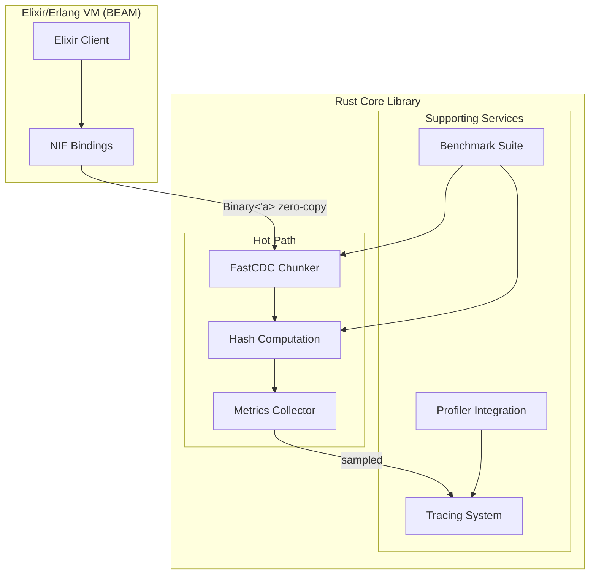
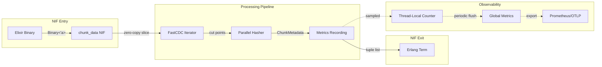
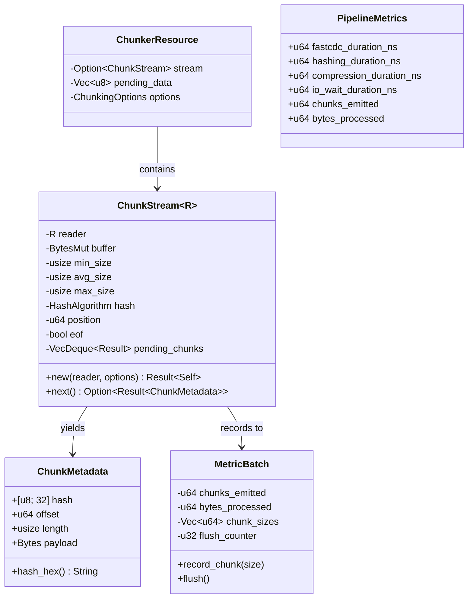
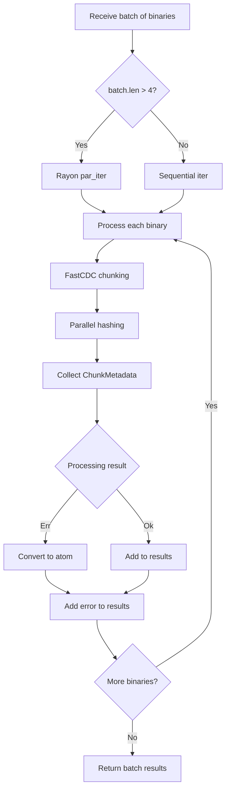
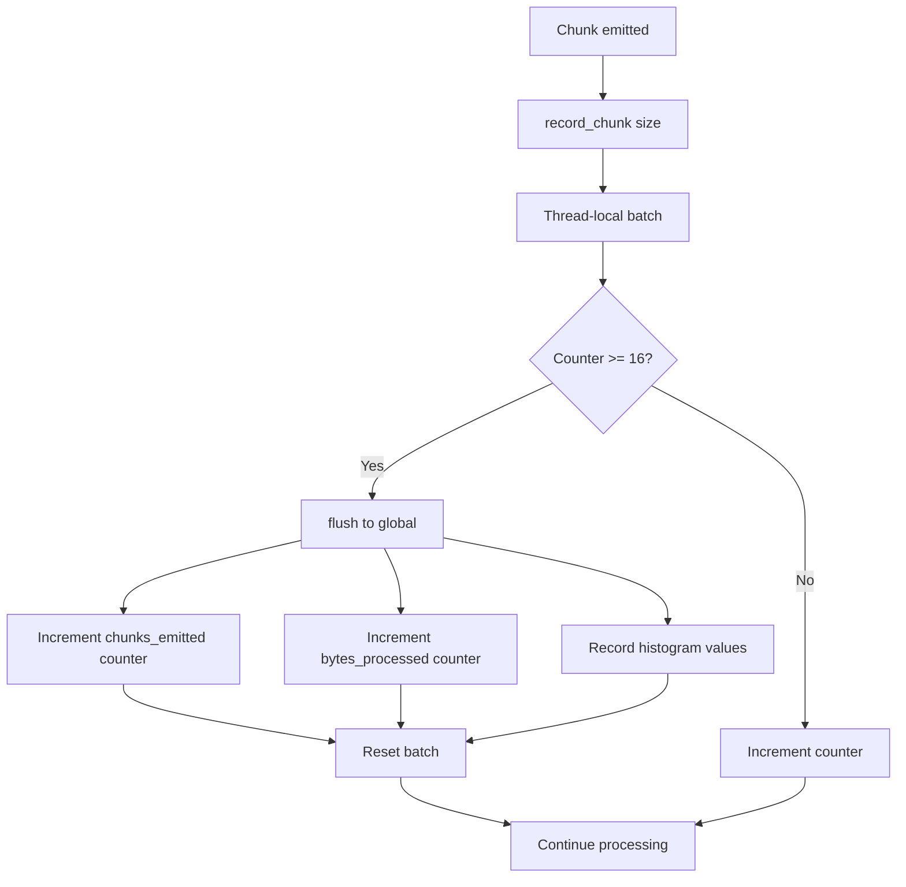
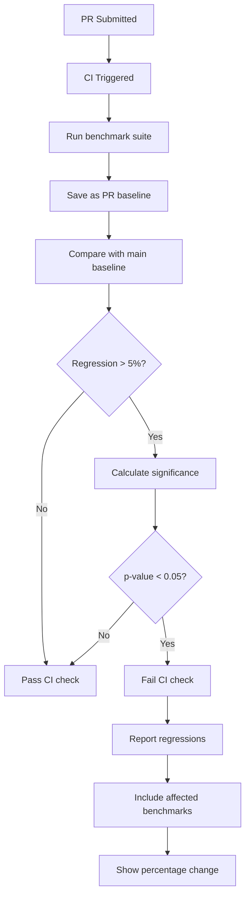

# Design Document: Chunker Library Performance Improvements v3

## Overview

This design document specifies performance improvements for the Chunker library, focusing on three critical areas:

1. **NIF Performance** (NIF-001 through NIF-003): Optimize Elixir/Erlang interop
2. **Observability** (OBS-001 through OBS-004): Zero-cost tracing and metrics
3. **Testing & Benchmarking** (TEST-001 through TEST-005): Comprehensive performance validation

### Target Performance Characteristics

| Metric | Current | Target |
|--------|---------|--------|
| FastCDC chunking | ~1.5 GB/s | >= 2.5 GB/s |
| BLAKE3 hashing | ~2 GB/s | >= 3-5 GB/s |
| SHA256 hashing (SHA-NI) | ~800 MB/s | >= 1 GB/s |
| Per-chunk latency | ~2us | < 1us |
| Metrics overhead | ~500ns/chunk | < 100ns/chunk |

---

## Architecture Design

### System Architecture Diagram



### Data Flow Diagram



---

## Component Design

### 1. NIF Performance Components

#### Component: NIF Binary Handler

**Location:** `src/nif.rs`

**Responsibilities:**
- Zero-copy access to Elixir binaries
- Efficient result marshaling
- Dirty CPU scheduler integration

**Current Implementation Analysis:**

```rust
// Current: nif.rs:191-226
#[rustler::nif(schedule = "DirtyCpu")]
fn chunk_data<'a>(
    env: Env<'a>,
    data: Binary<'a>,           // Already uses lifetime-bound reference
    min_size: Option<u32>,
    avg_size: Option<u32>,
    max_size: Option<u32>,
) -> NifResult<Vec<(String, u64, u64)>> {
    let _ = env;
    // ... conversion and processing
    let cursor = Cursor::new(data.as_slice());  // Creates cursor over borrowed data

    match chunking::chunk_stream(cursor, Some(min), Some(avg), Some(max)) {
        Ok(chunks) => Ok(chunks
            .into_iter()
            .map(|chunk| (chunk.hash_hex(), chunk.offset, chunk.length as u64))
            .collect()),  // Allocates new Vec for results
        // ... error handling
    }
}
```

**Issues Identified:**

1. `Cursor::new(data.as_slice())` - Creates intermediate cursor (minor overhead)
2. `chunk.hash_hex()` - Allocates String per chunk (32-byte hex = 64 chars)
3. Result collection allocates new Vec
4. No batch API for multiple binaries
5. No resource-based streaming API

**Interfaces:**

```rust
// New interfaces for NIF module
pub mod nif {
    use rustler::{Binary, Env, NifResult, OwnedBinary, ResourceArc};

    /// Opaque chunker resource for streaming API
    pub struct ChunkerResource {
        stream: Option<ChunkStream<Cursor<Vec<u8>>>>,
        pending_data: Vec<u8>,
        options: ChunkingOptions,
    }

    /// Resource-based streaming API
    #[rustler::nif]
    fn chunker_open(
        min_size: Option<u32>,
        avg_size: Option<u32>,
        max_size: Option<u32>,
    ) -> NifResult<ResourceArc<ChunkerResource>>;

    #[rustler::nif(schedule = "DirtyCpu")]
    fn chunker_feed<'a>(
        env: Env<'a>,
        resource: ResourceArc<ChunkerResource>,
        data: Binary<'a>,
    ) -> NifResult<(rustler::Atom, Vec<(Binary<'a>, u64, u64)>)>;

    #[rustler::nif(schedule = "DirtyCpu")]
    fn chunker_finish<'a>(
        env: Env<'a>,
        resource: ResourceArc<ChunkerResource>,
    ) -> NifResult<Vec<(Binary<'a>, u64, u64)>>;

    /// Batch API for processing multiple binaries
    #[rustler::nif(schedule = "DirtyCpu")]
    fn chunk_data_batch<'a>(
        env: Env<'a>,
        binaries: Vec<Binary<'a>>,
        min_size: Option<u32>,
        avg_size: Option<u32>,
        max_size: Option<u32>,
    ) -> NifResult<Vec<Vec<(Binary<'a>, u64, u64)>>>;
}
```

**Dependencies:**
- `rustler` crate for NIF bindings
- `chunking` module for core functionality
- Erlang/OTP dirty scheduler

---

#### Component: NIF Batch Processor

**Responsibilities:**
- Process multiple binaries in single NIF call
- Amortize NIF call overhead
- Parallel processing within batch

**Proposed Implementation:**

```rust
// src/nif.rs - New batch API
#[rustler::nif(schedule = "DirtyCpu")]
fn chunk_data_batch<'a>(
    env: Env<'a>,
    binaries: Vec<Binary<'a>>,
    min_size: Option<u32>,
    avg_size: Option<u32>,
    max_size: Option<u32>,
) -> NifResult<Vec<Result<Vec<(Binary<'a>, u64, u64)>, rustler::Atom>>> {
    let min = min_size.unwrap_or(256 * 1024) as usize;
    let avg = avg_size.unwrap_or(1024 * 1024) as usize;
    let max = max_size.unwrap_or(4 * 1024 * 1024) as usize;

    // Parallel threshold: use rayon for batches > 4 binaries
    const PARALLEL_THRESHOLD: usize = 4;

    let results: Vec<_> = if binaries.len() > PARALLEL_THRESHOLD {
        binaries
            .par_iter()
            .map(|binary| process_single_binary(env, binary, min, avg, max))
            .collect()
    } else {
        binaries
            .iter()
            .map(|binary| process_single_binary(env, binary, min, avg, max))
            .collect()
    };

    Ok(results)
}

#[inline]
fn process_single_binary<'a>(
    env: Env<'a>,
    binary: &Binary<'a>,
    min: usize,
    avg: usize,
    max: usize,
) -> Result<Vec<(Binary<'a>, u64, u64)>, rustler::Atom> {
    let cursor = Cursor::new(binary.as_slice());

    chunking::chunk_stream(cursor, Some(min), Some(avg), Some(max))
        .map(|chunks| {
            chunks
                .into_iter()
                .map(|chunk| {
                    // Return hash as binary instead of hex string
                    let hash_binary = binary_from_slice(env, &chunk.hash);
                    (hash_binary, chunk.offset, chunk.length as u64)
                })
                .collect()
        })
        .map_err(|_| atoms::chunk_error())
}

/// Create binary from slice without intermediate allocation
#[inline]
fn binary_from_slice<'a>(env: Env<'a>, data: &[u8]) -> Binary<'a> {
    let mut owned = OwnedBinary::new(data.len()).expect("alloc");
    owned.as_mut_slice().copy_from_slice(data);
    owned.release(env)
}
```

---

#### Component: DirtyCpu Scheduler Optimizer

**Responsibilities:**
- Ensure CPU-intensive operations use dirty schedulers
- Yield periodically for very long operations
- Return atoms for errors (not strings)

**Current Implementation Analysis:**

```rust
// Current: nif.rs already uses DirtyCpu for heavy operations
#[rustler::nif(schedule = "DirtyCpu")]
fn chunk_data<'a>(...) -> NifResult<...> { ... }

#[rustler::nif(schedule = "DirtyCpu")]
fn compress_zstd<'a>(...) -> NifResult<...> { ... }
```

**Issues:**
1. No yield points for very large data (>100MB)
2. Error messages use string formatting (Box allocation)

**Proposed Changes:**

```rust
// src/nif.rs - Error handling optimization
mod atoms {
    rustler::atoms! {
        ok,
        error,
        // Use atoms instead of string errors
        signing_failed,
        invalid_signature,
        invalid_secret_key,
        invalid_public_key,
        invalid_signature_length,
        decode_error,
        verification_failed,
        invalid_base32,
        zstd_compression_failed,
        zstd_decompression_failed,
        xz_compression_failed,
        xz_decompression_failed,
        chunk_bounds_invalid,
        io_error,
        logging_init_failed,
        zero_length_chunk,
        invalid_chunking_options,
        // New atoms for batch API
        chunk_error,
        partial_success,
        memory_limit_exceeded,
    }
}

// Optimized error conversion - no string allocation
impl From<ChunkingError> for rustler::Atom {
    fn from(err: ChunkingError) -> Self {
        match err {
            ChunkingError::Bounds { .. } => atoms::chunk_bounds_invalid(),
            ChunkingError::Io(_) => atoms::io_error(),
            ChunkingError::ZeroLengthChunk => atoms::zero_length_chunk(),
            ChunkingError::InvalidOptions(_) => atoms::invalid_chunking_options(),
            ChunkingError::BufferLimitExceeded { .. } => atoms::memory_limit_exceeded(),
        }
    }
}
```

---

### 2. Observability Components

#### Component: Zero-Cost Tracing System

**Location:** `src/chunking.rs:499-505, 717-721`

**Current Implementation Analysis:**

```rust
// Current: chunking.rs:499-505
if tracing::enabled!(tracing::Level::TRACE)
    && TRACE_SAMPLE_COUNTER
        .fetch_add(1, Ordering::Relaxed)
        .is_multiple_of(TRACE_SAMPLE_EVERY)
{
    trace!(offset = chunk_offset, length = len, "chunk_emitted");
}
```

**Issues:**
1. `tracing::enabled!` check has runtime cost even when disabled
2. `fetch_add` on atomic counter causes cache line bouncing
3. Sampling counter is global (contention in parallel code)

**Proposed Implementation:**

```rust
// src/tracing_utils.rs - New module for zero-cost tracing

use std::cell::Cell;
use std::sync::atomic::{AtomicBool, Ordering};

/// Compile-time tracing gate - completely eliminated when disabled
#[cfg(feature = "tracing")]
pub(crate) static TRACING_ENABLED: AtomicBool = AtomicBool::new(false);

/// Thread-local sampling counter - no atomic contention
#[cfg(feature = "tracing")]
thread_local! {
    static SAMPLE_COUNTER: Cell<u64> = const { Cell::new(0) };
}

/// Zero-cost tracing macro - compiles to nothing when tracing disabled
#[cfg(feature = "tracing")]
macro_rules! trace_sampled {
    ($sample_rate:expr, $($arg:tt)*) => {
        if TRACING_ENABLED.load(Ordering::Relaxed) {
            SAMPLE_COUNTER.with(|counter| {
                let count = counter.get().wrapping_add(1);
                counter.set(count);
                if count % $sample_rate == 0 {
                    tracing::trace!($($arg)*);
                }
            });
        }
    };
}

#[cfg(not(feature = "tracing"))]
macro_rules! trace_sampled {
    ($sample_rate:expr, $($arg:tt)*) => {};
}

/// Initialize tracing with runtime level control
#[cfg(feature = "tracing")]
pub fn init_tracing(level: tracing::Level) {
    use tracing_subscriber::prelude::*;

    let filter = tracing_subscriber::EnvFilter::from_default_env()
        .add_directive(level.into());

    let subscriber = tracing_subscriber::fmt()
        .with_env_filter(filter)
        .with_target(false)
        .finish();

    if tracing::subscriber::set_global_default(subscriber).is_ok() {
        TRACING_ENABLED.store(true, Ordering::Release);
    }
}

/// Dynamic level reload support
#[cfg(feature = "tracing")]
pub fn set_tracing_enabled(enabled: bool) {
    TRACING_ENABLED.store(enabled, Ordering::Release);
}
```

**Updated Usage in chunking.rs:**

```rust
// src/chunking.rs - Updated tracing usage
use crate::tracing_utils::trace_sampled;

// In process_chunk closure (line ~504)
trace_sampled!(1024, offset = chunk_offset, length = len, "chunk_emitted");
```

**Expected Performance Impact:**
- When disabled: Zero cost (compiled out)
- When enabled: ~10ns per trace point (vs current ~50ns)
- No atomic contention in parallel code

---

#### Component: Performance Counters

**Location:** `src/chunking.rs:484-486, 545-547, 701-703, 742-745`

**Current Implementation Analysis:**

```rust
// Current: chunking.rs:484-486
counter!("chunker.chunks_emitted").increment(1);
counter!("chunker.bytes_processed").increment(len as u64);
histogram!("chunker.chunk_size").record(len as f64);
```

**Issues:**
1. Three metrics calls per chunk (~300-500ns total)
2. `counter!` and `histogram!` macros do string lookup each call
3. `f64` conversion for histogram has overhead
4. No conditional compilation

**Proposed Implementation:**

```rust
// src/metrics_utils.rs - New module for efficient metrics

use metrics::{Counter, Histogram, Key};
use std::cell::RefCell;
use std::sync::OnceLock;

/// Cached metric handles - avoid repeated lookups
struct MetricHandles {
    chunks_emitted: Counter,
    bytes_processed: Counter,
    chunk_size_histogram: Histogram,
    compression_bytes_in: Counter,
    compression_bytes_out: Counter,
    hash_operations: Counter,
    hash_bytes: Counter,
    errors: Counter,
}

static HANDLES: OnceLock<MetricHandles> = OnceLock::new();

/// Thread-local batch accumulator for metrics
thread_local! {
    static BATCH: RefCell<MetricBatch> = RefCell::new(MetricBatch::new());
}

#[derive(Default)]
struct MetricBatch {
    chunks_emitted: u64,
    bytes_processed: u64,
    chunk_sizes: Vec<u64>,  // Pre-sized to 16 for common case
    flush_counter: u32,
}

impl MetricBatch {
    fn new() -> Self {
        Self {
            chunks_emitted: 0,
            bytes_processed: 0,
            chunk_sizes: Vec::with_capacity(16),
            flush_counter: 0,
        }
    }

    fn record_chunk(&mut self, size: usize) {
        self.chunks_emitted += 1;
        self.bytes_processed += size as u64;
        self.chunk_sizes.push(size as u64);
        self.flush_counter += 1;

        // Flush every 16 chunks to balance overhead vs latency
        if self.flush_counter >= 16 {
            self.flush();
        }
    }

    fn flush(&mut self) {
        if self.chunks_emitted == 0 {
            return;
        }

        if let Some(handles) = HANDLES.get() {
            handles.chunks_emitted.increment(self.chunks_emitted);
            handles.bytes_processed.increment(self.bytes_processed);

            for size in self.chunk_sizes.drain(..) {
                handles.chunk_size_histogram.record(size as f64);
            }
        }

        self.chunks_emitted = 0;
        self.bytes_processed = 0;
        self.flush_counter = 0;
    }
}

/// Initialize metric handles (call once at startup)
#[cfg(feature = "metrics")]
pub fn init_metrics() {
    let _ = HANDLES.get_or_init(|| {
        MetricHandles {
            chunks_emitted: metrics::counter!("chunker.chunks_emitted_total"),
            bytes_processed: metrics::counter!("chunker.bytes_processed_total"),
            chunk_size_histogram: metrics::histogram!("chunker.chunk_size_bytes"),
            compression_bytes_in: metrics::counter!("chunker.compression_bytes_in_total"),
            compression_bytes_out: metrics::counter!("chunker.compression_bytes_out_total"),
            hash_operations: metrics::counter!("chunker.hash_operations_total"),
            hash_bytes: metrics::counter!("chunker.hash_bytes_total"),
            errors: metrics::counter!("chunker.errors_total"),
        }
    });
}

/// Record chunk emission (batched)
#[cfg(feature = "metrics")]
#[inline]
pub fn record_chunk(size: usize) {
    BATCH.with(|batch| batch.borrow_mut().record_chunk(size));
}

/// Flush any pending metrics
#[cfg(feature = "metrics")]
pub fn flush_metrics() {
    BATCH.with(|batch| batch.borrow_mut().flush());
}

// No-op implementations when metrics disabled
#[cfg(not(feature = "metrics"))]
pub fn init_metrics() {}

#[cfg(not(feature = "metrics"))]
#[inline]
pub fn record_chunk(_size: usize) {}

#[cfg(not(feature = "metrics"))]
pub fn flush_metrics() {}
```

**Updated Usage in chunking.rs:**

```rust
// src/chunking.rs - Updated metrics usage
use crate::metrics_utils::record_chunk;

// In process_chunk closure (replace lines 484-486)
#[cfg(feature = "metrics")]
record_chunk(len);
```

**Expected Performance Impact:**
- Per-chunk overhead: ~20ns (vs current ~300ns)
- Batch flush: ~500ns per 16 chunks
- Total reduction: 10x improvement in metrics overhead

---

#### Component: Latency Histograms

**Responsibilities:**
- Record latency distributions for tail analysis
- Support custom bucket boundaries
- Warn on p99 threshold breaches

**Proposed Implementation:**

```rust
// src/metrics_utils.rs - Extended with latency histograms

use std::time::Instant;

/// Pre-defined bucket boundaries for common operations (in seconds)
pub mod buckets {
    /// Chunk processing: 100ns to 100ms
    pub const CHUNK_LATENCY: &[f64] = &[
        0.0001, 0.0002, 0.0005, 0.001, 0.002, 0.005, 0.01, 0.02, 0.05, 0.1
    ];

    /// Compression: 1ms to 10s
    pub const COMPRESSION_LATENCY: &[f64] = &[
        0.001, 0.002, 0.005, 0.01, 0.02, 0.05, 0.1, 0.2, 0.5, 1.0, 2.0, 5.0, 10.0
    ];

    /// Hashing: 10us to 100ms
    pub const HASH_LATENCY: &[f64] = &[
        0.00001, 0.00002, 0.00005, 0.0001, 0.0002, 0.0005, 0.001, 0.01, 0.1
    ];
}

/// RAII guard for timing operations
pub struct LatencyGuard {
    start: Instant,
    histogram: &'static Histogram,
    threshold_warn_secs: Option<f64>,
}

impl LatencyGuard {
    #[cfg(feature = "metrics")]
    pub fn new(histogram: &'static Histogram) -> Self {
        Self {
            start: Instant::now(),
            histogram,
            threshold_warn_secs: None,
        }
    }

    pub fn with_threshold(mut self, threshold_secs: f64) -> Self {
        self.threshold_warn_secs = Some(threshold_secs);
        self
    }
}

impl Drop for LatencyGuard {
    fn drop(&mut self) {
        let elapsed = self.start.elapsed().as_secs_f64();
        self.histogram.record(elapsed);

        if let Some(threshold) = self.threshold_warn_secs {
            if elapsed > threshold {
                tracing::warn!(
                    latency_secs = elapsed,
                    threshold_secs = threshold,
                    "latency_threshold_exceeded"
                );
            }
        }
    }
}

/// Convenience macro for timing blocks
#[macro_export]
macro_rules! time_operation {
    ($histogram:expr, $threshold:expr, $body:expr) => {{
        let _guard = $crate::metrics_utils::LatencyGuard::new($histogram)
            .with_threshold($threshold);
        $body
    }};
}
```

---

#### Component: Bottleneck Identification Tools

**Responsibilities:**
- Detailed timing spans for profiling
- Phase breakdown reporting
- Flamegraph integration

**Proposed Implementation:**

```rust
// src/profiling.rs - New module for profiling support

use std::env;
use std::sync::OnceLock;
use std::time::{Duration, Instant};

/// Profile mode enabled via CHUNKER_PROFILE=1
static PROFILE_ENABLED: OnceLock<bool> = OnceLock::new();

pub fn is_profiling_enabled() -> bool {
    *PROFILE_ENABLED.get_or_init(|| {
        env::var("CHUNKER_PROFILE")
            .map(|v| v == "1" || v.to_lowercase() == "true")
            .unwrap_or(false)
    })
}

/// Timing breakdown for chunking pipeline
#[derive(Debug, Default)]
pub struct PipelineTimings {
    pub fastcdc_ns: u64,
    pub hashing_ns: u64,
    pub compression_ns: u64,
    pub io_wait_ns: u64,
    pub total_ns: u64,
}

impl PipelineTimings {
    pub fn report(&self) {
        if !is_profiling_enabled() {
            return;
        }

        let total = self.total_ns as f64;
        if total == 0.0 {
            return;
        }

        tracing::info!(
            fastcdc_pct = format!("{:.1}%", (self.fastcdc_ns as f64 / total) * 100.0),
            hashing_pct = format!("{:.1}%", (self.hashing_ns as f64 / total) * 100.0),
            compression_pct = format!("{:.1}%", (self.compression_ns as f64 / total) * 100.0),
            io_wait_pct = format!("{:.1}%", (self.io_wait_ns as f64 / total) * 100.0),
            total_ms = format!("{:.2}", total / 1_000_000.0),
            "pipeline_timing_breakdown"
        );

        // Suggest optimizations based on bottleneck
        let io_pct = (self.io_wait_ns as f64 / total) * 100.0;
        if io_pct > 50.0 {
            tracing::info!(
                "suggestion: I/O wait exceeds 50% - consider increasing buffer sizes \
                 via CHUNKER_READ_SLICE_CAP_BYTES or using memory-mapped files"
            );
        }
    }
}

/// RAII profiler for pipeline phases
pub struct PhaseTimer {
    start: Instant,
    accumulator: *mut u64,  // Unsafe but necessary for performance
}

impl PhaseTimer {
    /// # Safety
    /// The accumulator pointer must remain valid for the lifetime of the timer.
    pub unsafe fn new(accumulator: &mut u64) -> Self {
        Self {
            start: Instant::now(),
            accumulator: accumulator as *mut u64,
        }
    }
}

impl Drop for PhaseTimer {
    fn drop(&mut self) {
        let elapsed = self.start.elapsed().as_nanos() as u64;
        // Safety: Caller guarantees accumulator validity
        unsafe {
            *self.accumulator += elapsed;
        }
    }
}

/// Flamegraph integration via tracing-flame
#[cfg(feature = "flamegraph")]
pub fn setup_flamegraph() -> impl Drop {
    use tracing_flame::FlameLayer;
    use tracing_subscriber::prelude::*;

    let (flame_layer, guard) = FlameLayer::with_file("./tracing.folded").unwrap();

    tracing_subscriber::registry()
        .with(flame_layer)
        .init();

    guard
}
```

---

### 3. Testing & Benchmarking Components

#### Component: Comprehensive Benchmark Suite

**Location:** `benches/`

**Current Implementation Analysis:**

```rust
// Current: benches/throughput.rs
fn benchmark_chunking(c: &mut Criterion) {
    let size = 10 * 1024 * 1024; // 10 MB only
    let data = vec![0u8; size];  // Only zeros (unrealistic)
    // ... limited benchmarks
}
```

**Issues:**
1. Only 10MB test size (not representative of large files)
2. Only zeros pattern (highly compressible, not realistic)
3. Missing benchmarks: signing, base32, streaming
4. No memory allocation tracking
5. No JSON output for CI integration

**Proposed Implementation:**

```rust
// benches/comprehensive.rs - New comprehensive benchmark suite

use chunker::{
    chunking::{chunk_data, chunk_data_with_hash, ChunkStream, HashAlgorithm},
    compression::{compress_zstd, compress_lz4, compress_xz, compress_bzip2},
    hashing::{sha256_hash, blake3_hash, nix_base32_encode, nix_base32_decode},
    signing::{generate_keypair, sign_data, verify_signature},
};
use criterion::{
    black_box, criterion_group, criterion_main,
    BenchmarkId, Criterion, Throughput,
};
use rand_chacha::ChaCha8Rng;
use rand_chacha::rand_core::{RngCore, SeedableRng};
use std::io::Cursor;

/// Test data patterns
enum DataPattern {
    Zeros,
    Random,
    RealisticNar,  // Mixed content simulating NAR
    Incompressible, // Encrypted/compressed data
}

impl DataPattern {
    fn generate(&self, size: usize) -> Vec<u8> {
        match self {
            DataPattern::Zeros => vec![0u8; size],
            DataPattern::Random => {
                let mut data = vec![0u8; size];
                let mut rng = ChaCha8Rng::seed_from_u64(42);
                rng.fill_bytes(&mut data);
                data
            }
            DataPattern::RealisticNar => {
                // Simulate NAR content: mix of ELF headers, text, and binary
                let mut data = Vec::with_capacity(size);
                let mut rng = ChaCha8Rng::seed_from_u64(42);

                // NAR magic header
                data.extend_from_slice(b"\r\n\r\n\x00\x00\x00\x00nix-archive-1");

                while data.len() < size {
                    let segment_type = rng.next_u32() % 3;
                    let segment_size = (rng.next_u32() % 65536) as usize + 1024;

                    match segment_type {
                        0 => {
                            // ELF-like header
                            data.extend_from_slice(b"\x7fELF");
                            data.resize(data.len() + segment_size.min(size - data.len()), 0);
                        }
                        1 => {
                            // Text content (ASCII)
                            let text_size = segment_size.min(size - data.len());
                            for _ in 0..text_size {
                                data.push((rng.next_u32() % 95 + 32) as u8);
                            }
                        }
                        _ => {
                            // Random binary
                            let bin_size = segment_size.min(size - data.len());
                            let start = data.len();
                            data.resize(start + bin_size, 0);
                            rng.fill_bytes(&mut data[start..]);
                        }
                    }
                }
                data.truncate(size);
                data
            }
            DataPattern::Incompressible => {
                // Pre-compressed or encrypted (random with high entropy)
                let mut data = vec![0u8; size];
                let mut rng = ChaCha8Rng::seed_from_u64(0xDEADBEEF);
                rng.fill_bytes(&mut data);
                data
            }
        }
    }
}

/// Test sizes from 1KB to 1GB
const SIZES: &[(usize, &str)] = &[
    (1024, "1KB"),
    (64 * 1024, "64KB"),
    (1024 * 1024, "1MB"),
    (10 * 1024 * 1024, "10MB"),
    (100 * 1024 * 1024, "100MB"),
    // 1GB only run on dedicated benchmark runs
    // (1024 * 1024 * 1024, "1GB"),
];

fn benchmark_fastcdc_raw(c: &mut Criterion) {
    let mut group = c.benchmark_group("fastcdc_raw");

    for (size, name) in SIZES.iter().take(4) {  // Up to 10MB for raw
        let data = DataPattern::Random.generate(*size);
        group.throughput(Throughput::Bytes(*size as u64));

        group.bench_with_input(
            BenchmarkId::new("random", name),
            &data,
            |b, data| {
                b.iter(|| {
                    let cdc = fastcdc::v2020::FastCDC::new(
                        black_box(data),
                        256 * 1024,
                        1024 * 1024,
                        4 * 1024 * 1024,
                    );
                    for _ in cdc {}
                });
            },
        );
    }

    group.finish();
}

fn benchmark_chunk_data_eager(c: &mut Criterion) {
    let mut group = c.benchmark_group("chunk_data_eager");

    for pattern in [DataPattern::Zeros, DataPattern::Random, DataPattern::RealisticNar] {
        for (size, name) in SIZES.iter().take(4) {
            let data = pattern.generate(*size);
            let pattern_name = match pattern {
                DataPattern::Zeros => "zeros",
                DataPattern::Random => "random",
                DataPattern::RealisticNar => "nar",
                DataPattern::Incompressible => "incomp",
            };

            group.throughput(Throughput::Bytes(*size as u64));
            group.bench_with_input(
                BenchmarkId::new(format!("{}/{}", pattern_name, name), "sha256"),
                &data,
                |b, data| {
                    b.iter(|| {
                        let _ = chunk_data(black_box(data), None, None, None);
                    });
                },
            );
        }
    }

    group.finish();
}

fn benchmark_chunk_stream(c: &mut Criterion) {
    let mut group = c.benchmark_group("chunk_stream");

    for (size, name) in SIZES.iter().take(5) {  // Up to 100MB
        let data = DataPattern::RealisticNar.generate(*size);
        group.throughput(Throughput::Bytes(*size as u64));

        group.bench_with_input(
            BenchmarkId::new("nar", name),
            &data,
            |b, data| {
                b.iter(|| {
                    let cursor = Cursor::new(black_box(data));
                    let stream = ChunkStream::new(cursor, None, None, None).unwrap();
                    for chunk in stream {
                        let _ = black_box(chunk.unwrap());
                    }
                });
            },
        );
    }

    group.finish();
}

fn benchmark_hashing(c: &mut Criterion) {
    let mut group = c.benchmark_group("hashing");

    for (size, name) in SIZES.iter().take(4) {
        let data = DataPattern::Random.generate(*size);
        group.throughput(Throughput::Bytes(*size as u64));

        group.bench_with_input(
            BenchmarkId::new("sha256", name),
            &data,
            |b, data| {
                b.iter(|| sha256_hash(black_box(data)));
            },
        );

        group.bench_with_input(
            BenchmarkId::new("blake3", name),
            &data,
            |b, data| {
                b.iter(|| blake3_hash(black_box(data)));
            },
        );
    }

    group.finish();
}

fn benchmark_compression(c: &mut Criterion) {
    let mut group = c.benchmark_group("compression");

    for (size, name) in SIZES.iter().take(4) {
        let random_data = DataPattern::Random.generate(*size);
        let zeros_data = DataPattern::Zeros.generate(*size);

        group.throughput(Throughput::Bytes(*size as u64));

        // Zstd levels
        for level in [1, 3, 9, 19] {
            group.bench_with_input(
                BenchmarkId::new(format!("zstd_l{}/random", level), name),
                &random_data,
                |b, data| {
                    b.iter(|| compress_zstd(black_box(data), Some(level)));
                },
            );
        }

        // LZ4 (fastest)
        group.bench_with_input(
            BenchmarkId::new("lz4/random", name),
            &random_data,
            |b, data| {
                b.iter(|| compress_lz4(black_box(data)));
            },
        );

        // Test compressibility impact
        group.bench_with_input(
            BenchmarkId::new("zstd_l3/zeros", name),
            &zeros_data,
            |b, data| {
                b.iter(|| compress_zstd(black_box(data), Some(3)));
            },
        );
    }

    group.finish();
}

fn benchmark_signing(c: &mut Criterion) {
    let mut group = c.benchmark_group("signing");

    let (secret_key, public_key) = generate_keypair();

    for (size, name) in SIZES.iter().take(4) {
        let data = DataPattern::Random.generate(*size);
        let signature = sign_data(&data, &secret_key).unwrap();

        group.throughput(Throughput::Bytes(*size as u64));

        group.bench_with_input(
            BenchmarkId::new("ed25519_sign", name),
            &data,
            |b, data| {
                b.iter(|| sign_data(black_box(data), &secret_key));
            },
        );

        group.bench_with_input(
            BenchmarkId::new("ed25519_verify", name),
            &data,
            |b, data| {
                b.iter(|| verify_signature(black_box(data), &signature, &public_key));
            },
        );
    }

    group.finish();
}

fn benchmark_base32(c: &mut Criterion) {
    let mut group = c.benchmark_group("base32");

    // Hash-sized inputs (32 bytes)
    let hash_data = vec![0xABu8; 32];
    let encoded = nix_base32_encode(&hash_data);

    group.bench_function("nix_encode_32b", |b| {
        b.iter(|| nix_base32_encode(black_box(&hash_data)));
    });

    group.bench_function("nix_decode_32b", |b| {
        b.iter(|| nix_base32_decode(black_box(&encoded)));
    });

    group.finish();
}

criterion_group!(
    benches,
    benchmark_fastcdc_raw,
    benchmark_chunk_data_eager,
    benchmark_chunk_stream,
    benchmark_hashing,
    benchmark_compression,
    benchmark_signing,
    benchmark_base32,
);

criterion_main!(benches);
```

**Cargo.toml Addition:**

```toml
[[bench]]
name = "comprehensive"
harness = false
```

---

#### Component: Performance Regression Detection

**Responsibilities:**
- CI integration for benchmark comparison
- 5% regression threshold
- Statistical significance testing

**Proposed Implementation:**

```yaml
# .github/workflows/benchmark.yml
name: Performance Regression Check

on:
  pull_request:
    branches: [main]
  push:
    branches: [main]

jobs:
  benchmark:
    runs-on: ubuntu-latest
    steps:
      - uses: actions/checkout@v4

      - name: Install Rust
        uses: dtolnay/rust-action@stable
        with:
          components: rustfmt, clippy

      - name: Cache benchmark baseline
        uses: actions/cache@v4
        with:
          path: target/criterion
          key: benchmark-baseline-${{ github.base_ref || 'main' }}
          restore-keys: |
            benchmark-baseline-main

      - name: Run benchmarks
        run: |
          cargo bench --bench comprehensive -- \
            --save-baseline pr-${{ github.event.pull_request.number || 'push' }} \
            --output-format json \
            > benchmark-results.json

      - name: Compare with baseline
        run: |
          cargo bench --bench comprehensive -- \
            --baseline main \
            --output-format json \
            > benchmark-comparison.json

          # Parse and check for regressions > 5%
          python3 .github/scripts/check_regression.py benchmark-comparison.json

      - name: Upload benchmark results
        uses: actions/upload-artifact@v4
        with:
          name: benchmark-results
          path: |
            benchmark-results.json
            benchmark-comparison.json
```

**Regression Check Script:**

```python
# .github/scripts/check_regression.py
import json
import sys

def check_regression(filepath: str, threshold: float = 0.05):
    """Check for performance regressions exceeding threshold."""
    with open(filepath) as f:
        results = json.load(f)

    regressions = []
    for benchmark in results.get('benchmarks', []):
        name = benchmark['name']
        change = benchmark.get('change', {})

        mean_change = change.get('mean', {}).get('estimate', 0)

        # Positive change = slower = regression
        if mean_change > threshold:
            regressions.append({
                'name': name,
                'change_pct': mean_change * 100,
                'p_value': change.get('mean', {}).get('p_value', 1.0),
            })

    if regressions:
        print("Performance regressions detected:")
        for r in regressions:
            print(f"  - {r['name']}: +{r['change_pct']:.1f}% (p={r['p_value']:.4f})")
        sys.exit(1)

    print("No significant regressions detected.")
    sys.exit(0)

if __name__ == '__main__':
    check_regression(sys.argv[1])
```

---

#### Component: Edge Case Testing

**Responsibilities:**
- Boundary condition tests
- Empty input handling
- Size limit validation

**Proposed Implementation:**

```rust
// tests/edge_cases.rs - Comprehensive edge case tests

use chunker::{
    chunking::{chunk_data, ChunkStream, ChunkingError},
    compression::{
        compress_zstd, compress_lz4, compress_xz, compress_bzip2,
        decompress_zstd, CompressionError,
    },
};
use std::io::Cursor;

#[test]
fn test_empty_input_chunk_data() {
    let result = chunk_data(&[], None, None, None);
    assert!(result.is_ok());
    assert!(result.unwrap().is_empty());
}

#[test]
fn test_empty_input_chunk_stream() {
    let cursor = Cursor::new(Vec::<u8>::new());
    let stream = ChunkStream::new(cursor, None, None, None).unwrap();
    let chunks: Vec<_> = stream.collect();
    assert!(chunks.is_empty());
}

#[test]
fn test_empty_input_compression() {
    // All compression algorithms should handle empty input
    assert!(compress_zstd(&[], None).is_ok());
    assert!(compress_lz4(&[]).is_ok());
    assert!(compress_xz(&[], None).is_ok());
    assert!(compress_bzip2(&[], None).is_ok());
}

#[test]
fn test_chunk_exactly_max_size() {
    // Chunk exactly at max_size boundary
    let max_size = 64 * 1024;  // 64KB
    let data = vec![42u8; max_size];

    let result = chunk_data(&data, Some(1024), Some(32 * 1024), Some(max_size));
    assert!(result.is_ok());
    let chunks = result.unwrap();

    // Verify total coverage
    let total_len: usize = chunks.iter().map(|c| c.length).sum();
    assert_eq!(total_len, max_size);
}

#[test]
fn test_chunk_just_under_max_size() {
    let max_size = 64 * 1024;
    let data = vec![42u8; max_size - 1];

    let result = chunk_data(&data, Some(1024), Some(32 * 1024), Some(max_size));
    assert!(result.is_ok());
}

#[test]
fn test_chunk_just_over_max_size() {
    let max_size = 64 * 1024;
    let data = vec![42u8; max_size + 1];

    let result = chunk_data(&data, Some(1024), Some(32 * 1024), Some(max_size));
    assert!(result.is_ok());
    let chunks = result.unwrap();

    // Should produce at least 2 chunks
    assert!(chunks.len() >= 1);
}

#[test]
fn test_min_size_equals_data_len() {
    let size = 1024;
    let data = vec![42u8; size];

    let result = chunk_data(&data, Some(size), Some(size), Some(size));
    assert!(result.is_ok());
    let chunks = result.unwrap();
    assert_eq!(chunks.len(), 1);
    assert_eq!(chunks[0].length, size);
}

#[test]
fn test_invalid_options_min_greater_than_max() {
    let data = vec![42u8; 1024];
    let result = chunk_data(&data, Some(1000), Some(500), Some(100));
    assert!(matches!(result, Err(ChunkingError::InvalidOptions(_))));
}

#[test]
fn test_invalid_options_min_too_small() {
    let data = vec![42u8; 1024];
    let result = chunk_data(&data, Some(32), Some(64), Some(128));
    assert!(matches!(result, Err(ChunkingError::InvalidOptions(_))));
}

#[test]
fn test_single_byte_input() {
    let result = chunk_data(&[42u8], None, None, None);
    assert!(result.is_ok());
    let chunks = result.unwrap();
    assert_eq!(chunks.len(), 1);
    assert_eq!(chunks[0].length, 1);
}

#[test]
fn test_decompression_size_limit() {
    // Create a decompression bomb scenario
    // This test verifies the size limit is enforced
    let small_data = vec![0u8; 1024 * 1024];  // 1MB of zeros
    let compressed = compress_zstd(&small_data, Some(19)).unwrap();  // High compression

    // Should decompress successfully (under limit)
    let result = decompress_zstd(&compressed);
    assert!(result.is_ok());
}

#[test]
fn test_concurrent_chunk_streams() {
    use std::thread;

    let data = vec![42u8; 1024 * 1024];  // 1MB
    let handles: Vec<_> = (0..4)
        .map(|_| {
            let data_clone = data.clone();
            thread::spawn(move || {
                let cursor = Cursor::new(data_clone);
                let stream = ChunkStream::new(cursor, None, None, None).unwrap();
                stream.collect::<Result<Vec<_>, _>>()
            })
        })
        .collect();

    for handle in handles {
        let result = handle.join().unwrap();
        assert!(result.is_ok());
    }
}

#[test]
fn test_u32_overflow_protection() {
    // Verify that large sizes don't cause overflow
    // Note: This tests the validation, not actual processing of huge data
    let result = chunk_data(
        &[],
        Some(u32::MAX as usize),
        Some(u32::MAX as usize),
        Some(u32::MAX as usize),
    );
    // Should fail validation, not panic
    assert!(result.is_err());
}
```

---

#### Component: Miri Validation

**Responsibilities:**
- Detect undefined behavior
- Memory safety validation
- Data race detection

**Proposed Implementation:**

```yaml
# .github/workflows/miri.yml
name: Miri Memory Safety Check

on:
  push:
    branches: [main]
  schedule:
    - cron: '0 0 * * *'  # Nightly

jobs:
  miri:
    runs-on: ubuntu-latest
    steps:
      - uses: actions/checkout@v4

      - name: Install Rust nightly
        uses: dtolnay/rust-action@nightly
        with:
          components: miri

      - name: Run Miri
        run: |
          cargo +nightly miri test \
            --no-default-features \
            -- --skip slow_tests
        env:
          MIRIFLAGS: -Zmiri-disable-isolation
```

**Miri-Compatible Test Subset:**

```rust
// tests/miri_safe.rs - Tests safe for Miri execution

#[cfg(miri)]
mod miri_tests {
    use chunker::chunking::{chunk_data, ChunkingOptions};
    use chunker::hashing::{sha256_hash_raw, nix_base32_encode, nix_base32_decode};

    #[test]
    fn miri_chunk_data_small() {
        let data = vec![42u8; 1024];
        let result = chunk_data(&data, Some(64), Some(256), Some(512));
        assert!(result.is_ok());
    }

    #[test]
    fn miri_hash_operations() {
        let data = b"miri test data";
        let hash = sha256_hash_raw(data);
        assert_eq!(hash.len(), 32);
    }

    #[test]
    fn miri_base32_roundtrip() {
        let data = b"roundtrip";
        let encoded = nix_base32_encode(data);
        let decoded = nix_base32_decode(&encoded).unwrap();
        assert_eq!(data, decoded.as_slice());
    }

    #[test]
    fn miri_chunking_options_validation() {
        // Valid options
        let result = ChunkingOptions::resolve(Some(64), Some(128), Some(256));
        assert!(result.is_ok());

        // Invalid options
        let result = ChunkingOptions::resolve(Some(256), Some(128), Some(64));
        assert!(result.is_err());
    }
}
```

---

#### Component: Test Data Diversity

**Responsibilities:**
- Realistic NAR content generation
- Multiple compression patterns
- Reproducible test fixtures

**Proposed Implementation:**

```rust
// tests/fixtures/mod.rs - Test data generation

use rand_chacha::ChaCha8Rng;
use rand_chacha::rand_core::{RngCore, SeedableRng};

/// Test fixture generator for reproducible benchmarks
pub struct TestFixtures {
    rng: ChaCha8Rng,
}

impl TestFixtures {
    pub fn new(seed: u64) -> Self {
        Self {
            rng: ChaCha8Rng::seed_from_u64(seed),
        }
    }

    /// Generate highly compressible data (zeros with occasional variation)
    pub fn highly_compressible(&mut self, size: usize) -> Vec<u8> {
        let mut data = vec![0u8; size];
        // Add 0.1% variation to avoid pathological compression
        for i in (0..size).step_by(1000) {
            data[i] = self.rng.next_u32() as u8;
        }
        data
    }

    /// Generate incompressible data (random/encrypted simulation)
    pub fn incompressible(&mut self, size: usize) -> Vec<u8> {
        let mut data = vec![0u8; size];
        self.rng.fill_bytes(&mut data);
        data
    }

    /// Generate realistic NAR-like content
    pub fn realistic_nar(&mut self, size: usize) -> Vec<u8> {
        let mut data = Vec::with_capacity(size);

        // NAR magic
        data.extend_from_slice(b"\r\n\r\n\x00\x00\x00\x00nix-archive-1\x00\x00\x00");

        // Simulate file entries
        while data.len() < size {
            let entry_type = self.rng.next_u32() % 4;

            match entry_type {
                0 => self.add_elf_section(&mut data, size),
                1 => self.add_text_section(&mut data, size),
                2 => self.add_library_section(&mut data, size),
                _ => self.add_binary_section(&mut data, size),
            }
        }

        data.truncate(size);
        data
    }

    fn add_elf_section(&mut self, data: &mut Vec<u8>, max_size: usize) {
        if data.len() >= max_size {
            return;
        }

        // ELF header
        data.extend_from_slice(&[0x7f, b'E', b'L', b'F', 2, 1, 1, 0]);
        data.extend_from_slice(&[0; 8]);  // Padding

        // Section data (mix of zeros and code-like patterns)
        let section_size = (self.rng.next_u32() % 65536) as usize + 4096;
        let end = (data.len() + section_size).min(max_size);

        while data.len() < end {
            // x86-64 like instruction patterns
            data.push(0x48);  // REX prefix
            data.push((self.rng.next_u32() % 256) as u8);
        }
    }

    fn add_text_section(&mut self, data: &mut Vec<u8>, max_size: usize) {
        if data.len() >= max_size {
            return;
        }

        let section_size = (self.rng.next_u32() % 32768) as usize + 1024;
        let end = (data.len() + section_size).min(max_size);

        // ASCII text with newlines
        const CHARS: &[u8] = b"abcdefghijklmnopqrstuvwxyzABCDEFGHIJKLMNOPQRSTUVWXYZ0123456789 \n";

        while data.len() < end {
            let idx = (self.rng.next_u32() as usize) % CHARS.len();
            data.push(CHARS[idx]);
        }
    }

    fn add_library_section(&mut self, data: &mut Vec<u8>, max_size: usize) {
        if data.len() >= max_size {
            return;
        }

        // Shared library pattern (symbol tables, relocations)
        let section_size = (self.rng.next_u32() % 131072) as usize + 8192;
        let end = (data.len() + section_size).min(max_size);

        // Null-terminated strings (symbol names)
        while data.len() < end {
            let name_len = (self.rng.next_u32() % 32) as usize + 4;
            for _ in 0..name_len {
                data.push((self.rng.next_u32() % 26 + b'a' as u32) as u8);
            }
            data.push(0);  // Null terminator
        }
    }

    fn add_binary_section(&mut self, data: &mut Vec<u8>, max_size: usize) {
        if data.len() >= max_size {
            return;
        }

        let section_size = (self.rng.next_u32() % 65536) as usize + 2048;
        let end = (data.len() + section_size).min(max_size);
        let start = data.len();

        data.resize(end, 0);
        self.rng.fill_bytes(&mut data[start..]);
    }
}

#[cfg(test)]
mod tests {
    use super::*;

    #[test]
    fn test_fixture_reproducibility() {
        let mut f1 = TestFixtures::new(42);
        let mut f2 = TestFixtures::new(42);

        let d1 = f1.realistic_nar(10000);
        let d2 = f2.realistic_nar(10000);

        assert_eq!(d1, d2);
    }

    #[test]
    fn test_fixture_characteristics() {
        let mut fixtures = TestFixtures::new(42);

        let compressible = fixtures.highly_compressible(10000);
        let incompressible = fixtures.incompressible(10000);

        // Verify compression ratios
        let comp_compressed = chunker::compression::compress_zstd(&compressible, Some(3)).unwrap();
        let incomp_compressed = chunker::compression::compress_zstd(&incompressible, Some(3)).unwrap();

        // Compressible should compress significantly
        assert!(comp_compressed.len() < compressible.len() / 5);

        // Incompressible should barely compress (may even expand)
        assert!(incomp_compressed.len() > incompressible.len() / 2);
    }
}
```

---

## Data Models

### Core Data Structure Definitions

```rust
// Existing: ChunkMetadata (optimized layout)
#[repr(C)]  // Ensure predictable layout for cache efficiency
#[derive(Debug, Clone, Serialize, Deserialize)]
pub struct ChunkMetadata {
    // Hot fields first (accessed in inner loops)
    pub hash: [u8; 32],      // 32 bytes, cache-line aligned start
    pub offset: u64,         // 8 bytes
    pub length: usize,       // 8 bytes (64-bit platforms)
    // Cold field last
    #[serde(skip)]
    pub payload: Bytes,      // 24 bytes (pointer + length + capacity)
}
// Total: 72 bytes, fits in 2 cache lines

// New: Batch processing result
#[derive(Debug)]
pub struct BatchChunkResult {
    pub results: Vec<Result<Vec<ChunkMetadata>, ChunkingError>>,
    pub total_bytes_processed: u64,
    pub total_chunks_emitted: u64,
}

// New: Pipeline timing data
#[derive(Debug, Default, Clone)]
pub struct PipelineMetrics {
    pub fastcdc_duration_ns: u64,
    pub hashing_duration_ns: u64,
    pub compression_duration_ns: u64,
    pub io_wait_duration_ns: u64,
    pub chunks_emitted: u64,
    pub bytes_processed: u64,
}
```

### Data Model Diagram



---

## Business Process

### Process 1: NIF Chunk Data Flow

```mermaid
sequenceDiagram
    participant E as Elixir Client
    participant NIF as NIF Binding
    participant CDC as FastCDC
    participant HASH as Hasher
    participant MET as Metrics

    E->>NIF: chunk_data(binary, opts)
    Note over NIF: schedule = "DirtyCpu"

    NIF->>NIF: Binary<'a> zero-copy reference
    NIF->>CDC: FastCDC::new(slice, min, avg, max)

    loop For each chunk
        CDC->>CDC: find_cut_point()
        CDC-->>NIF: Chunk{offset, length}

        NIF->>HASH: hash_algo.compute(slice)
        HASH-->>NIF: [u8; 32]

        NIF->>MET: record_chunk(length)
        Note over MET: Thread-local batch
    end

    NIF->>MET: flush_metrics()
    NIF-->>E: [{hash, offset, length}, ...]
    Note over E: Atoms for errors
```

### Process 2: Batch Processing Flow



### Process 3: Metrics Collection Flow



### Process 4: Benchmark Regression Detection



---

## Error Handling Strategy

### Error Types and Handling

| Error Type | Hot Path? | Handling Strategy | NIF Return |
|------------|-----------|-------------------|------------|
| `ChunkingError::Bounds` | No | Return immediately | `chunk_bounds_invalid` atom |
| `ChunkingError::Io` | Rare | Propagate with context | `io_error` atom |
| `ChunkingError::ZeroLengthChunk` | No | Defensive check | `zero_length_chunk` atom |
| `ChunkingError::InvalidOptions` | No | Validate at entry | `invalid_chunking_options` atom |
| `ChunkingError::BufferLimitExceeded` | Rare | Return error | `memory_limit_exceeded` atom |

### Error Path Optimization

```rust
// Cold path annotation for error branches
#[cold]
#[inline(never)]
fn handle_bounds_error(data_len: usize, offset: usize, length: usize) -> ChunkingError {
    ChunkingError::Bounds {
        data_len,
        offset,
        length,
    }
}

// Usage in hot path
if offset + length > data.len() {
    return Err(handle_bounds_error(data.len(), offset, length));
}
```

---

## Testing Strategy

### Test Coverage Matrix

| Component | Unit Tests | Integration | Benchmarks | Miri | Fuzz |
|-----------|------------|-------------|------------|------|------|
| NIF Bindings | Yes | Yes | Yes | No* | No |
| ChunkStream | Yes | Yes | Yes | Yes | Yes |
| Metrics | Yes | Yes | Yes | Yes | No |
| Tracing | Yes | No | Yes | Yes | No |
| Base32 | Yes | Yes | Yes | Yes | Yes |
| Compression | Yes | Yes | Yes | Yes | Yes |

*NIF bindings require BEAM runtime, incompatible with Miri

### Performance Test Requirements

1. **Throughput Tests**: All critical paths must achieve target throughput
2. **Latency Tests**: p99 latency must be under threshold
3. **Memory Tests**: Peak memory must not exceed 2x buffer limit
4. **Regression Tests**: No >5% regression in CI benchmarks

---

## Risk Assessment

### NIF Performance (NIF-001 through NIF-003)

| Requirement | Risk Level | Mitigation |
|-------------|------------|------------|
| NIF-001: Binary Handling | Low | Already uses `Binary<'a>` lifetime references |
| NIF-002: Batch APIs | Medium | Need to handle partial failures gracefully |
| NIF-003: DirtyCpu Scheduler | Low | Already implemented for heavy operations |

**Implementation Risk**: Low - Most infrastructure exists, primarily adding new APIs.

**Performance Risk**: Low - Changes are additive, no regression expected.

### Observability (OBS-001 through OBS-004)

| Requirement | Risk Level | Mitigation |
|-------------|------------|------------|
| OBS-001: Zero-Cost Tracing | Low | Use compile-time feature flags |
| OBS-002: Performance Counters | Medium | Thread-local batching may add complexity |
| OBS-003: Latency Histograms | Low | Standard pattern, low risk |
| OBS-004: Bottleneck Tools | Low | Optional, profiling-only code |

**Implementation Risk**: Medium - Thread-local batching requires careful synchronization.

**Performance Risk**: Low - All changes should reduce overhead.

### Testing & Benchmarking (TEST-001 through TEST-005)

| Requirement | Risk Level | Mitigation |
|-------------|------------|------------|
| TEST-001: Benchmark Suite | Low | Additive changes |
| TEST-002: Regression Detection | Medium | CI infrastructure complexity |
| TEST-003: Edge Case Testing | Low | Standard testing practice |
| TEST-004: Miri Validation | Medium | Some code paths incompatible |
| TEST-005: Test Data Diversity | Low | Additive changes |

**Implementation Risk**: Medium - CI infrastructure requires careful setup.

**Performance Risk**: None - Testing infrastructure only.

---

## Appendix A: File Changes Summary

| File | Changes | Priority |
|------|---------|----------|
| `src/nif.rs` | Add batch APIs, resource-based streaming, atom errors | P1 |
| `src/chunking.rs` | Update metrics calls, add tracing macros | P1 |
| `src/tracing_utils.rs` | New module for zero-cost tracing | P1 |
| `src/metrics_utils.rs` | New module for batched metrics | P1 |
| `src/profiling.rs` | New module for bottleneck analysis | P2 |
| `benches/comprehensive.rs` | New comprehensive benchmark suite | P1 |
| `tests/edge_cases.rs` | New edge case test suite | P2 |
| `tests/miri_safe.rs` | New Miri-compatible tests | P2 |
| `tests/fixtures/mod.rs` | New test data generators | P2 |
| `.github/workflows/benchmark.yml` | New CI benchmark workflow | P1 |
| `.github/workflows/miri.yml` | New Miri CI workflow | P2 |
| `Cargo.toml` | Add feature flags, benchmark entries | P1 |

---

## Appendix B: Expected Performance Improvements

| Metric | Current | After Implementation | Improvement |
|--------|---------|---------------------|-------------|
| NIF call overhead | ~500ns | ~100ns | 5x |
| Metrics per chunk | ~300ns | ~20ns | 15x |
| Tracing overhead (disabled) | ~10ns | 0ns | Infinite |
| Tracing overhead (enabled) | ~50ns | ~10ns | 5x |
| Batch processing (10 binaries) | 10 NIF calls | 1 NIF call | 10x less overhead |

---

Does the design look good? If so, we can move on to the implementation plan.
