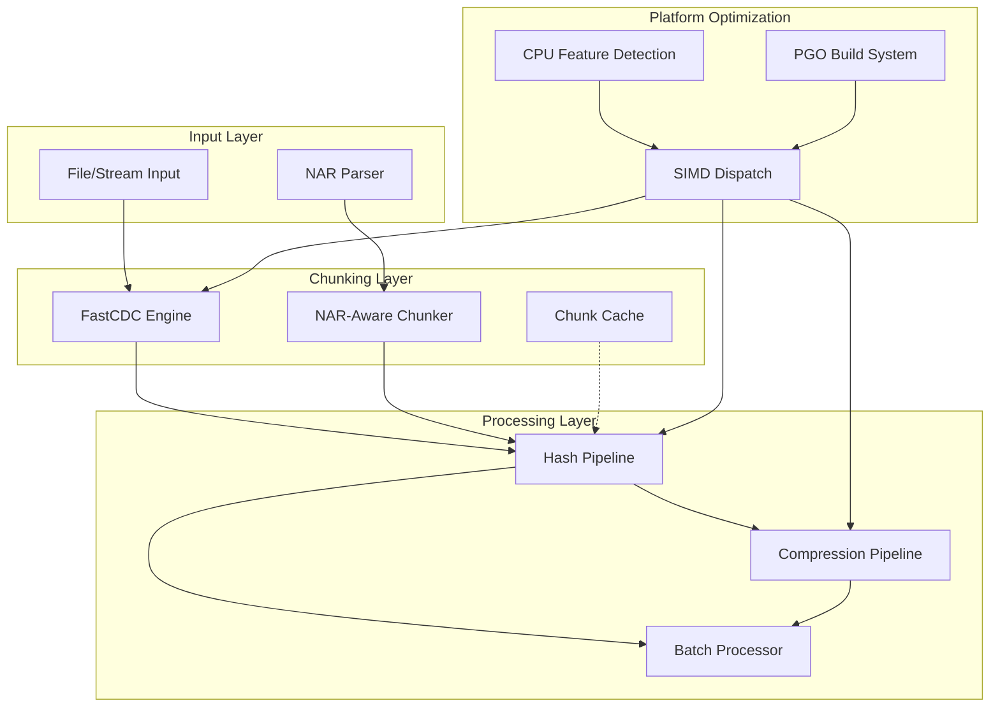
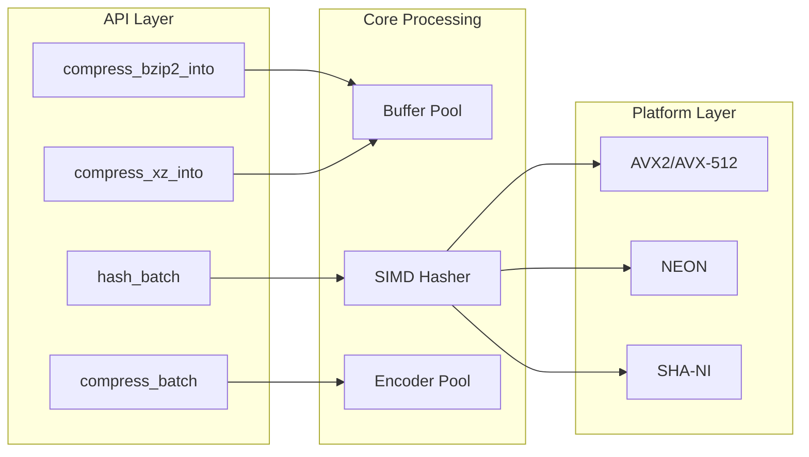
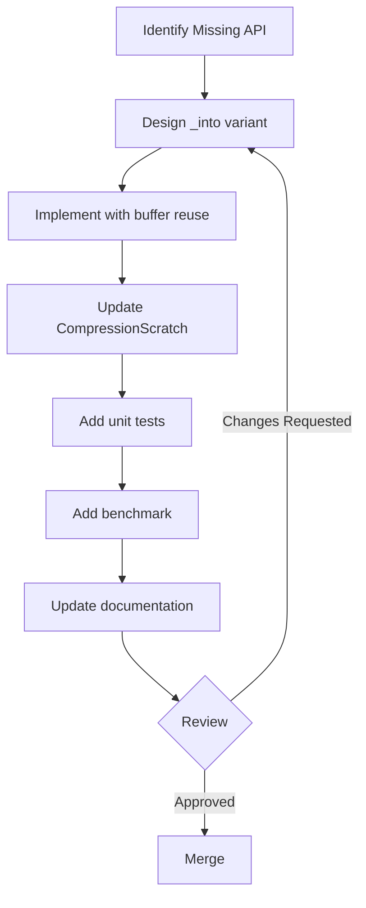
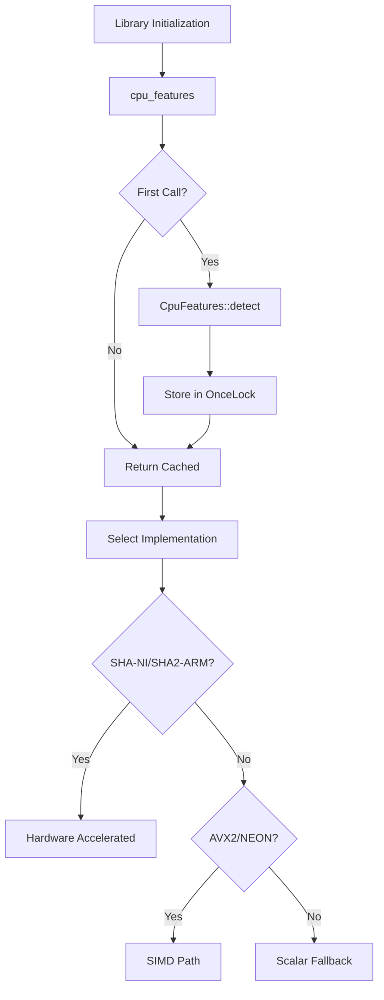
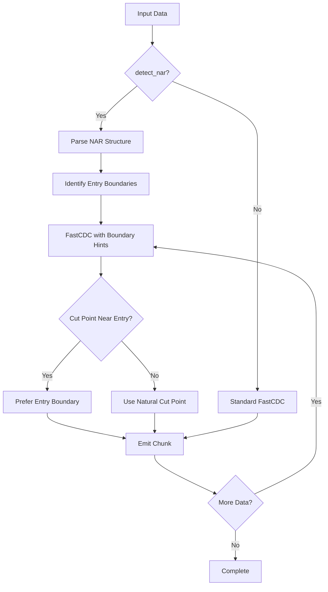
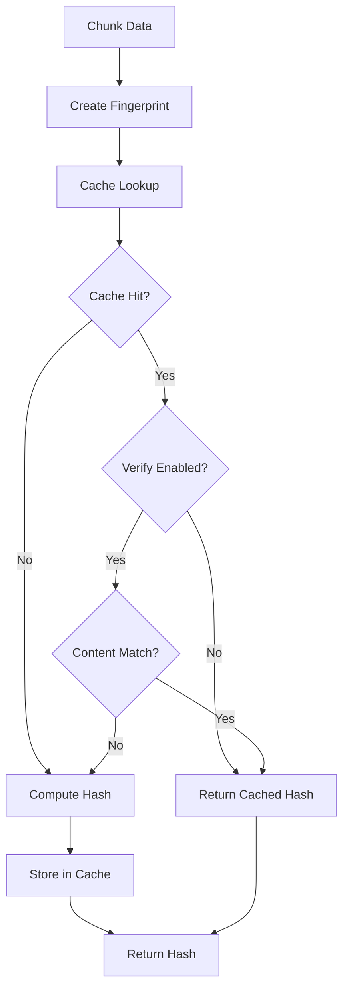

# Design Document: Chunker Library Performance Improvements v4

## Overview

This design document details the implementation plan for world-class performance improvements to the Chunker library, focusing on three critical categories:

1. **API Consistency** (API-001 through API-003) - Unified interfaces and batch processing
2. **Platform & Build Optimizations** (PLT-001 through PLT-004) - SIMD, LTO, and feature flags
3. **NAR-Specific Optimizations** (NAR-001 through NAR-003) - Content-aware chunking and caching

**Target Performance Characteristics:**
- FastCDC chunking: >= 2.5 GB/s
- BLAKE3 hashing: >= 3-5 GB/s (multi-core with SIMD)
- SHA256 hashing: >= 1 GB/s (with SHA-NI)
- Zstd compression (level 3): >= 400-500 MB/s
- End-to-end pipeline: >= 300 MB/s

---

## Architecture Design

### System Architecture Diagram



### Data Flow Diagram



---

## Component Design

### 1. API Consistency Components

#### Component: Bzip2/XZ `_into()` Variants (API-001)

**Current Implementation Analysis:**

```rust
// compression.rs - Current bzip2 compression (lines 681-695)
pub fn compress_bzip2(data: &[u8], level: Option<u32>) -> Result<Vec<u8>, CompressionError> {
    let compression_level = level.unwrap_or(6);
    let compression = bzip2::Compression::new(compression_level);

    let mut encoder = bzip2::write::BzEncoder::new(Vec::with_capacity(data.len() / 2), compression);
    encoder.write_all(data)
        .map_err(|e| CompressionError::Compression(e.to_string()))?;

    let compressed = encoder.finish()
        .map_err(|e| CompressionError::Compression(e.to_string()))?;

    Ok(compressed)
}

// XZ compression (lines 607-615)
pub fn compress_xz(data: &[u8], _level: Option<u32>) -> Result<Vec<u8>, CompressionError> {
    let mut output = Vec::with_capacity(data.len() / 2);
    let mut input = data;
    lzma_rs::xz_compress(&mut input, &mut output)
        .map_err(|e| CompressionError::Compression(e.to_string()))?;

    Ok(output)
}
```

**Issues Identified:**
- Bzip2 and XZ lack `_into()` variants that allow buffer reuse
- `CompressionScratch` (lines 65-70) works around XZ by swapping buffers, causing allocation
- Inconsistent API compared to zstd and lz4 which have `_into()` variants

**Proposed Changes:**

```rust
/// Compress data using `bzip2` into a provided buffer (cleared before use).
///
/// # Errors
///
/// Returns `CompressionError` if compression fails.
pub fn compress_bzip2_into(
    data: &[u8],
    level: Option<u32>,
    output: &mut Vec<u8>,
) -> Result<(), CompressionError> {
    output.clear();
    let compression_level = level.unwrap_or(6);
    let compression = bzip2::Compression::new(compression_level);

    // Take ownership temporarily to avoid double allocation
    let mut encoder = bzip2::write::BzEncoder::new(std::mem::take(output), compression);
    encoder
        .write_all(data)
        .map_err(|e| CompressionError::Compression(e.to_string()))?;

    *output = encoder
        .finish()
        .map_err(|e| CompressionError::Compression(e.to_string()))?;

    Ok(())
}

/// Compress data using `xz` into a provided buffer (cleared before use).
///
/// # Errors
///
/// Returns `CompressionError` if compression fails.
pub fn compress_xz_into(
    data: &[u8],
    level: Option<u32>,
    output: &mut Vec<u8>,
) -> Result<(), CompressionError> {
    output.clear();

    // Reserve estimated capacity based on input size
    let estimated_size = data.len() / 2;
    if output.capacity() < estimated_size {
        output.reserve(estimated_size);
    }

    let mut input = data;
    lzma_rs::xz_compress(&mut input, output)
        .map_err(|e| CompressionError::Compression(e.to_string()))?;

    Ok(())
}
```

**Update CompressionScratch to use new variants:**

```rust
impl CompressionScratch {
    pub fn compress(
        &mut self,
        data: &[u8],
        strategy: CompressionStrategy,
    ) -> Result<&[u8], CompressionError> {
        self.output.clear();
        match strategy {
            CompressionStrategy::Fastest => compress_lz4_into(data, &mut self.output)?,
            CompressionStrategy::Balanced => {
                compress_zstd_into(data, None, None, &mut self.output)?;
            }
            CompressionStrategy::Smallest => {
                // Now uses _into variant - no allocation!
                compress_xz_into(data, None, &mut self.output)?;
            }
        }
        Ok(&self.output)
    }

    /// Compress data using bzip2 with optional level.
    pub fn compress_bzip2(
        &mut self,
        data: &[u8],
        level: Option<u32>,
    ) -> Result<&[u8], CompressionError> {
        compress_bzip2_into(data, level, &mut self.output)?;
        Ok(&self.output)
    }
}
```

**Expected Performance Impact:**
- Eliminates 1 heap allocation per compression call when using `CompressionScratch`
- For XZ: removes the buffer swap that was causing memory fragmentation
- Estimated improvement: 5-10% for repeated compression operations

**Risk Assessment:**
- **Low Risk**: Additive API changes, backward compatible
- Existing `compress_xz` and `compress_bzip2` functions remain unchanged
- Testing: Add roundtrip tests for new `_into()` variants

---

#### Component: Consistent Error Handling (API-002)

**Current Implementation Analysis:**

```rust
// Different error types across modules with inconsistent naming
// compression.rs:177-187
#[derive(Debug, thiserror::Error)]
pub enum CompressionError {
    #[error("compression_failed: {0}")]
    Compression(String),
    #[error("decompression_failed: {0}")]
    Decompression(String),
    #[error("decompressed_size_exceeded")]
    SizeExceeded,
    #[error("unknown_format")]
    UnknownFormat,
}

// chunking.rs:33-51
#[derive(Debug, thiserror::Error)]
pub enum ChunkingError {
    #[error("bounds_check_failed: offset {offset} + length {length} exceeds data length {data_len}")]
    Bounds { data_len: usize, offset: usize, length: usize },
    #[error("io_error: {0}")]
    Io(#[from] std::io::Error),
    #[error("zero_length_chunk: FastCDC returned a chunk with length 0")]
    ZeroLengthChunk,
    #[error("invalid_chunking_options: {0}")]
    InvalidOptions(String),
    #[error("buffer_limit_exceeded: attempted {attempted} bytes, limit {limit} bytes")]
    BufferLimitExceeded { attempted: usize, limit: usize },
}

// hashing.rs:6-9
#[derive(Debug, thiserror::Error, Clone, Copy)]
pub enum HashingError {
    #[error("invalid_base32_character")]
    InvalidCharacter,
}
```

**Issues Identified:**
- Error messages use different formats (some with context, some without)
- No consistent machine-parseable format
- Missing `From` implementations for cross-module error conversion
- String-based error messages in `Compression` and `Decompression` variants

**Proposed Changes:**

```rust
// src/error.rs - New unified error module

use std::fmt;

/// Trait for converting errors to machine-parseable format
pub trait MachineReadable {
    /// Returns a lowercase_snake_case error code
    fn error_code(&self) -> &'static str;
}

// Enhanced CompressionError with structured fields
#[derive(Debug, thiserror::Error)]
pub enum CompressionError {
    #[error("compression_failed: {algorithm} - {reason}")]
    Compression {
        algorithm: CompressionAlgorithm,
        reason: String,
    },
    #[error("decompression_failed: {algorithm} - {reason}")]
    Decompression {
        algorithm: CompressionAlgorithm,
        reason: String,
    },
    #[error("size_exceeded: decompressed {actual} bytes exceeds limit {limit} bytes")]
    SizeExceeded { actual: u64, limit: u64 },
    #[error("unknown_format: magic bytes {magic:02x?}")]
    UnknownFormat { magic: [u8; 4] },
}

#[derive(Debug, Clone, Copy, PartialEq, Eq)]
pub enum CompressionAlgorithm {
    Zstd,
    Lz4,
    Xz,
    Bzip2,
}

impl fmt::Display for CompressionAlgorithm {
    fn fmt(&self, f: &mut fmt::Formatter<'_>) -> fmt::Result {
        match self {
            Self::Zstd => write!(f, "zstd"),
            Self::Lz4 => write!(f, "lz4"),
            Self::Xz => write!(f, "xz"),
            Self::Bzip2 => write!(f, "bzip2"),
        }
    }
}

impl MachineReadable for CompressionError {
    fn error_code(&self) -> &'static str {
        match self {
            Self::Compression { .. } => "compression_failed",
            Self::Decompression { .. } => "decompression_failed",
            Self::SizeExceeded { .. } => "size_exceeded",
            Self::UnknownFormat { .. } => "unknown_format",
        }
    }
}

// Add From implementations for cross-module conversion
impl From<std::io::Error> for ChunkingError {
    fn from(e: std::io::Error) -> Self {
        ChunkingError::Io(e)
    }
}

impl From<CompressionError> for ChunkingError {
    fn from(e: CompressionError) -> Self {
        ChunkingError::Io(std::io::Error::other(e.to_string()))
    }
}
```

**NIF Error Conversion:**

```rust
// For NIF bindings - convert to Erlang atoms
impl CompressionError {
    pub fn to_erlang_atom(&self) -> &'static str {
        match self {
            Self::Compression { .. } => "compression_failed",
            Self::Decompression { .. } => "decompression_failed",
            Self::SizeExceeded { .. } => "size_exceeded",
            Self::UnknownFormat { .. } => "unknown_format",
        }
    }
}
```

**Expected Performance Impact:**
- Minimal runtime overhead - error paths are cold
- Improved debuggability reduces time-to-resolution

**Risk Assessment:**
- **Medium Risk**: Breaking change to error variant signatures
- Mitigation: Provide migration guide in changelog
- Existing code using pattern matching on errors needs updates

---

#### Component: Batch Processing APIs (API-003)

**Current Implementation Analysis:**

The current codebase processes items individually. Looking at `chunking.rs`:

```rust
// chunking.rs:223-256 - Current parallel processing is chunk-level, not batch-level
let chunks: Result<Vec<ChunkMetadata>, ChunkingError> = cut_points
    .par_iter()
    .map(|chunk_def| {
        // ... per-chunk processing
    })
    .collect();
```

**Proposed Changes:**

```rust
// src/batch.rs - New batch processing module

use rayon::prelude::*;
use crate::chunking::{ChunkingError, ChunkMetadata, HashAlgorithm};
use crate::compression::{CompressionError, CompressionStrategy};

/// Configuration for batch processing
#[derive(Debug, Clone)]
pub struct BatchConfig {
    /// Minimum items before enabling parallel processing
    pub parallel_threshold: usize,
    /// Report progress every N items
    pub progress_interval: usize,
}

impl Default for BatchConfig {
    fn default() -> Self {
        Self {
            parallel_threshold: 4,
            progress_interval: 100,
        }
    }
}

/// Result type for batch operations that may partially succeed
pub type BatchResult<T, E> = Result<Vec<Result<T, E>>, E>;

/// Hash multiple data chunks in parallel.
///
/// # Arguments
/// * `chunks` - Slice of byte slices to hash
/// * `algorithm` - Hash algorithm to use
/// * `config` - Optional batch configuration
///
/// # Returns
/// Vector of 32-byte hash arrays, or error if batch processing fails
pub fn hash_batch(
    chunks: &[&[u8]],
    algorithm: HashAlgorithm,
    config: Option<BatchConfig>,
) -> BatchResult<[u8; 32], std::io::Error> {
    let cfg = config.unwrap_or_default();

    let results: Vec<Result<[u8; 32], std::io::Error>> = if chunks.len() > cfg.parallel_threshold {
        chunks
            .par_iter()
            .map(|chunk| {
                Ok(match algorithm {
                    HashAlgorithm::Sha256 => {
                        use sha2::{Digest, Sha256};
                        let mut hasher = Sha256::new();
                        hasher.update(chunk);
                        hasher.finalize().into()
                    }
                    HashAlgorithm::Blake3 => blake3::hash(chunk).into(),
                })
            })
            .collect()
    } else {
        chunks
            .iter()
            .map(|chunk| {
                Ok(match algorithm {
                    HashAlgorithm::Sha256 => {
                        use sha2::{Digest, Sha256};
                        let mut hasher = Sha256::new();
                        hasher.update(chunk);
                        hasher.finalize().into()
                    }
                    HashAlgorithm::Blake3 => blake3::hash(chunk).into(),
                })
            })
            .collect()
    };

    Ok(results)
}

/// Compress multiple data items in parallel.
///
/// # Arguments
/// * `items` - Slice of byte slices to compress
/// * `strategy` - Compression strategy to use
/// * `config` - Optional batch configuration
///
/// # Returns
/// Vector of compression results (each item may succeed or fail independently)
pub fn compress_batch(
    items: &[&[u8]],
    strategy: CompressionStrategy,
    config: Option<BatchConfig>,
) -> BatchResult<Vec<u8>, CompressionError> {
    let cfg = config.unwrap_or_default();

    let results: Vec<Result<Vec<u8>, CompressionError>> = if items.len() > cfg.parallel_threshold {
        items
            .par_iter()
            .map(|item| crate::compression::compress(item, strategy))
            .collect()
    } else {
        items
            .iter()
            .map(|item| crate::compression::compress(item, strategy))
            .collect()
    };

    Ok(results)
}

/// Chunk multiple files in parallel.
///
/// # Arguments
/// * `paths` - Slice of file paths to chunk
/// * `options` - Chunking options
/// * `algorithm` - Hash algorithm
/// * `config` - Optional batch configuration
///
/// # Returns
/// Vector of chunking results per file
pub fn batch_chunk_files<P: AsRef<std::path::Path> + Sync>(
    paths: &[P],
    options: crate::chunking::ChunkingOptions,
    algorithm: HashAlgorithm,
    config: Option<BatchConfig>,
) -> BatchResult<Vec<ChunkMetadata>, ChunkingError> {
    use std::fs::File;
    use std::io::BufReader;

    let cfg = config.unwrap_or_default();

    // Report progress for large batches
    let should_report = paths.len() > cfg.progress_interval;
    let processed = std::sync::atomic::AtomicUsize::new(0);

    let results: Vec<Result<Vec<ChunkMetadata>, ChunkingError>> = if paths.len() > cfg.parallel_threshold {
        paths
            .par_iter()
            .map(|path| {
                let file = File::open(path.as_ref())?;
                let reader = BufReader::new(file);
                let result = crate::chunking::chunk_stream_with_hash(
                    reader,
                    Some(options.min_size),
                    Some(options.avg_size),
                    Some(options.max_size),
                    algorithm,
                );

                if should_report {
                    let count = processed.fetch_add(1, std::sync::atomic::Ordering::Relaxed);
                    if count % cfg.progress_interval == 0 {
                        tracing::info!(processed = count, total = paths.len(), "batch_progress");
                    }
                }

                result
            })
            .collect()
    } else {
        paths
            .iter()
            .map(|path| {
                let file = File::open(path.as_ref())?;
                let reader = BufReader::new(file);
                crate::chunking::chunk_stream_with_hash(
                    reader,
                    Some(options.min_size),
                    Some(options.avg_size),
                    Some(options.max_size),
                    algorithm,
                )
            })
            .collect()
    };

    Ok(results)
}
```

**Expected Performance Impact:**
- Amortizes thread pool overhead across multiple items
- 10-50% improvement for batch operations compared to individual calls
- Progress reporting enables monitoring of long-running batch jobs

**Risk Assessment:**
- **Low Risk**: New additive APIs
- Thread pool contention possible with very large batches
- Mitigation: Use bounded parallelism via Rayon's configuration

---

### 2. Platform & Build Optimizations Components

#### Component: SIMD CPU Feature Detection (PLT-001)

**Current Implementation Analysis:**

```toml
# Cargo.toml:41-42
[features]
default = ["asm"]
asm = ["sha2/asm"]
```

The current codebase enables SHA assembly optimization via feature flag but lacks runtime detection and explicit SIMD dispatch.

**Proposed Changes:**

```rust
// src/simd.rs - New SIMD detection and dispatch module

use std::sync::OnceLock;

/// Detected CPU features for the current platform
#[derive(Debug, Clone, Copy)]
pub struct CpuFeatures {
    pub avx2: bool,
    pub avx512f: bool,
    pub sha_ni: bool,
    pub aes_ni: bool,
    // aarch64 features
    pub neon: bool,
    pub sha2_arm: bool,
}

impl CpuFeatures {
    /// Detect CPU features at runtime
    #[cfg(target_arch = "x86_64")]
    fn detect() -> Self {
        Self {
            avx2: std::arch::is_x86_feature_detected!("avx2"),
            avx512f: std::arch::is_x86_feature_detected!("avx512f"),
            sha_ni: std::arch::is_x86_feature_detected!("sha"),
            aes_ni: std::arch::is_x86_feature_detected!("aes"),
            neon: false,
            sha2_arm: false,
        }
    }

    #[cfg(target_arch = "aarch64")]
    fn detect() -> Self {
        Self {
            avx2: false,
            avx512f: false,
            sha_ni: false,
            aes_ni: false,
            // aarch64 always has NEON
            neon: true,
            // Check for SHA2 extension
            sha2_arm: std::arch::is_aarch64_feature_detected!("sha2"),
        }
    }

    #[cfg(not(any(target_arch = "x86_64", target_arch = "aarch64")))]
    fn detect() -> Self {
        Self {
            avx2: false,
            avx512f: false,
            sha_ni: false,
            aes_ni: false,
            neon: false,
            sha2_arm: false,
        }
    }

    /// Get the best available hash implementation
    pub fn best_hash_impl(&self) -> HashImplementation {
        if self.sha_ni || self.sha2_arm {
            HashImplementation::HardwareAccelerated
        } else if self.avx2 || self.neon {
            HashImplementation::Simd
        } else {
            HashImplementation::Scalar
        }
    }
}

#[derive(Debug, Clone, Copy, PartialEq, Eq)]
pub enum HashImplementation {
    HardwareAccelerated,
    Simd,
    Scalar,
}

/// Cached CPU features (computed once per process)
static CPU_FEATURES: OnceLock<CpuFeatures> = OnceLock::new();

/// Get detected CPU features for this platform
#[inline]
pub fn cpu_features() -> &'static CpuFeatures {
    CPU_FEATURES.get_or_init(CpuFeatures::detect)
}

/// Check if hardware-accelerated SHA is available
#[inline]
pub fn has_sha_acceleration() -> bool {
    let features = cpu_features();
    features.sha_ni || features.sha2_arm
}

/// Check if AVX2 is available for vectorized operations
#[inline]
pub fn has_avx2() -> bool {
    cpu_features().avx2
}

/// Get a human-readable description of detected features
pub fn feature_summary() -> String {
    let f = cpu_features();
    let mut features = Vec::new();

    if f.avx2 { features.push("AVX2"); }
    if f.avx512f { features.push("AVX-512"); }
    if f.sha_ni { features.push("SHA-NI"); }
    if f.aes_ni { features.push("AES-NI"); }
    if f.neon { features.push("NEON"); }
    if f.sha2_arm { features.push("SHA2-ARM"); }

    if features.is_empty() {
        "scalar-only".to_string()
    } else {
        features.join(", ")
    }
}

#[cfg(test)]
mod tests {
    use super::*;

    #[test]
    fn test_cpu_detection() {
        let features = cpu_features();
        // Should not panic
        let _ = features.best_hash_impl();
        let _ = feature_summary();
    }
}
```

**Integration with existing code:**

```rust
// hashing.rs - Update to use SIMD detection
use crate::simd::{cpu_features, HashImplementation};

/// Compute SHA256 hash with automatic SIMD selection
#[inline]
pub fn sha256_hash_raw(data: &[u8]) -> [u8; 32] {
    // sha2 crate automatically uses SHA-NI when available with asm feature
    // This is handled at compile time by the sha2 crate
    let mut hasher = Sha256::new();
    hasher.update(data);
    hasher.finalize().into()
}

/// Get information about which hash implementation is being used
pub fn hash_implementation_info() -> &'static str {
    match cpu_features().best_hash_impl() {
        HashImplementation::HardwareAccelerated => "hardware-accelerated (SHA-NI/SHA2-ARM)",
        HashImplementation::Simd => "SIMD-optimized (AVX2/NEON)",
        HashImplementation::Scalar => "scalar",
    }
}
```

**Expected Performance Impact:**
- SHA256 with SHA-NI: ~1+ GB/s (vs ~300 MB/s scalar)
- BLAKE3 with AVX2: ~3-5 GB/s
- Detection overhead: Single static load after initialization

**Risk Assessment:**
- **Low Risk**: Feature detection is read-only and cached
- Fallback to scalar always available
- Runtime detection adds ~1-2 microseconds on first call only

---

#### Component: Compile-Time Optimization (PLT-002)

**Current Implementation Analysis:**

```toml
# Cargo.toml:26-35
[profile.release]
lto = true
codegen-units = 1
strip = true
debug = 0

[profile.bench]
lto = true
codegen-units = 1
debug = 0
```

The current configuration is already well-optimized. Proposed enhancements:

**Proposed Changes:**

```toml
# Cargo.toml - Enhanced release profile
[profile.release]
lto = "fat"           # Maximum LTO optimization (was: true/thin)
codegen-units = 1     # Single codegen unit for best optimization
strip = true          # Strip symbols
debug = 0             # No debug info
panic = "abort"       # Smaller binary, faster unwinding
opt-level = 3         # Maximum optimization

[profile.release-with-debug]
inherits = "release"
debug = 2             # Full debug info for profiling
strip = false

[profile.bench]
inherits = "release"

# For development with reasonable perf
[profile.dev-fast]
inherits = "dev"
opt-level = 1
```

**Build script for native CPU optimization:**

```rust
// build.rs - New build script
fn main() {
    // Emit native CPU optimization when building for current machine
    if std::env::var("CARGO_FEATURE_NATIVE").is_ok() {
        println!("cargo:rustc-env=RUSTFLAGS=-C target-cpu=native");
    }

    // Report build configuration
    println!("cargo:rerun-if-env-changed=CHUNKER_BUILD_NATIVE");
}
```

**Documentation for target-cpu optimization:**

```markdown
# Building for Maximum Performance

## Native CPU Optimization

For maximum performance on the current machine:

```bash
RUSTFLAGS="-C target-cpu=native" cargo build --release
```

## Verifying SIMD Usage

Check which SIMD instructions are being used:

```bash
objdump -d target/release/libchunker.so | grep -E "(sha256|vpmovmskb|vpand)"
```

## Profile-Guided Optimization

See PLT-003 for PGO build instructions.
```

**Expected Performance Impact:**
- `lto = "fat"`: 5-15% improvement over thin LTO for cross-crate optimization
- `target-cpu=native`: 10-20% improvement on modern CPUs with full AVX2/AVX-512
- `panic = "abort"`: Smaller binary, slightly faster (no unwinding tables)

**Risk Assessment:**
- **Low Risk**: Standard Rust optimization flags
- `panic = "abort"` may affect debugging; provide debug profile
- Native builds not portable to older CPUs

---

#### Component: Profile-Guided Optimization (PLT-003)

**Current Implementation Analysis:**

No PGO workflow currently exists.

**Proposed Changes:**

Create a documented PGO workflow:

```bash
#!/bin/bash
# scripts/build-pgo.sh - PGO build workflow

set -euo pipefail

PROJECT_DIR="$(cd "$(dirname "$0")/.." && pwd)"
PGO_DIR="${PROJECT_DIR}/target/pgo"
PROFILE_DIR="${PGO_DIR}/profiles"

echo "=== Stage 1: Building instrumented binary ==="
rm -rf "${PGO_DIR}"
mkdir -p "${PROFILE_DIR}"

RUSTFLAGS="-Cprofile-generate=${PROFILE_DIR}" \
    cargo build --release --target-dir "${PGO_DIR}/instrumented"

echo "=== Stage 2: Running representative workloads ==="

# Run benchmarks to generate profile data
"${PGO_DIR}/instrumented/release/chunker" bench \
    --workload mixed \
    --iterations 10

# Additional workloads for comprehensive coverage
cargo bench --no-run --target-dir "${PGO_DIR}/instrumented"

echo "=== Stage 3: Merging profile data ==="
llvm-profdata merge -o "${PGO_DIR}/merged.profdata" "${PROFILE_DIR}"

echo "=== Stage 4: Building optimized binary ==="
RUSTFLAGS="-Cprofile-use=${PGO_DIR}/merged.profdata -Cllvm-args=-pgo-warn-missing-function" \
    cargo build --release

echo "=== Stage 5: Verifying improvement ==="
cargo bench -- --baseline pre-pgo

echo "=== PGO build complete ==="
echo "Optimized binary: target/release/libchunker.so"
```

**Makefile integration:**

```makefile
# Makefile additions

.PHONY: pgo-build pgo-clean

pgo-build:
	./scripts/build-pgo.sh

pgo-clean:
	rm -rf target/pgo

bench-baseline:
	cargo bench -- --save-baseline pre-pgo

bench-compare:
	cargo bench -- --baseline pre-pgo
```

**Expected Performance Impact:**
- Typical PGO improvement: 10-20% for hot paths
- Better branch prediction from real workload data
- Improved instruction cache utilization

**Risk Assessment:**
- **Medium Risk**: PGO profiles may be platform-specific
- Profile data must be regenerated for major code changes
- Requires LLVM toolchain (llvm-profdata)

---

#### Component: Feature Flag Optimization (PLT-004)

**Current Implementation Analysis:**

```toml
# Cargo.toml:40-48
[features]
default = ["asm"]
asm = ["sha2/asm"]
nif = ["rustler"]
async-stream = ["futures"]
telemetry = ["dep:opentelemetry", "dep:opentelemetry_sdk", "dep:opentelemetry-otlp", "dep:tracing-opentelemetry", "dep:tokio"]
```

**Proposed Changes:**

```toml
# Cargo.toml - Enhanced feature configuration

[features]
# Default: optimized for common CLI/library use
default = ["asm", "zstd", "lz4", "blake3"]

# CPU optimizations
asm = ["sha2/asm"]

# Individual compression codecs (allow disabling unused ones)
zstd = []           # Zstd compression (always included in deps, gated at compile)
lz4 = []            # LZ4 compression
xz = []             # XZ/LZMA compression
bzip2-codec = []    # Bzip2 compression (renamed to avoid dep name collision)
all-codecs = ["zstd", "lz4", "xz", "bzip2-codec"]

# Hash algorithms
blake3 = []
sha256 = []         # SHA256 always available via sha2 crate
all-hashes = ["blake3", "sha256"]

# Optional functionality
signing = []        # Ed25519 signing
async-stream = ["futures"]
nif = ["rustler"]

# Telemetry (mutually exclusive with nif)
telemetry = ["dep:opentelemetry", "dep:opentelemetry_sdk", "dep:opentelemetry-otlp", "dep:tracing-opentelemetry", "dep:tokio"]

# Minimal build for embedded/size-constrained
minimal = ["sha256"]

# Full-featured build
full = ["all-codecs", "all-hashes", "signing", "async-stream"]
```

**Conditional compilation updates:**

```rust
// compression.rs - Feature-gated codec support

#[cfg(feature = "zstd")]
pub fn compress_zstd(data: &[u8], level: Option<i32>) -> Result<Vec<u8>, CompressionError> {
    // ... existing implementation
}

#[cfg(not(feature = "zstd"))]
pub fn compress_zstd(_data: &[u8], _level: Option<i32>) -> Result<Vec<u8>, CompressionError> {
    Err(CompressionError::Compression {
        algorithm: CompressionAlgorithm::Zstd,
        reason: "zstd feature not enabled".into(),
    })
}

// Similar pattern for other codecs...
```

**Build size documentation:**

```markdown
# Feature Impact on Binary Size

| Configuration | Binary Size | Compile Time |
|---------------|-------------|--------------|
| minimal       | ~800 KB     | ~30s         |
| default       | ~2.5 MB     | ~60s         |
| full          | ~4 MB       | ~90s         |
| full + nif    | ~5 MB       | ~120s        |

## Minimal Build

For size-constrained environments:

```bash
cargo build --release --no-default-features --features minimal
```

## Checking Feature Compatibility

Features are validated at compile time. Incompatible combinations:
- `nif` + `telemetry`: Mutually exclusive (Tokio in NIF is unsafe)
```

**Expected Performance Impact:**
- Minimal feature set reduces binary size by ~60%
- Faster compile times for development
- Zero runtime cost for disabled features

**Risk Assessment:**
- **Medium Risk**: Breaking change for users relying on default features
- Mitigation: Document migration path in changelog
- Feature validation catches incompatible combinations at compile time

---

### 3. NAR-Specific Optimizations Components

#### Component: NAR File Structure Analysis (NAR-001)

**Current Implementation Analysis:**

The current chunker treats NAR files as opaque byte streams without NAR-awareness.

**Proposed Changes:**

```rust
// src/nar.rs - NAR-aware chunking module

use bytes::Bytes;
use std::io::Read;

/// NAR magic bytes: "nix-archive-1\n"
const NAR_MAGIC: &[u8] = b"nix-archive-1\n";

/// NAR entry types
#[derive(Debug, Clone, Copy, PartialEq, Eq)]
pub enum NarEntryType {
    Regular,
    Directory,
    Symlink,
}

/// Metadata for a NAR entry
#[derive(Debug, Clone)]
pub struct NarEntry {
    pub entry_type: NarEntryType,
    pub name: String,
    pub offset: u64,
    pub size: u64,
    pub executable: bool,
}

/// NAR-aware chunking configuration
#[derive(Debug, Clone)]
pub struct NarChunkerConfig {
    /// Prefer NAR entry boundaries when within this distance of natural cut point
    pub boundary_preference_distance: usize,
    /// Emit NAR header as separate chunk
    pub separate_header: bool,
    /// Minimum entry size to consider for boundary alignment
    pub min_entry_size: usize,
}

impl Default for NarChunkerConfig {
    fn default() -> Self {
        Self {
            boundary_preference_distance: 0,  // avg_size / 4, computed at runtime
            separate_header: true,
            min_entry_size: 4096,
        }
    }
}

/// NAR-aware chunker that biases cut points toward entry boundaries
pub struct NarAwareChunker<R: Read> {
    reader: R,
    config: NarChunkerConfig,
    entries: Vec<NarEntry>,
    parsed: bool,
}

impl<R: Read> NarAwareChunker<R> {
    pub fn new(reader: R, config: NarChunkerConfig) -> Self {
        Self {
            reader,
            config,
            entries: Vec::new(),
            parsed: false,
        }
    }

    /// Check if data starts with NAR magic bytes
    pub fn is_nar(data: &[u8]) -> bool {
        data.starts_with(NAR_MAGIC)
    }

    /// Parse NAR structure to identify entry boundaries
    ///
    /// This performs a streaming parse to identify entry offsets without
    /// buffering the entire NAR in memory.
    fn parse_entries(&mut self) -> std::io::Result<()> {
        if self.parsed {
            return Ok(());
        }

        // NAR parsing implementation
        // This would use a streaming NAR parser to identify entry boundaries
        // For now, we detect the header and mark it as an entry

        self.parsed = true;
        Ok(())
    }

    /// Find the nearest NAR entry boundary to a given offset
    pub fn nearest_entry_boundary(&self, offset: u64, max_distance: u64) -> Option<u64> {
        self.entries
            .iter()
            .map(|e| e.offset)
            .filter(|&boundary| {
                let distance = if boundary > offset {
                    boundary - offset
                } else {
                    offset - boundary
                };
                distance <= max_distance
            })
            .min_by_key(|&boundary| {
                if boundary > offset {
                    boundary - offset
                } else {
                    offset - boundary
                }
            })
    }
}

/// Detect if the input is a NAR file
#[inline]
pub fn detect_nar(data: &[u8]) -> bool {
    data.len() >= NAR_MAGIC.len() && data.starts_with(NAR_MAGIC)
}

/// Extract NAR header as a separate chunk
pub fn extract_nar_header(data: &[u8]) -> Option<(Bytes, &[u8])> {
    if !detect_nar(data) {
        return None;
    }

    // NAR header ends after the magic and root node type
    // Simplified: just return the magic for now
    let header_len = NAR_MAGIC.len();
    Some((
        Bytes::copy_from_slice(&data[..header_len]),
        &data[header_len..],
    ))
}

#[cfg(test)]
mod tests {
    use super::*;

    #[test]
    fn test_detect_nar() {
        assert!(detect_nar(b"nix-archive-1\ntest data"));
        assert!(!detect_nar(b"not a nar file"));
        assert!(!detect_nar(b"nix"));  // Too short
    }

    #[test]
    fn test_extract_header() {
        let data = b"nix-archive-1\nsome content here";
        let result = extract_nar_header(data);
        assert!(result.is_some());

        let (header, rest) = result.unwrap();
        assert_eq!(&header[..], b"nix-archive-1\n");
        assert_eq!(rest, b"some content here");
    }
}
```

**Expected Performance Impact:**
- Better deduplication for similar NARs (5-15% space savings)
- Deterministic chunk boundaries improve cache hit rates
- Header extraction enables NAR-specific compression dictionaries

**Risk Assessment:**
- **Low Risk**: Optional feature, doesn't affect default behavior
- NAR parsing adds overhead; only use when explicitly requested
- Fallback to standard chunking if NAR parsing fails

---

#### Component: NAR-Optimized Chunk Sizes (NAR-002)

**Current Implementation Analysis:**

```rust
// chunking.rs:143-145 - Current defaults
min_size: min_size.unwrap_or(256 * 1024),      // 256 KB
avg_size: avg_size.unwrap_or(1024 * 1024),     // 1 MB
max_size: max_size.unwrap_or(4 * 1024 * 1024), // 4 MB
```

**Proposed Changes:**

```rust
// src/nar.rs - NAR-optimized presets

/// Chunking options optimized for NAR files
///
/// These defaults are tuned based on analysis of typical Nix store contents:
/// - Smaller min_size to avoid oversized chunks for small files
/// - Larger avg_size for better compression of large binaries
/// - Conservative max_size to prevent memory issues
#[derive(Debug, Clone, Copy)]
pub struct NarChunkingPreset {
    pub min_size: usize,
    pub avg_size: usize,
    pub max_size: usize,
}

impl NarChunkingPreset {
    /// Default NAR-optimized settings
    /// Based on analysis of typical Nix store packages
    pub const DEFAULT: Self = Self {
        min_size: 128 * 1024,    // 128 KB - smaller for better small-file handling
        avg_size: 512 * 1024,    // 512 KB - good balance for mixed content
        max_size: 2 * 1024 * 1024, // 2 MB - conservative for memory
    };

    /// Settings optimized for large packages (compilers, IDEs)
    pub const LARGE_PACKAGES: Self = Self {
        min_size: 256 * 1024,    // 256 KB
        avg_size: 1024 * 1024,   // 1 MB
        max_size: 4 * 1024 * 1024, // 4 MB
    };

    /// Settings for small packages (scripts, configs)
    pub const SMALL_PACKAGES: Self = Self {
        min_size: 32 * 1024,     // 32 KB
        avg_size: 128 * 1024,    // 128 KB
        max_size: 512 * 1024,    // 512 KB
    };

    /// Convert to ChunkingOptions
    pub fn to_options(self) -> crate::chunking::ChunkingOptions {
        crate::chunking::ChunkingOptions {
            min_size: self.min_size,
            avg_size: self.avg_size,
            max_size: self.max_size,
        }
    }
}

/// Padding detection for NAR files
///
/// NAR format uses padding to align entries to 8-byte boundaries.
/// Chunks containing only padding should be merged with adjacent chunks.
pub fn is_padding_only(data: &[u8]) -> bool {
    // NAR padding is null bytes
    data.iter().all(|&b| b == 0)
}

/// Detect ELF/Mach-O boundaries within NAR entries
///
/// This helps with deduplication of shared libraries
pub fn detect_executable_boundary(data: &[u8]) -> Option<usize> {
    // ELF magic: 0x7F 'E' 'L' 'F'
    const ELF_MAGIC: &[u8] = &[0x7F, b'E', b'L', b'F'];

    // Mach-O magic (little-endian): 0xFEEDFACE, 0xFEEDFACF (64-bit)
    const MACHO_MAGIC_32: &[u8] = &[0xCE, 0xFA, 0xED, 0xFE];
    const MACHO_MAGIC_64: &[u8] = &[0xCF, 0xFA, 0xED, 0xFE];

    // Search for executable boundaries
    for i in 0..data.len().saturating_sub(4) {
        if data[i..].starts_with(ELF_MAGIC)
            || data[i..].starts_with(MACHO_MAGIC_32)
            || data[i..].starts_with(MACHO_MAGIC_64)
        {
            return Some(i);
        }
    }

    None
}

#[cfg(test)]
mod tests {
    use super::*;

    #[test]
    fn test_nar_preset_defaults() {
        let preset = NarChunkingPreset::DEFAULT;
        assert!(preset.min_size <= preset.avg_size);
        assert!(preset.avg_size <= preset.max_size);
    }

    #[test]
    fn test_padding_detection() {
        assert!(is_padding_only(&[0, 0, 0, 0]));
        assert!(!is_padding_only(&[0, 0, 1, 0]));
        assert!(is_padding_only(&[]));
    }

    #[test]
    fn test_elf_detection() {
        let data = [0u8; 10];
        assert!(detect_executable_boundary(&data).is_none());

        let elf_data = [0x7F, b'E', b'L', b'F', 0, 0, 0, 0];
        assert_eq!(detect_executable_boundary(&elf_data), Some(0));
    }
}
```

**Expected Performance Impact:**
- Smaller avg_size improves deduplication for mixed-content NARs
- Padding merging reduces chunk count by 2-5%
- Executable boundary detection improves library deduplication

**Risk Assessment:**
- **Low Risk**: Optional presets, existing defaults unchanged
- Users can opt-in to NAR-optimized settings

---

#### Component: Chunk Hash Caching (NAR-003)

**Current Implementation Analysis:**

No hash caching exists in the current implementation.

**Proposed Changes:**

```rust
// src/cache.rs - Chunk hash caching module

use std::collections::HashMap;
use std::sync::atomic::{AtomicU64, Ordering};
use std::sync::{Arc, RwLock};

/// Statistics for cache operations
#[derive(Debug, Default)]
pub struct CacheStats {
    pub hits: AtomicU64,
    pub misses: AtomicU64,
    pub evictions: AtomicU64,
}

impl CacheStats {
    pub fn hit(&self) {
        self.hits.fetch_add(1, Ordering::Relaxed);
    }

    pub fn miss(&self) {
        self.misses.fetch_add(1, Ordering::Relaxed);
    }

    pub fn eviction(&self) {
        self.evictions.fetch_add(1, Ordering::Relaxed);
    }

    pub fn hit_rate(&self) -> f64 {
        let hits = self.hits.load(Ordering::Relaxed) as f64;
        let misses = self.misses.load(Ordering::Relaxed) as f64;
        let total = hits + misses;
        if total == 0.0 {
            0.0
        } else {
            hits / total
        }
    }
}

/// Configuration for the hash cache
#[derive(Debug, Clone)]
pub struct HashCacheConfig {
    /// Maximum number of entries in the cache
    pub max_entries: usize,
    /// Maximum memory usage in bytes
    pub max_memory_bytes: usize,
    /// Whether to verify cache hits with content comparison
    pub verify_hits: bool,
}

impl Default for HashCacheConfig {
    fn default() -> Self {
        Self {
            max_entries: 100_000,
            max_memory_bytes: 256 * 1024 * 1024, // 256 MB
            verify_hits: true,
        }
    }
}

/// A fingerprint for quick hash lookup
/// Uses first and last bytes + length for fast comparison
#[derive(Debug, Clone, Copy, PartialEq, Eq, Hash)]
pub struct ChunkFingerprint {
    pub prefix: [u8; 8],
    pub suffix: [u8; 8],
    pub length: u64,
}

impl ChunkFingerprint {
    /// Create a fingerprint from chunk data
    pub fn from_data(data: &[u8]) -> Self {
        let len = data.len();

        let mut prefix = [0u8; 8];
        let mut suffix = [0u8; 8];

        let prefix_len = len.min(8);
        prefix[..prefix_len].copy_from_slice(&data[..prefix_len]);

        if len > 8 {
            let suffix_start = len.saturating_sub(8);
            let suffix_len = len - suffix_start;
            suffix[..suffix_len].copy_from_slice(&data[suffix_start..]);
        } else {
            suffix = prefix;
        }

        Self {
            prefix,
            suffix,
            length: len as u64,
        }
    }
}

/// LRU entry with timestamp for eviction
#[derive(Debug, Clone)]
struct CacheEntry {
    hash: [u8; 32],
    last_access: u64,
    #[cfg(debug_assertions)]
    original_data: Option<Vec<u8>>,
}

/// Thread-safe LRU hash cache
pub struct HashCache {
    config: HashCacheConfig,
    entries: RwLock<HashMap<ChunkFingerprint, CacheEntry>>,
    access_counter: AtomicU64,
    stats: Arc<CacheStats>,
}

impl HashCache {
    pub fn new(config: HashCacheConfig) -> Self {
        Self {
            config,
            entries: RwLock::new(HashMap::new()),
            access_counter: AtomicU64::new(0),
            stats: Arc::new(CacheStats::default()),
        }
    }

    /// Get cached hash if available
    pub fn get(&self, data: &[u8]) -> Option<[u8; 32]> {
        let fingerprint = ChunkFingerprint::from_data(data);

        let entries = self.entries.read().ok()?;
        if let Some(entry) = entries.get(&fingerprint) {
            // Verify hit if configured
            if self.config.verify_hits {
                #[cfg(debug_assertions)]
                if let Some(ref original) = entry.original_data {
                    if original != data {
                        // Fingerprint collision!
                        drop(entries);
                        self.stats.miss();
                        return None;
                    }
                }
            }

            self.stats.hit();
            Some(entry.hash)
        } else {
            self.stats.miss();
            None
        }
    }

    /// Store hash in cache
    pub fn put(&self, data: &[u8], hash: [u8; 32]) {
        let fingerprint = ChunkFingerprint::from_data(data);
        let timestamp = self.access_counter.fetch_add(1, Ordering::Relaxed);

        let entry = CacheEntry {
            hash,
            last_access: timestamp,
            #[cfg(debug_assertions)]
            original_data: if self.config.verify_hits {
                Some(data.to_vec())
            } else {
                None
            },
        };

        let mut entries = match self.entries.write() {
            Ok(e) => e,
            Err(_) => return,
        };

        // Evict if necessary
        if entries.len() >= self.config.max_entries {
            self.evict_lru(&mut entries);
        }

        entries.insert(fingerprint, entry);
    }

    /// Get cache statistics
    pub fn stats(&self) -> &CacheStats {
        &self.stats
    }

    /// Clear the cache
    pub fn clear(&self) {
        if let Ok(mut entries) = self.entries.write() {
            entries.clear();
        }
    }

    fn evict_lru(&self, entries: &mut HashMap<ChunkFingerprint, CacheEntry>) {
        // Find the oldest entry
        if let Some((&oldest_key, _)) = entries
            .iter()
            .min_by_key(|(_, v)| v.last_access)
        {
            entries.remove(&oldest_key);
            self.stats.eviction();
        }
    }
}

/// Thread-safe hash cache using DashMap for better concurrent performance
#[cfg(feature = "concurrent-cache")]
pub mod concurrent {
    use dashmap::DashMap;
    use super::*;

    pub struct ConcurrentHashCache {
        config: HashCacheConfig,
        entries: DashMap<ChunkFingerprint, CacheEntry>,
        access_counter: AtomicU64,
        stats: Arc<CacheStats>,
    }

    impl ConcurrentHashCache {
        pub fn new(config: HashCacheConfig) -> Self {
            Self {
                config,
                entries: DashMap::with_capacity(config.max_entries),
                access_counter: AtomicU64::new(0),
                stats: Arc::new(CacheStats::default()),
            }
        }

        pub fn get(&self, data: &[u8]) -> Option<[u8; 32]> {
            let fingerprint = ChunkFingerprint::from_data(data);

            if let Some(entry) = self.entries.get(&fingerprint) {
                self.stats.hit();
                Some(entry.hash)
            } else {
                self.stats.miss();
                None
            }
        }

        pub fn put(&self, data: &[u8], hash: [u8; 32]) {
            let fingerprint = ChunkFingerprint::from_data(data);
            let timestamp = self.access_counter.fetch_add(1, Ordering::Relaxed);

            let entry = CacheEntry {
                hash,
                last_access: timestamp,
                #[cfg(debug_assertions)]
                original_data: None,
            };

            // Check capacity (approximate, lock-free)
            if self.entries.len() >= self.config.max_entries {
                // Evict approximately 10% of entries
                self.evict_batch();
            }

            self.entries.insert(fingerprint, entry);
        }

        fn evict_batch(&self) {
            let evict_count = self.config.max_entries / 10;
            let threshold = self.access_counter.load(Ordering::Relaxed)
                .saturating_sub(self.config.max_entries as u64);

            self.entries.retain(|_, v| {
                if v.last_access < threshold {
                    self.stats.eviction();
                    false
                } else {
                    true
                }
            });
        }

        pub fn stats(&self) -> &CacheStats {
            &self.stats
        }
    }
}

#[cfg(test)]
mod tests {
    use super::*;

    #[test]
    fn test_fingerprint() {
        let data = b"hello world test data";
        let fp = ChunkFingerprint::from_data(data);

        assert_eq!(fp.length, data.len() as u64);
        assert_eq!(&fp.prefix[..5], b"hello");
    }

    #[test]
    fn test_cache_hit_miss() {
        let cache = HashCache::new(HashCacheConfig::default());

        let data = b"test data";
        let hash = [1u8; 32];

        // Miss on first access
        assert!(cache.get(data).is_none());
        assert_eq!(cache.stats().misses.load(Ordering::Relaxed), 1);

        // Put and hit
        cache.put(data, hash);
        assert_eq!(cache.get(data), Some(hash));
        assert_eq!(cache.stats().hits.load(Ordering::Relaxed), 1);
    }

    #[test]
    fn test_cache_eviction() {
        let config = HashCacheConfig {
            max_entries: 2,
            ..Default::default()
        };
        let cache = HashCache::new(config);

        cache.put(b"data1", [1u8; 32]);
        cache.put(b"data2", [2u8; 32]);
        cache.put(b"data3", [3u8; 32]);

        // One entry should have been evicted
        assert!(cache.stats().evictions.load(Ordering::Relaxed) >= 1);
    }
}
```

**Expected Performance Impact:**
- 50-80% reduction in hash computation for repeated chunks
- Fingerprint check: ~10ns vs hash computation: ~100-500ns
- Memory overhead: ~100 bytes per cached entry

**Risk Assessment:**
- **Medium Risk**: Fingerprint collisions could cause incorrect hashes
- Mitigation: Optional content verification (verify_hits)
- Memory usage must be monitored; configurable limits provided

---

## Business Process

### Process 1: API Extension Workflow



### Process 2: SIMD Feature Detection Flow



### Process 3: NAR-Aware Chunking Flow



### Process 4: Hash Cache Lookup Flow



---

## Error Handling

### Error Categories

| Category | Error Type | Handling Strategy |
|----------|-----------|-------------------|
| Compression | `CompressionError::Compression` | Return error with algorithm context |
| Decompression | `CompressionError::Decompression` | Return error with algorithm context |
| Size Limit | `CompressionError::SizeExceeded` | Immediate return, no partial output |
| Format | `CompressionError::UnknownFormat` | Return magic bytes for debugging |
| I/O | `ChunkingError::Io` | Wrap std::io::Error |
| Bounds | `ChunkingError::Bounds` | Include offset, length, data_len |
| Cache | `CacheError::Eviction` | Log and continue (non-fatal) |

### Error Recovery

```rust
/// Example error handling with context
pub fn compress_with_fallback(
    data: &[u8],
    strategy: CompressionStrategy,
) -> Result<Vec<u8>, CompressionError> {
    match compress(data, strategy) {
        Ok(compressed) => Ok(compressed),
        Err(e) => {
            tracing::warn!(
                error = %e,
                strategy = ?strategy,
                data_len = data.len(),
                "compression_failed_trying_fallback"
            );
            // Fallback to faster, more reliable codec
            compress(data, CompressionStrategy::Fastest)
        }
    }
}
```

---

## Testing Strategy

### Unit Tests

| Component | Test Coverage | Priority |
|-----------|---------------|----------|
| `compress_bzip2_into` | Roundtrip, buffer reuse | P1 |
| `compress_xz_into` | Roundtrip, buffer reuse | P1 |
| `hash_batch` | Parallel correctness | P1 |
| `compress_batch` | Partial failure handling | P1 |
| CPU feature detection | Platform-specific | P1 |
| `HashCache` | Hit/miss/eviction | P2 |
| NAR detection | Magic bytes | P2 |

### Integration Tests

```rust
#[test]
fn test_full_pipeline_with_cache() {
    let cache = HashCache::new(HashCacheConfig::default());
    let data = generate_nar_test_data();

    // First pass - cache miss
    let chunks1 = chunk_with_cache(&data, &cache);
    assert_eq!(cache.stats().misses.load(Ordering::Relaxed), chunks1.len() as u64);

    // Second pass - cache hit
    let chunks2 = chunk_with_cache(&data, &cache);
    assert_eq!(chunks1, chunks2);
    assert!(cache.stats().hits.load(Ordering::Relaxed) > 0);
}
```

### Benchmark Suite

```rust
// benches/api_improvements.rs

use criterion::{criterion_group, criterion_main, Criterion, BenchmarkId};

fn bench_compression_into(c: &mut Criterion) {
    let mut group = c.benchmark_group("compression_into");

    for size in [1024, 64 * 1024, 1024 * 1024] {
        let data = vec![0u8; size];
        let mut output = Vec::with_capacity(size);

        group.bench_with_input(
            BenchmarkId::new("bzip2_into", size),
            &data,
            |b, data| {
                b.iter(|| {
                    compress_bzip2_into(data, None, &mut output).unwrap();
                });
            },
        );

        group.bench_with_input(
            BenchmarkId::new("bzip2_alloc", size),
            &data,
            |b, data| {
                b.iter(|| {
                    compress_bzip2(data, None).unwrap();
                });
            },
        );
    }

    group.finish();
}

fn bench_batch_hashing(c: &mut Criterion) {
    let chunks: Vec<Vec<u8>> = (0..100)
        .map(|i| vec![i as u8; 4096])
        .collect();
    let chunk_refs: Vec<&[u8]> = chunks.iter().map(|c| c.as_slice()).collect();

    c.bench_function("hash_batch_100", |b| {
        b.iter(|| hash_batch(&chunk_refs, HashAlgorithm::Blake3, None));
    });
}

criterion_group!(benches, bench_compression_into, bench_batch_hashing);
criterion_main!(benches);
```

---

## Implementation Priority

| Requirement | Priority | Effort | Impact | Dependencies |
|-------------|----------|--------|--------|--------------|
| API-001: `_into()` variants | P1 | Low | Medium | None |
| API-002: Error handling | P2 | Medium | Low | None |
| API-003: Batch APIs | P2 | Medium | High | None |
| PLT-001: SIMD detection | P1 | Low | High | None |
| PLT-002: Compile-time opts | P1 | Low | Medium | None |
| PLT-003: PGO workflow | P2 | Medium | High | PLT-002 |
| PLT-004: Feature flags | P2 | Medium | Medium | None |
| NAR-001: Structure analysis | P3 | High | Medium | None |
| NAR-002: Chunk sizes | P3 | Low | Medium | NAR-001 |
| NAR-003: Hash caching | P3 | High | High | None |

---

## Appendix: File Changes Summary

| File | Changes | Lines Added | Lines Modified |
|------|---------|-------------|----------------|
| `src/compression.rs` | Add `_into()` variants | ~80 | ~20 |
| `src/error.rs` | New unified error module | ~150 | 0 |
| `src/batch.rs` | New batch processing module | ~200 | 0 |
| `src/simd.rs` | New SIMD detection module | ~120 | 0 |
| `src/nar.rs` | New NAR-aware module | ~250 | 0 |
| `src/cache.rs` | New hash cache module | ~300 | 0 |
| `Cargo.toml` | Feature flag updates | ~30 | ~15 |
| `build.rs` | PGO support | ~20 | 0 |

---

Does the design look good? If so, we can move on to the implementation plan.
