# Implementation Plan: Chunker Library World-Class Performance Improvements

This document provides an actionable implementation plan for optimizing the Chunker library to achieve world-class performance. Tasks are organized by implementation phases based on priority and dependencies.

**Target Performance Characteristics:**
- FastCDC chunking: >= 2.5 GB/s
- BLAKE3 hashing: >= 3-5 GB/s (multi-core with SIMD)
- SHA256 hashing: >= 1 GB/s (with SHA-NI)
- Zstd compression (level 3): >= 400-500 MB/s
- End-to-end pipeline: >= 300 MB/s

---

## Phase 1: Critical Bug Fixes (P0)

**Estimated Effort:** 1-2 days
**Risk Level:** Low
**Must complete before any other work**

- [x] **P1-T01:** Fix bzip2 decompression bomb detection (BUG-001)
  - **File(s):** `src/compression.rs` (line ~714)
  - **Description:** Change `==` comparison to `>` and use `take(limit + 1)` pattern
  - **Dependencies:** None
  - **Complexity:** S
  - **Test Requirements:**
    - Unit test for exact boundary case (data decompresses to exactly MAX_DECOMPRESSED_SIZE)
    - Unit test for overflow case (data exceeds limit by 1+ bytes)
    - Unit test for legitimate large file that equals limit
  - _Requirements: BUG-001 (all acceptance criteria)_

- [x] **P1-T02:** Add integer overflow protection for FastCDC size casting (BUG-002)
  - **File(s):** `src/chunking.rs` (lines 214-216)
  - **Description:** Add u32 overflow checks in `ChunkingOptions::validate()` and use `TryFrom` for safe casting
  - **Dependencies:** None
  - **Complexity:** S
  - **Test Requirements:**
    - Unit test with min_size > u32::MAX
    - Unit test with avg_size > u32::MAX
    - Unit test with max_size > u32::MAX
    - Test error message clarity
  - _Requirements: BUG-002 (all acceptance criteria)_

- [ ] **P1-T03:** Create helper function for safe usize-to-u32 conversion
  - **File(s):** `src/chunking.rs`
  - **Description:** Implement `usize_to_u32()` helper with descriptive error messages
  - **Dependencies:** P1-T02
  - **Complexity:** S
  - **Test Requirements:**
    - Unit tests for edge cases (0, u32::MAX, u32::MAX + 1)
  - _Requirements: BUG-002.5_

---

## Phase 2: Hot Path Optimizations (P0/P1)

**Estimated Effort:** 5-7 days
**Risk Level:** Low to Medium
**Maximum performance impact for core operations**

### FastCDC Optimization

- [x] **P2-T01:** Cache FastCDC configuration parameters as u32 in ChunkStream (HOT-001)
  - **File(s):** `src/chunking.rs` (lines 412-417)
  - **Description:** Add pre-converted u32 fields to ChunkStream struct to avoid repeated casts in next()
  - **Dependencies:** P1-T02, P1-T03
  - **Complexity:** S
  - **Test Requirements:**
    - Verify ChunkStream behavior unchanged
    - Benchmark before/after comparison
  - _Requirements: HOT-001.1, HOT-001.2_

- [x] **P2-T02:** Add early-exit optimization for buffers smaller than min_size (HOT-001)
  - **File(s):** `src/chunking.rs`
  - **Description:** Skip FastCDC iteration when buffer.len() < min_size and !eof
  - **Dependencies:** P2-T01
  - **Complexity:** S
  - **Test Requirements:**
    - Test streaming with small incremental reads
    - Verify no data loss at boundaries
  - _Requirements: HOT-001.4_

### Inlining Optimization

- [x] **P2-T03:** Add `#[inline]` hints to SHA256 and BLAKE3 hash functions (HOT-002)
  - **File(s):** `src/hashing.rs` (lines 38-50)
  - **Description:** Mark `sha256_hash_raw()` and `blake3_hash()` with `#[inline]`
  - **Dependencies:** None
  - **Complexity:** S
  - **Test Requirements:**
    - Verify generated assembly contains inlined code
    - Benchmark hash throughput
  - _Requirements: HOT-002.2, HOT-002.3_

- [x] **P2-T04:** Create specialized `#[inline(always)]` compute_hash function (HOT-002)
  - **File(s):** `src/chunking.rs` (new function near line 465)
  - **Description:** Implement monomorphized hash selection to eliminate match overhead
  - **Dependencies:** P2-T03
  - **Complexity:** S
  - **Test Requirements:**
    - Verify correct hash output for both algorithms
    - Check assembly for jump table generation
  - _Requirements: HOT-002.1, HOT-002.4_

- [ ] **P2-T05:** Add `#[inline]` to `decompress_auto_into()` magic byte detection (HOT-002)
  - **File(s):** `src/compression.rs`
  - **Description:** Mark decompression format detection as inline
  - **Dependencies:** None
  - **Complexity:** S
  - **Test Requirements:**
    - Verify all format detection still works
  - _Requirements: HOT-002.5_

### Branch Prediction Optimization

- [ ] **P2-T06:** Mark error paths as cold in ChunkStream::next() (HOT-003)
  - **File(s):** `src/chunking.rs` (lines 428-439, 446, 594-599)
  - **Description:** Add `#[cold]` and `#[inline(never)]` to error path functions
  - **Dependencies:** None
  - **Complexity:** S
  - **Test Requirements:**
    - Verify error paths still function correctly
    - Benchmark hot path improvement
  - _Requirements: HOT-003.1, HOT-003.2, HOT-003.4_

- [ ] **P2-T07:** Reorder compression format detection by frequency (HOT-003)
  - **File(s):** `src/compression.rs`
  - **Description:** Order magic byte checks: Zstd first, then LZ4, XZ, Bzip2; mark UnknownFormat as cold
  - **Dependencies:** None
  - **Complexity:** S
  - **Test Requirements:**
    - Test all compression format detection still works
  - _Requirements: HOT-003.3, HOT-003.5_

### Parallel Processing Threshold

- [ ] **P2-T08:** Implement configurable parallel threshold with environment variable (HOT-004)
  - **File(s):** `src/chunking.rs` (lines 515-520)
  - **Description:** Add `CHUNKER_PARALLEL_THRESHOLD` env var support with OnceLock caching
  - **Dependencies:** None
  - **Complexity:** S
  - **Test Requirements:**
    - Test env var parsing
    - Test default fallback
  - _Requirements: HOT-004.2_

- [ ] **P2-T09:** Implement multi-criteria parallel decision (HOT-004)
  - **File(s):** `src/chunking.rs`
  - **Description:** Consider total bytes (>64KB), average chunk size (>4KB), and available threads
  - **Dependencies:** P2-T08
  - **Complexity:** M
  - **Test Requirements:**
    - Test parallel/sequential selection logic
    - Benchmark with various chunk size distributions
  - _Requirements: HOT-004.1, HOT-004.3, HOT-004.4, HOT-004.5, HOT-004.6, HOT-004.7_

### Hash Computation Optimization

- [ ] **P2-T10:** Implement specialized hash functions with BLAKE3 multi-threading (HOT-005)
  - **File(s):** `src/hashing.rs`
  - **Description:** Create function pointer selection for hash algorithm with BLAKE3 multi-threaded variant for large chunks (>64KB)
  - **Dependencies:** P2-T04
  - **Complexity:** M
  - **Test Requirements:**
    - Test all hash variants produce correct output
    - Benchmark multi-threaded BLAKE3 for 64KB+ chunks
  - _Requirements: HOT-005.1, HOT-005.2, HOT-005.3_

- [ ] **P2-T11:** Ensure SHA-NI instructions are used on x86_64 (HOT-005)
  - **File(s):** `src/hashing.rs`, `Cargo.toml`
  - **Description:** Verify sha2 crate uses hardware acceleration; add `asm` feature if needed
  - **Dependencies:** None
  - **Complexity:** S
  - **Test Requirements:**
    - Inspect generated assembly for SHA-NI instructions
    - Benchmark SHA256 throughput
  - _Requirements: HOT-005.1, HOT-005.4_

### Metrics Collection Optimization

- [x] **P2-T12:** Implement cached metric handles with OnceLock (HOT-006)
  - **File(s):** `src/chunking.rs` (lines 484-486, 545-547, 701-703, 742-745)
  - **Description:** Create `ChunkerMetrics` struct with cached Counter and Histogram handles
  - **Dependencies:** None
  - **Complexity:** M
  - **Test Requirements:**
    - Verify metrics still recorded correctly
    - Benchmark overhead reduction
  - _Requirements: HOT-006.1, HOT-006.2_

- [ ] **P2-T13:** Implement thread-local batched metrics aggregation (HOT-006)
  - **File(s):** `src/metrics_utils.rs` (new file)
  - **Description:** Create `MetricsBatch` with thread-local accumulator and periodic flush
  - **Dependencies:** P2-T12
  - **Complexity:** M
  - **Test Requirements:**
    - Test batch accumulation and flush
    - Verify correct counts after flush
    - Test thread safety
  - _Requirements: HOT-006.3, HOT-006.5_

- [ ] **P2-T14:** Add compile-time metrics elimination with cfg feature (HOT-006)
  - **File(s):** `src/metrics_utils.rs`, `Cargo.toml`
  - **Description:** Use `#[cfg(feature = "metrics")]` to compile out metrics when disabled
  - **Dependencies:** P2-T13
  - **Complexity:** S
  - **Test Requirements:**
    - Build without metrics feature, verify no metrics code in binary
  - _Requirements: HOT-006.4_

### Dynamic Dispatch Elimination

- [ ] **P2-T15:** Create enum-based static dispatch for AutoDecompressReader (HOT-007)
  - **File(s):** `src/compression.rs` (lines 264-343)
  - **Description:** Implement `DecompressorInner` enum and `AutoDecompressReaderStatic<R>` struct
  - **Dependencies:** None
  - **Complexity:** L
  - **Test Requirements:**
    - Test all compression formats work with new reader
    - Benchmark decompression throughput improvement
  - _Requirements: HOT-007.1_

- [ ] **P2-T16:** Keep existing `AutoDecompressReader` for backward compatibility (HOT-007)
  - **File(s):** `src/compression.rs`
  - **Description:** Mark old API as deprecated, keep functional, add docs pointing to static version
  - **Dependencies:** P2-T15
  - **Complexity:** S
  - **Test Requirements:**
    - Verify existing API still works
  - _Requirements: HOT-007.5_

### Heap Allocation Elimination (MEM-001)

- [ ] **P2-T17:** Replace Vec with SmallVec for cut_points in ChunkStream::next() (MEM-001)
  - **File(s):** `src/chunking.rs` (line 420)
  - **Description:** Use `SmallVec<[fastcdc::v2020::Chunk; 8]>` for stack allocation
  - **Dependencies:** Add `smallvec` dependency
  - **Complexity:** S
  - **Test Requirements:**
    - Test with 1, 8, 16, 32 cut points
    - Verify correct behavior when exceeding inline capacity
  - _Requirements: MEM-001.1_

- [ ] **P2-T18:** Pre-allocate VecDeque for pending_chunks (MEM-001)
  - **File(s):** `src/chunking.rs` (line 394)
  - **Description:** Use `VecDeque::with_capacity(8)` in ChunkStream constructor
  - **Dependencies:** None
  - **Complexity:** S
  - **Test Requirements:**
    - Verify no behavior change
  - _Requirements: MEM-001.2_

- [ ] **P2-T19:** Cache environment variable lookups with OnceLock (MEM-001)
  - **File(s):** `src/chunking.rs` (lines 294-312)
  - **Description:** Implement `effective_read_slice_cap()` and `effective_async_buffer_limit()` with static caching
  - **Dependencies:** None
  - **Complexity:** S
  - **Test Requirements:**
    - Test env var parsing
    - Verify caching works (only parses once)
  - _Requirements: MEM-001.4_

---

## Phase 3: Memory & Allocation (P1)

**Estimated Effort:** 4-6 days
**Risk Level:** Low to Medium
**Buffer pooling, zero-copy, cache-friendly structures**

### Buffer Pooling

- [ ] **P3-T01:** Implement thread-local CompressionPool (MEM-002)
  - **File(s):** `src/compression.rs` (lines 26-175)
  - **Description:** Create `CompressionPool` with `ThreadLocal<RefCell<CompressionScratch>>`
  - **Dependencies:** Add `thread_local` crate dependency
  - **Complexity:** M
  - **Test Requirements:**
    - Test pool reuse across multiple operations
    - Verify buffer capacity maintained
    - Test multi-threaded access
  - _Requirements: MEM-002.1, MEM-002.2_

- [ ] **P3-T02:** Add pool size limits and buffer capacity floor (MEM-002)
  - **File(s):** `src/compression.rs`
  - **Description:** Limit max pool size, prevent buffer shrinking below minimum capacity
  - **Dependencies:** P3-T01
  - **Complexity:** S
  - **Test Requirements:**
    - Test pool eviction when limit exceeded
    - Verify buffer never shrinks below min
  - _Requirements: MEM-002.3, MEM-002.4_

- [ ] **P3-T03:** Add zero-allocation verification after warmup (MEM-002)
  - **File(s):** `tests/allocation_tests.rs` (new file)
  - **Description:** Test that CompressionScratch performs zero allocations after initial warmup
  - **Dependencies:** P3-T01
  - **Complexity:** S
  - **Test Requirements:**
    - Use allocation tracking to verify no allocations
  - _Requirements: MEM-002.5, MEM-002.6_

### Buffer Management Optimization

- [ ] **P3-T04:** Implement exponential buffer growth with configurable cap (MEM-003)
  - **File(s):** `src/chunking.rs` (lines 577-582)
  - **Description:** Use 2x growth strategy up to `CHUNKER_READ_SLICE_CAP_BYTES`
  - **Dependencies:** P2-T19
  - **Complexity:** S
  - **Test Requirements:**
    - Test growth pattern with various input sizes
    - Verify cap is respected
  - _Requirements: MEM-003.1_

- [ ] **P3-T05:** Verify `buffer.split_to()` is O(1) without hidden copies (MEM-003)
  - **File(s):** `tests/buffer_tests.rs` (new file)
  - **Description:** Add tests confirming BytesMut::split_to is zero-copy
  - **Dependencies:** None
  - **Complexity:** S
  - **Test Requirements:**
    - Pointer comparison tests
    - Performance verification
  - _Requirements: MEM-003.2, MEM-003.3_

- [ ] **P3-T06:** Implement buffer compaction when exceeding max_size * 2 (MEM-003)
  - **File(s):** `src/chunking.rs`
  - **Description:** Add compaction logic to prevent unbounded buffer growth
  - **Dependencies:** P3-T04
  - **Complexity:** M
  - **Test Requirements:**
    - Test compaction triggers at threshold
    - Verify no data loss during compaction
  - _Requirements: MEM-003.6_

- [ ] **P3-T07:** Evaluate `set_len()` instead of `resize()` for pre-overwritten buffers (MEM-003)
  - **File(s):** `src/chunking.rs` (line 582)
  - **Description:** Use unsafe `set_len()` when buffer will be immediately overwritten by read
  - **Dependencies:** None
  - **Complexity:** M
  - **Test Requirements:**
    - Add SAFETY comments
    - Verify with Miri
  - _Requirements: MEM-003.5_

### Zero-Copy Data Paths

- [ ] **P3-T08:** Refactor chunk_data_with_hash to use Bytes::slice for zero-copy (MEM-004)
  - **File(s):** `src/chunking.rs` (lines 481, 253)
  - **Description:** Create single `Bytes::copy_from_slice(data)` then use `.slice()` for chunks
  - **Dependencies:** None
  - **Complexity:** M
  - **Test Requirements:**
    - Verify correct chunk data
    - Benchmark memory bandwidth reduction
  - _Requirements: MEM-004.1, MEM-001.3_

- [ ] **P3-T09:** Update compression functions to accept borrowed slices (MEM-004)
  - **File(s):** `src/compression.rs`
  - **Description:** Ensure compress functions take `&[u8]` without requiring ownership
  - **Dependencies:** None
  - **Complexity:** S
  - **Test Requirements:**
    - Verify API compatibility
  - _Requirements: MEM-004.2_

- [ ] **P3-T10:** Provide option for borrowed vs owned data in results (MEM-004)
  - **File(s):** `src/chunking.rs`
  - **Description:** Add configuration option to control payload ownership
  - **Dependencies:** P3-T08
  - **Complexity:** M
  - **Test Requirements:**
    - Test both modes
  - _Requirements: MEM-004.5_

### Cache-Friendly Data Structures

- [ ] **P3-T11:** Optimize ChunkMetadata struct layout with #[repr(C)] (MEM-005)
  - **File(s):** `src/chunking.rs` (lines 62-75)
  - **Description:** Reorder fields: hash, offset, length (hot) before payload (cold)
  - **Dependencies:** None
  - **Complexity:** S
  - **Test Requirements:**
    - Verify serialization still works
    - Check struct size with `std::mem::size_of`
  - _Requirements: MEM-005.1, MEM-005.2_

- [ ] **P3-T12:** Add cache-line alignment to ChunkStream with #[repr(align(64))] (MEM-005)
  - **File(s):** `src/chunking.rs` (lines 270-280)
  - **Description:** Align hot fields to first cache line, cold fields separately
  - **Dependencies:** None
  - **Complexity:** S
  - **Test Requirements:**
    - Verify alignment with pointer checks
    - Benchmark batch operations
  - _Requirements: MEM-005.3, MEM-005.4, MEM-005.5_

### Memory Limits and Budgets

- [ ] **P3-T13:** Implement MemoryBudget configuration struct (MEM-006)
  - **File(s):** `src/memory.rs` (new file)
  - **Description:** Create `MemoryBudget` with soft_limit, hard_limit, max_buffer_size
  - **Dependencies:** None
  - **Complexity:** M
  - **Test Requirements:**
    - Test from_env() parsing
    - Test default values
  - _Requirements: MEM-006.1_

- [ ] **P3-T14:** Add memory limit enforcement to ChunkStream (MEM-006)
  - **File(s):** `src/chunking.rs`
  - **Description:** Track allocations, return `ChunkingError::BufferLimitExceeded` when exceeded
  - **Dependencies:** P3-T13
  - **Complexity:** M
  - **Test Requirements:**
    - Test limit enforcement
    - Verify error instead of panic
  - _Requirements: MEM-006.2, MEM-006.3, MEM-006.4, MEM-006.5_

---

## Phase 4: Parallelism & Algorithms (P1/P2)

**Estimated Effort:** 6-8 days
**Risk Level:** Medium
**Advanced parallelism and algorithm optimizations**

### Rayon Thread Pool Optimization

- [ ] **P4-T01:** Add ChunkerConfig with custom thread pool support (PAR-001)
  - **File(s):** `src/config.rs` (new file)
  - **Description:** Create `ChunkerConfig::with_thread_pool()` for custom Rayon pools
  - **Dependencies:** None
  - **Complexity:** M
  - **Test Requirements:**
    - Test custom pool usage
    - Test isolation between instances
  - _Requirements: PAR-001.1, PAR-001.2, PAR-001.3, PAR-001.6_

- [ ] **P4-T02:** Implement work-stealing scheduling awareness (PAR-001)
  - **File(s):** `src/chunking.rs`
  - **Description:** Consider chunk size when scheduling parallel work
  - **Dependencies:** P4-T01
  - **Complexity:** M
  - **Test Requirements:**
    - Test with highly variable chunk sizes
  - _Requirements: PAR-001.4, PAR-001.5_

### Lock-Free Metrics

- [ ] **P4-T03:** Add thread-local counters with periodic global merge (PAR-002)
  - **File(s):** `src/metrics_utils.rs`
  - **Description:** Use thread-local accumulators, merge at batch boundaries
  - **Dependencies:** P2-T13
  - **Complexity:** M
  - **Test Requirements:**
    - Test concurrent metric updates
    - Verify eventual consistency
  - _Requirements: PAR-002.1, PAR-002.2, PAR-002.3, PAR-002.4, PAR-002.5, PAR-002.6_

### Pipeline Parallelism Architecture

- [ ] **P4-T04:** Implement PipelineBuilder API (PAR-003)
  - **File(s):** `src/pipeline.rs` (new file)
  - **Description:** Create `PipelineBuilder` with channel-based stage communication
  - **Dependencies:** P4-T01
  - **Complexity:** L
  - **Test Requirements:**
    - Test pipeline construction
    - Test backpressure behavior
  - _Requirements: PAR-003.1, PAR-003.5_

- [ ] **P4-T05:** Implement concurrent chunking/hashing/compression stages (PAR-003)
  - **File(s):** `src/pipeline.rs`
  - **Description:** Create chunking_stage, hashing_stage with bounded channels
  - **Dependencies:** P4-T04
  - **Complexity:** L
  - **Test Requirements:**
    - Test stage throughput
    - Test error propagation
  - _Requirements: PAR-003.2, PAR-003.3, PAR-003.4_

- [ ] **P4-T06:** Add backward-compatible fallback to sequential processing (PAR-003)
  - **File(s):** `src/pipeline.rs`
  - **Description:** Return `PipelineStream::Sequential` when pipeline disabled
  - **Dependencies:** P4-T05
  - **Complexity:** S
  - **Test Requirements:**
    - Verify same output as sequential
  - _Requirements: PAR-003.6_

### Cooperative Scheduling for NIF

- [ ] **P4-T07:** Implement CooperativeChunkIterator (PAR-004)
  - **File(s):** `src/cooperative.rs` (new file)
  - **Description:** Wrapper iterator that yields after N chunks or time threshold
  - **Dependencies:** None
  - **Complexity:** M
  - **Test Requirements:**
    - Test yield behavior
    - Test timing accuracy
  - _Requirements: PAR-004.1, PAR-004.2, PAR-004.3_

- [ ] **P4-T08:** Add tokio::task::yield_now() support for async paths (PAR-004)
  - **File(s):** `src/chunking.rs` (async paths)
  - **Description:** Insert yield points in async streaming
  - **Dependencies:** None
  - **Complexity:** S
  - **Test Requirements:**
    - Test async yielding
  - _Requirements: PAR-004.4, PAR-004.5_

### Algorithm Optimizations

- [ ] **P4-T09:** Implement SIMD Base32 encoding (AVX2/NEON) (ALG-001)
  - **File(s):** `src/simd.rs` (new file), `src/hashing.rs` (lines 58-101)
  - **Description:** Add SIMD-accelerated nix_base32_encode with fallback
  - **Dependencies:** None
  - **Complexity:** L
  - **Test Requirements:**
    - Test output matches scalar
    - Benchmark 2x+ improvement for 32-byte inputs
  - _Requirements: ALG-001.1, ALG-001.2, ALG-001.3, ALG-001.4_

- [ ] **P4-T10:** Implement batch base32 encoding for multiple hashes (ALG-001)
  - **File(s):** `src/hashing.rs`
  - **Description:** Process multiple hashes in parallel for batch operations
  - **Dependencies:** P4-T09
  - **Complexity:** M
  - **Test Requirements:**
    - Test batch output correctness
  - _Requirements: ALG-001.5_

- [ ] **P4-T11:** Implement FastCDC gear table warmup (ALG-002)
  - **File(s):** `src/chunking.rs`
  - **Description:** Add `warmup_gear_table()` and `ensure_initialized()` for cache priming
  - **Dependencies:** None
  - **Complexity:** S
  - **Test Requirements:**
    - Verify warmup completes successfully
    - Benchmark first-chunk latency improvement
  - _Requirements: ALG-002.1, ALG-002.2_

- [ ] **P4-T12:** Implement compression dictionary preloading for NAR (ALG-003)
  - **File(s):** `src/compression.rs`
  - **Description:** Add NAR_ENCODER_DICT and NAR_DECODER_DICT static dictionaries
  - **Dependencies:** None
  - **Complexity:** M
  - **Test Requirements:**
    - Test dictionary compression/decompression
    - Verify 10%+ compression improvement
  - _Requirements: ALG-003.1, ALG-003.2, ALG-003.3, ALG-003.4, ALG-003.5_

- [ ] **P4-T13:** Implement adaptive compression with content detection (ALG-004)
  - **File(s):** `src/compression.rs` (lines 189-194)
  - **Description:** Add `detect_content_type()` and `compress_adaptive()` functions
  - **Dependencies:** None
  - **Complexity:** M
  - **Test Requirements:**
    - Test content type detection
    - Test skip for already-compressed content
    - Test ratio threshold
  - _Requirements: ALG-004.1, ALG-004.2, ALG-004.3, ALG-004.4, ALG-004.5_

- [ ] **P4-T14:** Implement thread-local zstd encoder/decoder pooling (ALG-005)
  - **File(s):** `src/compression.rs` (lines 537-561)
  - **Description:** Create `THREAD_COMPRESSOR` and `THREAD_DECOMPRESSOR` thread-locals
  - **Dependencies:** P3-T01
  - **Complexity:** M
  - **Test Requirements:**
    - Test encoder reuse
    - Benchmark initialization overhead reduction
  - _Requirements: ALG-005.1, ALG-005.2, ALG-005.3, ALG-005.4_

---

## Phase 5: I/O, NIF, Observability (P2)

**Estimated Effort:** 5-7 days
**Risk Level:** Low to Medium
**I/O optimization, NIF improvements, zero-cost observability**

### I/O Optimization

- [ ] **P5-T01:** Implement adaptive buffer sizing with BufferStrategy enum (IO-001)
  - **File(s):** `src/buffer_strategy.rs` (new file)
  - **Description:** Create `BufferStrategy::Fixed`, `Adaptive`, `PreAllocated` variants
  - **Dependencies:** P3-T04
  - **Complexity:** M
  - **Test Requirements:**
    - Test each strategy behavior
    - Test adaptive rolling average
  - _Requirements: IO-001.1, IO-001.2, IO-001.3, IO-001.4, IO-001.6_

- [ ] **P5-T02:** Add memory pressure detection and graceful buffer reduction (IO-001)
  - **File(s):** `src/buffer_strategy.rs`
  - **Description:** Detect memory pressure, reduce buffer sizes gracefully
  - **Dependencies:** P5-T01, P3-T13
  - **Complexity:** M
  - **Test Requirements:**
    - Test pressure detection
    - Test gradual reduction
  - _Requirements: IO-001.5_

- [ ] **P5-T03:** Implement memory-mapped file support (IO-002)
  - **File(s):** `src/mmap.rs` (new file)
  - **Description:** Create `MmapChunkSource::open()` with madvise hints
  - **Dependencies:** Add `memmap2` dependency
  - **Complexity:** M
  - **Test Requirements:**
    - Test mmap creation
    - Test fallback on failure
    - Test proper unmapping on drop
  - _Requirements: IO-002.1, IO-002.2, IO-002.3, IO-002.4, IO-002.5_

- [ ] **P5-T04:** Implement windowed/sliding mmap for very large files (IO-002)
  - **File(s):** `src/mmap.rs`
  - **Description:** Support files >1GB with sliding window approach
  - **Dependencies:** P5-T03
  - **Complexity:** L
  - **Test Requirements:**
    - Test with large files
    - Test window transitions
  - _Requirements: IO-002.6_

- [ ] **P5-T05:** Add I/O read buffer alignment to filesystem block size (IO-003)
  - **File(s):** `src/chunking.rs`
  - **Description:** Align read sizes to 4KB multiples, add `align_up()` helper
  - **Dependencies:** None
  - **Complexity:** S
  - **Test Requirements:**
    - Verify aligned reads
  - _Requirements: IO-003.1, IO-003.3, IO-003.6_

- [ ] **P5-T06:** Implement PollableChunkStream for async optimization (IO-004)
  - **File(s):** `src/async_optimized.rs` (new file)
  - **Description:** Create manual `poll_next_chunk()` API for fine-grained control
  - **Dependencies:** None
  - **Complexity:** M
  - **Test Requirements:**
    - Test with Tokio
    - Test proper suspend/resume
  - _Requirements: IO-004.1, IO-004.2, IO-004.3, IO-004.4, IO-004.5_

### NIF Performance

- [ ] **P5-T07:** Implement resource-based streaming NIF API (NIF-001)
  - **File(s):** `src/nif.rs` (new or existing)
  - **Description:** Create `chunker_open()`, `chunker_feed()`, `chunker_finish()` NIFs
  - **Dependencies:** P4-T07
  - **Complexity:** L
  - **Test Requirements:**
    - Test streaming API from Elixir
    - Test resource cleanup
  - _Requirements: NIF-001.1, NIF-001.2, NIF-001.3, NIF-001.4, NIF-001.5_

- [ ] **P5-T08:** Implement batch NIF APIs (NIF-002)
  - **File(s):** `src/nif.rs`
  - **Description:** Create `chunk_data_batch()`, `compress_batch()` with parallel execution
  - **Dependencies:** P5-T07
  - **Complexity:** M
  - **Test Requirements:**
    - Test batch processing
    - Test partial failure handling
  - _Requirements: NIF-002.1, NIF-002.2, NIF-002.3, NIF-002.4, NIF-002.5_

- [ ] **P5-T09:** Add DirtyCpu scheduler annotations and atom-based errors (NIF-003)
  - **File(s):** `src/nif.rs`
  - **Description:** Mark CPU-intensive NIFs with `schedule = "DirtyCpu"`, create error atom mappings
  - **Dependencies:** P5-T08
  - **Complexity:** S
  - **Test Requirements:**
    - Verify DirtyCpu usage
    - Test error atom returns
  - _Requirements: NIF-003.1, NIF-003.2, NIF-003.3, NIF-003.4_

### Observability

- [ ] **P5-T10:** Implement zero-cost tracing with compile-time elimination (OBS-001)
  - **File(s):** `src/tracing_utils.rs` (new file)
  - **Description:** Create `trace_sampled!` macro with cfg-based elimination
  - **Dependencies:** None
  - **Complexity:** M
  - **Test Requirements:**
    - Verify zero cost when disabled
    - Test sampling behavior when enabled
  - _Requirements: OBS-001.1, OBS-001.2, OBS-001.3, OBS-001.5, OBS-001.6_

- [ ] **P5-T11:** Add dynamic tracing level reload support (OBS-001)
  - **File(s):** `src/tracing_utils.rs`
  - **Description:** Support `tracing_subscriber::reload` for runtime level changes
  - **Dependencies:** P5-T10
  - **Complexity:** S
  - **Test Requirements:**
    - Test level changes at runtime
  - _Requirements: OBS-001.4_

- [ ] **P5-T12:** Implement latency histograms with custom buckets (OBS-003)
  - **File(s):** `src/metrics_utils.rs`
  - **Description:** Create `LatencyGuard` with pre-defined bucket boundaries
  - **Dependencies:** P2-T12
  - **Complexity:** M
  - **Test Requirements:**
    - Test latency recording
    - Test threshold warning
  - _Requirements: OBS-003.1, OBS-003.2, OBS-003.3, OBS-003.4, OBS-003.5_

- [ ] **P5-T13:** Implement bottleneck identification with PipelineTimings (OBS-004)
  - **File(s):** `src/profiling.rs` (new file)
  - **Description:** Create `PipelineTimings` struct with breakdown reporting
  - **Dependencies:** P4-T05
  - **Complexity:** M
  - **Test Requirements:**
    - Test timing breakdown accuracy
    - Test suggestion generation
  - _Requirements: OBS-004.1, OBS-004.2, OBS-004.3, OBS-004.4, OBS-004.5_

---

## Phase 6: API, Platform, Testing (P2)

**Estimated Effort:** 5-7 days
**Risk Level:** Low
**API consistency, platform optimizations, comprehensive testing**

### API Consistency

- [ ] **P6-T01:** Add compress_bzip2_into() and compress_xz_into() variants (API-001)
  - **File(s):** `src/compression.rs`
  - **Description:** Implement buffer-reusing compression for bzip2 and XZ
  - **Dependencies:** None
  - **Complexity:** S
  - **Test Requirements:**
    - Test output matches non-into variants
    - Test buffer reuse
  - _Requirements: API-001.1, API-001.2, API-001.3, API-001.4, API-001.5_

- [ ] **P6-T02:** Implement consistent error types with structured fields (API-002)
  - **File(s):** `src/error.rs` (new file or consolidate existing)
  - **Description:** Create structured error types with MachineReadable trait
  - **Dependencies:** None
  - **Complexity:** M
  - **Test Requirements:**
    - Test error display format
    - Test From implementations
  - _Requirements: API-002.1, API-002.2, API-002.3, API-002.4, API-002.5, API-002.6_

- [ ] **P6-T03:** Implement batch processing APIs (hash_batch, compress_batch) (API-003)
  - **File(s):** `src/batch.rs` (new file)
  - **Description:** Create batch APIs with parallel execution and partial failure support
  - **Dependencies:** P4-T01
  - **Complexity:** M
  - **Test Requirements:**
    - Test batch processing
    - Test partial failure handling
    - Test progress reporting for >100 files
  - _Requirements: API-003.1, API-003.2, API-003.3, API-003.4, API-003.5, API-003.6_

### Platform Optimizations

- [ ] **P6-T04:** Implement CPU feature detection module (PLT-001)
  - **File(s):** `src/simd.rs`
  - **Description:** Create `CpuFeatures` struct with AVX2, AVX-512, SHA-NI, NEON detection
  - **Dependencies:** None
  - **Complexity:** M
  - **Test Requirements:**
    - Test detection on x86_64 and aarch64
    - Test fallback for unsupported platforms
  - _Requirements: PLT-001.1, PLT-001.2, PLT-001.3, PLT-001.4, PLT-001.5, PLT-001.6_

- [ ] **P6-T05:** Verify and document compile-time optimizations (PLT-002)
  - **File(s):** `Cargo.toml`
  - **Description:** Verify LTO, codegen-units=1, strip settings; document PGO workflow
  - **Dependencies:** None
  - **Complexity:** S
  - **Test Requirements:**
    - Verify build profile settings
    - Test PGO workflow
  - _Requirements: PLT-002.1, PLT-002.2, PLT-002.3, PLT-002.4, PLT-002.5_

- [ ] **P6-T06:** Create PGO build script (PLT-003)
  - **File(s):** `scripts/build-pgo.sh` (new file)
  - **Description:** Implement profile-generate, run workload, profile-use workflow
  - **Dependencies:** P6-T05
  - **Complexity:** M
  - **Test Requirements:**
    - Test PGO workflow end-to-end
    - Verify performance improvement
  - _Requirements: PLT-003.1, PLT-003.2, PLT-003.3, PLT-003.4, PLT-003.5_

- [ ] **P6-T07:** Implement fine-grained feature flags (PLT-004)
  - **File(s):** `Cargo.toml`
  - **Description:** Add independent feature flags for codecs, hashes, signing, async, NIF, telemetry
  - **Dependencies:** None
  - **Complexity:** M
  - **Test Requirements:**
    - Test minimal feature build
    - Test feature combinations
    - Document binary sizes
  - _Requirements: PLT-004.1, PLT-004.2, PLT-004.3, PLT-004.4, PLT-004.5_

### Testing & Benchmarking

- [ ] **P6-T08:** Create comprehensive benchmark suite (TEST-001)
  - **File(s):** `benches/comprehensive.rs` (new file)
  - **Description:** Benchmark all critical paths with multiple sizes and patterns
  - **Dependencies:** None
  - **Complexity:** L
  - **Test Requirements:**
    - Cover all sizes: 1KB, 64KB, 1MB, 10MB, 100MB
    - Cover all patterns: zeros, random, NAR
    - Output JSON for CI
  - _Requirements: TEST-001.1, TEST-001.2, TEST-001.3, TEST-001.4, TEST-001.5_

- [ ] **P6-T09:** Implement CI performance regression detection (TEST-002)
  - **File(s):** `.github/workflows/benchmark.yml` (new file)
  - **Description:** Create workflow that compares PR benchmarks against main baseline
  - **Dependencies:** P6-T08
  - **Complexity:** M
  - **Test Requirements:**
    - Test regression detection with 5% threshold
    - Test result storage
  - _Requirements: TEST-002.1, TEST-002.2, TEST-002.3, TEST-002.4, TEST-002.5, TEST-002.6, TEST-002.7_

- [ ] **P6-T10:** Implement edge case test suite (TEST-003)
  - **File(s):** `tests/edge_cases.rs` (new file)
  - **Description:** Test empty input, exact boundaries, size limits, overflow handling
  - **Dependencies:** None
  - **Complexity:** M
  - **Test Requirements:**
    - Test all boundary conditions listed in TEST-003
  - _Requirements: TEST-003.1, TEST-003.2, TEST-003.3, TEST-003.4, TEST-003.5, TEST-003.6_

- [ ] **P6-T11:** Add Miri validation to CI (TEST-004)
  - **File(s):** `.github/workflows/miri.yml` (new file)
  - **Description:** Run Miri on test subset for memory safety validation
  - **Dependencies:** None
  - **Complexity:** S
  - **Test Requirements:**
    - Verify Miri runs successfully
    - Test subset selection
  - _Requirements: TEST-004.1, TEST-004.2, TEST-004.3, TEST-004.4, TEST-004.5_

- [ ] **P6-T12:** Implement test data fixtures with diversity (TEST-005)
  - **File(s):** `tests/fixtures.rs` (new file)
  - **Description:** Create TestFixtures with compressible, incompressible, NAR-like data generators
  - **Dependencies:** None
  - **Complexity:** M
  - **Test Requirements:**
    - Test fixture generation
    - Verify reproducibility with seeded RNG
  - _Requirements: TEST-005.1, TEST-005.2, TEST-005.3, TEST-005.4_

---

## Phase 7: NAR-Specific (P3)

**Estimated Effort:** 3-5 days
**Risk Level:** Low
**NAR-optimized chunking and caching**

- [ ] **P7-T01:** Implement NAR file format detection (NAR-001)
  - **File(s):** `src/nar.rs` (new file)
  - **Description:** Create `detect_nar()` and `extract_nar_header()` functions
  - **Dependencies:** None
  - **Complexity:** S
  - **Test Requirements:**
    - Test NAR magic detection
    - Test header extraction
  - _Requirements: NAR-001.1, NAR-001.2_

- [ ] **P7-T02:** Implement NarAwareChunker with boundary biasing (NAR-001)
  - **File(s):** `src/nar.rs`
  - **Description:** Create chunker that prefers entry boundaries within avg_size/4 of natural cuts
  - **Dependencies:** P7-T01
  - **Complexity:** L
  - **Test Requirements:**
    - Test boundary preference
    - Test chunk-to-entry mapping
  - _Requirements: NAR-001.3, NAR-001.4, NAR-001.5_

- [ ] **P7-T03:** Add streaming NAR parsing for large files (NAR-001)
  - **File(s):** `src/nar.rs`
  - **Description:** Support streaming parsing for >100MB NAR files
  - **Dependencies:** P7-T02
  - **Complexity:** L
  - **Test Requirements:**
    - Test with large NAR files
    - Test memory efficiency
  - _Requirements: NAR-001.6_

- [ ] **P7-T04:** Implement NAR-optimized chunk size presets (NAR-002)
  - **File(s):** `src/nar.rs`
  - **Description:** Create `NarChunkingPreset::DEFAULT`, `LARGE_PACKAGES`, `SMALL_PACKAGES`
  - **Dependencies:** None
  - **Complexity:** S
  - **Test Requirements:**
    - Test preset values
  - _Requirements: NAR-002.1_

- [ ] **P7-T05:** Implement padding-only chunk detection and filtering (NAR-002)
  - **File(s):** `src/nar.rs`
  - **Description:** Add `is_padding_only()` check to skip standalone padding chunks
  - **Dependencies:** P7-T02
  - **Complexity:** S
  - **Test Requirements:**
    - Test padding detection
    - Test chunk filtering
  - _Requirements: NAR-002.2_

- [ ] **P7-T06:** Implement executable boundary detection (NAR-002)
  - **File(s):** `src/nar.rs`
  - **Description:** Detect ELF/Mach-O boundaries within NAR content
  - **Dependencies:** P7-T02
  - **Complexity:** M
  - **Test Requirements:**
    - Test ELF detection
    - Test Mach-O detection
  - _Requirements: NAR-002.3, NAR-002.4_

- [ ] **P7-T07:** Implement chunk hash cache with fingerprinting (NAR-003)
  - **File(s):** `src/cache.rs` (new file)
  - **Description:** Create `HashCache` with LRU eviction and `ChunkFingerprint` keys
  - **Dependencies:** None
  - **Complexity:** L
  - **Test Requirements:**
    - Test cache hit/miss
    - Test LRU eviction
    - Test memory limit enforcement
  - _Requirements: NAR-003.1, NAR-003.2, NAR-003.3, NAR-003.4, NAR-003.5_

- [ ] **P7-T08:** Add concurrent DashMap support for multi-threaded cache (NAR-003)
  - **File(s):** `src/cache.rs`
  - **Description:** Use DashMap for thread-safe concurrent cache access
  - **Dependencies:** P7-T07, Add `dashmap` dependency
  - **Complexity:** M
  - **Test Requirements:**
    - Test concurrent access
    - Test race condition safety
  - _Requirements: NAR-003.6_

---

## Risk Mitigation Checkpoints

### After Phase 1 (Critical Bug Fixes)
- [ ] Run full test suite to verify no regressions
- [ ] Verify decompression bomb tests pass
- [ ] Verify integer overflow tests pass

### After Phase 2 (Hot Path Optimizations)
- [ ] Run benchmark suite, compare against baseline
- [ ] Verify at least 10% throughput improvement
- [ ] Check memory usage has not increased significantly

### After Phase 3 (Memory & Allocation)
- [ ] Run allocation profiling, verify reduced allocations
- [ ] Run Miri on critical paths
- [ ] Verify no memory leaks with long-running test

### After Phase 4 (Parallelism & Algorithms)
- [ ] Run multi-threaded stress tests
- [ ] Verify SIMD implementations match scalar outputs
- [ ] Benchmark pipeline parallelism improvement

### After Phase 5 (I/O, NIF, Observability)
- [ ] Test NIF integration from Elixir
- [ ] Verify tracing has zero cost when disabled
- [ ] Test mmap with large files

### After Phase 6 (API, Platform, Testing)
- [ ] Run full benchmark suite on multiple platforms
- [ ] Verify CI workflows pass
- [ ] Review API compatibility

### After Phase 7 (NAR-Specific)
- [ ] Test with real NAR files from Nix store
- [ ] Benchmark NAR-aware chunking improvement
- [ ] Verify cache effectiveness

---

## Estimated Total Effort

| Phase | Estimated Days | Risk Level |
|-------|----------------|------------|
| Phase 1: Critical Bug Fixes | 1-2 days | Low |
| Phase 2: Hot Path Optimizations | 5-7 days | Low-Medium |
| Phase 3: Memory & Allocation | 4-6 days | Low-Medium |
| Phase 4: Parallelism & Algorithms | 6-8 days | Medium |
| Phase 5: I/O, NIF, Observability | 5-7 days | Low-Medium |
| Phase 6: API, Platform, Testing | 5-7 days | Low |
| Phase 7: NAR-Specific | 3-5 days | Low |
| **Total** | **29-42 days** | - |

---

## Tasks Dependency Diagram

```mermaid
flowchart TD
    subgraph Phase1["Phase 1: Critical Bug Fixes"]
        P1T01[P1-T01: Fix bzip2 bomb detection]
        P1T02[P1-T02: Integer overflow protection]
        P1T03[P1-T03: Safe usize-to-u32 helper]
        P1T02 --> P1T03
    end

    subgraph Phase2["Phase 2: Hot Path Optimizations"]
        P2T01[P2-T01: Cache FastCDC params]
        P2T02[P2-T02: Early-exit for small buffers]
        P2T03[P2-T03: Inline hash functions]
        P2T04[P2-T04: Specialized compute_hash]
        P2T05[P2-T05: Inline decompress_auto]
        P2T06[P2-T06: Cold error paths]
        P2T07[P2-T07: Reorder format detection]
        P2T08[P2-T08: Configurable parallel threshold]
        P2T09[P2-T09: Multi-criteria parallel decision]
        P2T10[P2-T10: Specialized hash functions]
        P2T11[P2-T11: Verify SHA-NI usage]
        P2T12[P2-T12: Cached metric handles]
        P2T13[P2-T13: Thread-local metrics batch]
        P2T14[P2-T14: Compile-time metrics elimination]
        P2T15[P2-T15: Enum-based static dispatch]
        P2T16[P2-T16: Backward compat for AutoDecompressReader]
        P2T17[P2-T17: SmallVec for cut_points]
        P2T18[P2-T18: Pre-allocate VecDeque]
        P2T19[P2-T19: Cache env var lookups]

        P1T03 --> P2T01
        P2T01 --> P2T02
        P2T03 --> P2T04
        P2T04 --> P2T10
        P2T08 --> P2T09
        P2T12 --> P2T13
        P2T13 --> P2T14
        P2T15 --> P2T16
    end

    subgraph Phase3["Phase 3: Memory & Allocation"]
        P3T01[P3-T01: Thread-local CompressionPool]
        P3T02[P3-T02: Pool size limits]
        P3T03[P3-T03: Zero-allocation verification]
        P3T04[P3-T04: Exponential buffer growth]
        P3T05[P3-T05: Verify split_to O-1]
        P3T06[P3-T06: Buffer compaction]
        P3T07[P3-T07: set_len vs resize]
        P3T08[P3-T08: Zero-copy chunk_data_with_hash]
        P3T09[P3-T09: Borrowed slices for compression]
        P3T10[P3-T10: Borrowed vs owned option]
        P3T11[P3-T11: ChunkMetadata layout]
        P3T12[P3-T12: ChunkStream cache alignment]
        P3T13[P3-T13: MemoryBudget config]
        P3T14[P3-T14: Memory limit enforcement]

        P3T01 --> P3T02
        P3T01 --> P3T03
        P2T19 --> P3T04
        P3T04 --> P3T06
        P3T08 --> P3T10
        P3T13 --> P3T14
    end

    subgraph Phase4["Phase 4: Parallelism & Algorithms"]
        P4T01[P4-T01: ChunkerConfig with thread pool]
        P4T02[P4-T02: Work-stealing awareness]
        P4T03[P4-T03: Thread-local counters merge]
        P4T04[P4-T04: PipelineBuilder API]
        P4T05[P4-T05: Concurrent pipeline stages]
        P4T06[P4-T06: Sequential fallback]
        P4T07[P4-T07: CooperativeChunkIterator]
        P4T08[P4-T08: Async yield points]
        P4T09[P4-T09: SIMD Base32 encoding]
        P4T10[P4-T10: Batch base32 encoding]
        P4T11[P4-T11: FastCDC gear table warmup]
        P4T12[P4-T12: Compression dictionary preload]
        P4T13[P4-T13: Adaptive compression]
        P4T14[P4-T14: Thread-local zstd pooling]

        P4T01 --> P4T02
        P2T13 --> P4T03
        P4T01 --> P4T04
        P4T04 --> P4T05
        P4T05 --> P4T06
        P4T09 --> P4T10
        P3T01 --> P4T14
    end

    subgraph Phase5["Phase 5: I/O, NIF, Observability"]
        P5T01[P5-T01: BufferStrategy enum]
        P5T02[P5-T02: Memory pressure detection]
        P5T03[P5-T03: Memory-mapped file support]
        P5T04[P5-T04: Windowed mmap]
        P5T05[P5-T05: I/O alignment]
        P5T06[P5-T06: PollableChunkStream]
        P5T07[P5-T07: Resource-based NIF API]
        P5T08[P5-T08: Batch NIF APIs]
        P5T09[P5-T09: DirtyCpu annotations]
        P5T10[P5-T10: Zero-cost tracing]
        P5T11[P5-T11: Dynamic level reload]
        P5T12[P5-T12: Latency histograms]
        P5T13[P5-T13: Bottleneck identification]

        P3T04 --> P5T01
        P5T01 --> P5T02
        P3T13 --> P5T02
        P5T03 --> P5T04
        P4T07 --> P5T07
        P5T07 --> P5T08
        P5T08 --> P5T09
        P5T10 --> P5T11
        P2T12 --> P5T12
        P4T05 --> P5T13
    end

    subgraph Phase6["Phase 6: API, Platform, Testing"]
        P6T01[P6-T01: compress_bzip2_into/xz_into]
        P6T02[P6-T02: Consistent error types]
        P6T03[P6-T03: Batch processing APIs]
        P6T04[P6-T04: CPU feature detection]
        P6T05[P6-T05: Compile-time optimization docs]
        P6T06[P6-T06: PGO build script]
        P6T07[P6-T07: Feature flags]
        P6T08[P6-T08: Benchmark suite]
        P6T09[P6-T09: CI regression detection]
        P6T10[P6-T10: Edge case tests]
        P6T11[P6-T11: Miri validation]
        P6T12[P6-T12: Test fixtures]

        P4T01 --> P6T03
        P6T05 --> P6T06
        P6T08 --> P6T09
    end

    subgraph Phase7["Phase 7: NAR-Specific"]
        P7T01[P7-T01: NAR format detection]
        P7T02[P7-T02: NarAwareChunker]
        P7T03[P7-T03: Streaming NAR parsing]
        P7T04[P7-T04: NAR chunk size presets]
        P7T05[P7-T05: Padding detection]
        P7T06[P7-T06: Executable boundary detection]
        P7T07[P7-T07: Hash cache with fingerprinting]
        P7T08[P7-T08: DashMap for concurrent cache]

        P7T01 --> P7T02
        P7T02 --> P7T03
        P7T02 --> P7T05
        P7T02 --> P7T06
        P7T07 --> P7T08
    end

    %% Cross-phase dependencies
    Phase1 --> Phase2
    Phase2 --> Phase3
    Phase3 --> Phase4
    Phase4 --> Phase5
    Phase5 --> Phase6
    Phase6 --> Phase7

    %% Parallel execution opportunities highlighted in green
    style P2T03 fill:#c8e6c9
    style P2T05 fill:#c8e6c9
    style P2T06 fill:#c8e6c9
    style P2T07 fill:#c8e6c9
    style P2T11 fill:#c8e6c9
    style P2T17 fill:#c8e6c9
    style P2T18 fill:#c8e6c9
    style P3T05 fill:#c8e6c9
    style P3T07 fill:#c8e6c9
    style P3T09 fill:#c8e6c9
    style P3T11 fill:#c8e6c9
    style P3T12 fill:#c8e6c9
    style P4T07 fill:#c8e6c9
    style P4T08 fill:#c8e6c9
    style P4T11 fill:#c8e6c9
    style P4T12 fill:#c8e6c9
    style P4T13 fill:#c8e6c9
    style P5T05 fill:#c8e6c9
    style P6T01 fill:#c8e6c9
    style P6T02 fill:#c8e6c9
    style P6T04 fill:#c8e6c9
    style P6T07 fill:#c8e6c9
    style P6T10 fill:#c8e6c9
    style P6T11 fill:#c8e6c9
    style P6T12 fill:#c8e6c9
    style P7T04 fill:#c8e6c9
```

**Legend:**
- Green highlighted tasks can be executed in parallel within their phase (no dependencies on other tasks within the same phase)
- Arrows indicate dependencies that must be completed first
- Phase boundaries indicate recommended completion order
